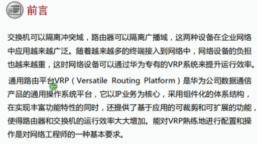
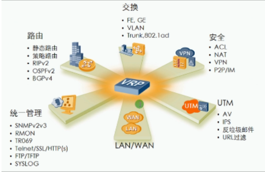
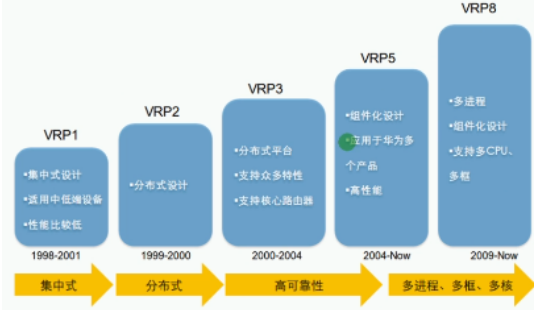
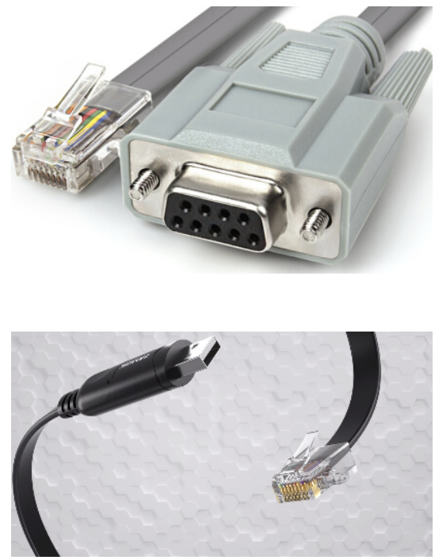
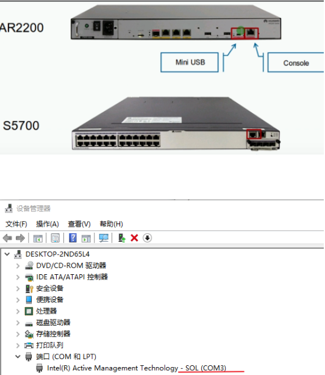
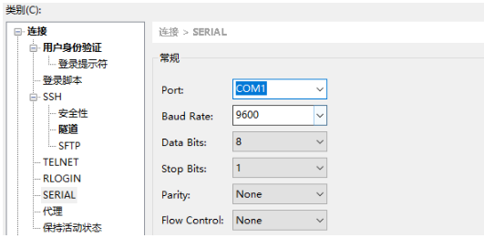

VRP：version route platform 通用路由平台
- 华为公司具有完全自主知识产权的网络操作系统
- 可用运行多中硬件平台之上(路由器、交换机、防火墙)
- 拥有一致的网络界面、用户界面和管理界面，提供丰富的应用解决方案
- 集成了路由交换技术、QOS技术、安全技术和IP语言技术等数据通信功能

主要使用版本：VRPv5 高级版本v8
设备管理方式：

| **管理方式** | **登入方式** | **优点**                         | **缺点**                              | **应用场景**                            |
| ------------ | ------------ | -------------------------------- | ------------------------------------- | --------------------------------------- |
| CLI命令行    | console      | 使用console线缆连接 完全本地管理 | 单会话 无法远程                       | 初始化 故障恢复 升级                    |
| CLI命令行    | miniUSB      | 使用miniUSB线缆连接 完全本地管理 | 单会话 无法远程                       | 初始化 故障恢复 升级                    |
| CLI命令行    | Telnet       | 远程管理 多会话                  | 明文传输 不安全                       | 对安全性要求不高的网络                  |
| CLI命令行    | SSH          | 远程管理 多会话 高安全性         | 配置较复杂                            | 对安全性要求高的网络                    |
| **管理方式** | **登入方式** | **优点**                         | **相同点**                            | **不同点**                              |
| web图形化    | HTTP         | 图形化界面，更直观               | 加载SSL证书用于登入认证，配置几乎相同 | 登入使用HTTPS，传输数据使用HTTP         |
| web图形化    | HTTPS        | 图形化界面，更直观               | 加载SSL证书用于登入认证，配置几乎相同 | 登入和传输数据都是用HTTPS，需要开启命令 |

| 管理形式       | 备注                                                         |
| -------------- | ------------------------------------------------------------ |
| 本地管理 local | 通过console连接console口或miniUSB口，终端使用serial协议适合初始化，故障恢复系统升级 |
| 远程管理remote | 通过IP地址或域名连接虚拟接口VTY口，使用Telnet或SSH适合后期维护、异地管理，同时支持多个会话 |

**console线**

