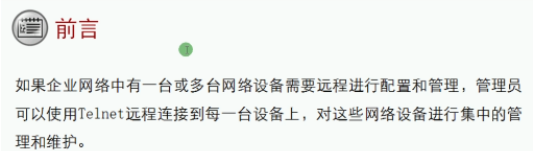
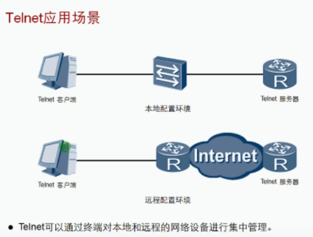
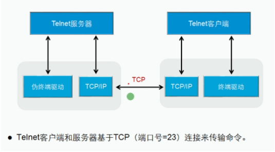
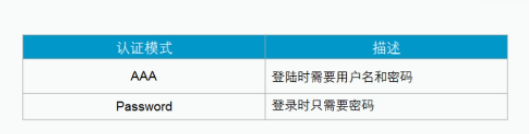

运行终端用户远程到任何可用充当Telnet服务器的设备

Telnet 服务器无需与终端用户直连，只要TCP可达

**认证模式：**

**配置命令：**

| | |
| ------------------------------------------------------------ | ------------------------------------------------------------ |
| Telnet server enable                                         | 开启telnet服务                                               |
| Display telnet server                                        | 验证telnet服务                                               |
| user-interface 0 4  set authentication-mode password/aaa     user privilege level 15     user-interface maximum-vty 15     idle-timeout 10 | 进入VTY配置模式配置认证模式配置用户权限配置最大接入数配置超时时间 |
| AAA local-user huawei password cipher huawei@123 local-user huawei privilege level 15 local-user huawei service-type telnet | 进入AAA配置模式创建用户名和密码配置用户权限配置服务类型      |
