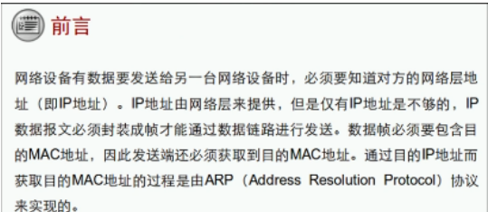
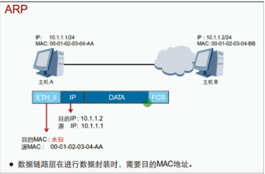
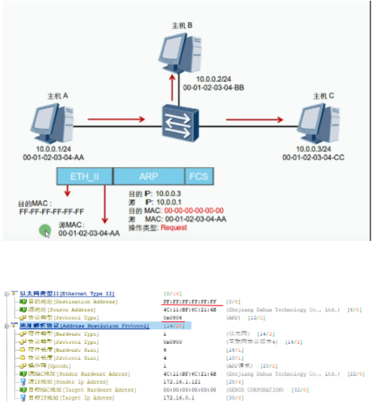
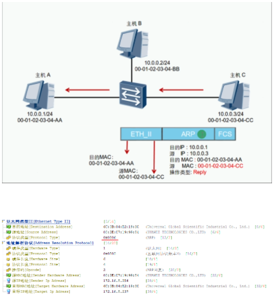
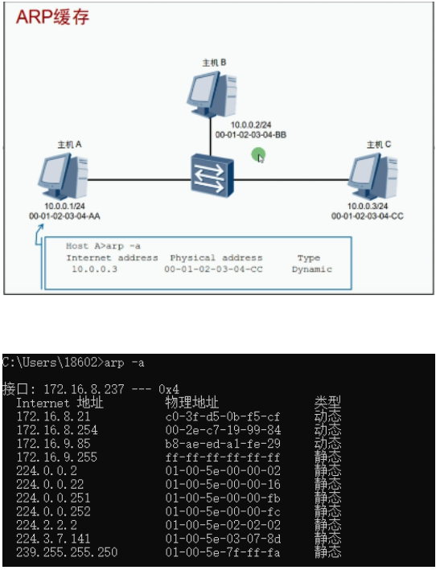
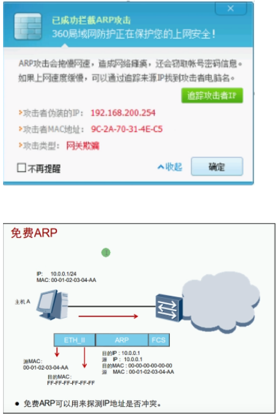
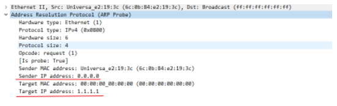
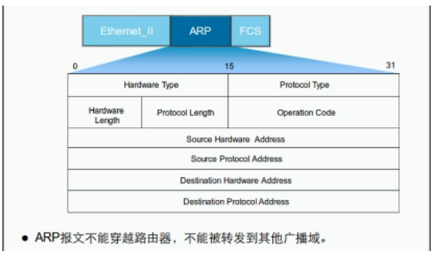

# ARP

address resolution protocol 地址解析协议

目的MAC不能不存在，负责完成不了封装，于是出现ARP

ARP报文的类型分为request请求和reply/respond回应

ARP请求：

ARP请求发送的类型为广播帧 （同一广播域的主机都会收到）

ARP响应：

ARP响应的类型为单播帧 （可以使用软件修改为广播-ARP欺骗）

ARP缓存表：获取到的MAC地址会存放在该表

| 命令   | 备注        |
| ------ | ----------- |
| Arp -a | 查看ARP缓存 |
| Arp -d | 清空ARP缓存 |

ARP欺骗：攻击者发送“无故ARP响应”来伪装其他设备

免费arp：用来检测配置/修改的IP地址是否重复

连续发送3次来检测地址有没有冲突

