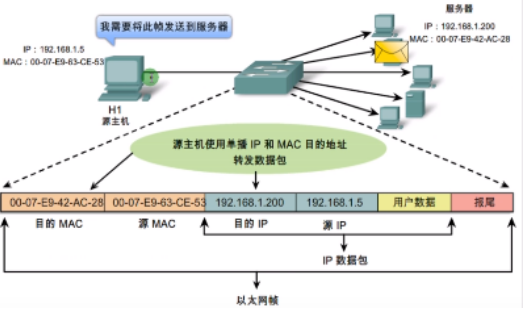
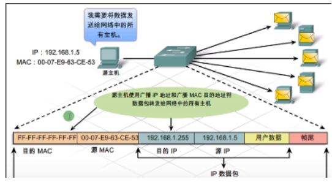
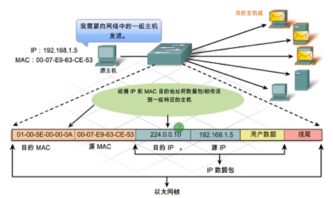
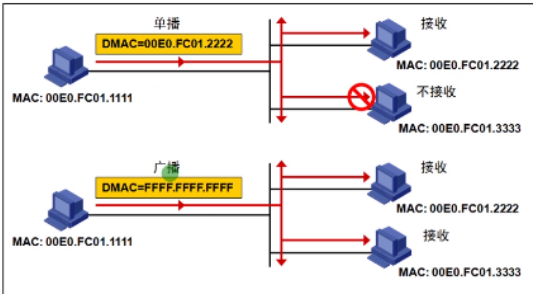
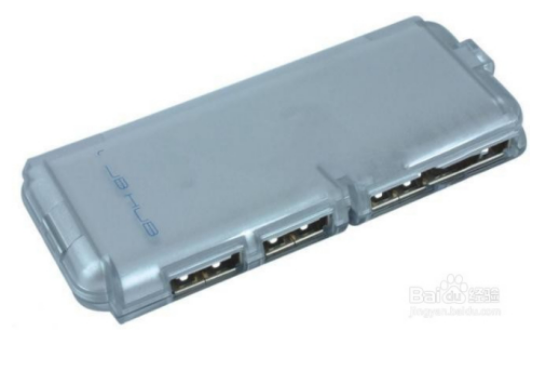
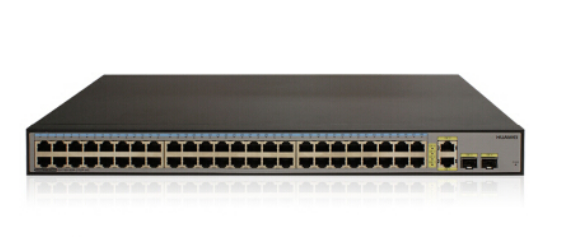
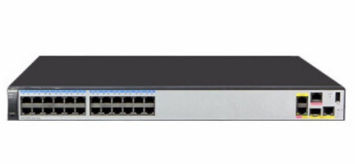

**根据目标地址判断**

| 类型 | 备注                                                         |
| ---- | ------------------------------------------------------------ |
| 单播 | Unicast 发送给单个设备（明确目标地址）                       |
| 广播 | Broadcast 发送给所属广播域内的所有设备（目标地址不明确）     MAC地址全F，IP地址全1 |
| 组播 | Multicast 发送给一组目标MAC地址为01-00-5e，IP地址为D类       |

接收规则：

- 如果是单播帧，会比较目的MAC是否一致
- 如果是广播帧，会接收处理 （收到了不一定会回复）
- 组播只会给需要该数据的设备

**冲突与广播：**

| 冲突   | Collision多个设备如果连接都一个传输信道上，发生的冲撞会导致信号不完整只会发生在早期使用使用集线器组网的共享式网络中 |
| ------ | ------------------------------------------------------------ |
| 冲突域 | Collision domain能够产生冲突的设备的范围                     |
| 广播   | Broadcast发送给所有设备                                      |
| 广播域 | Broadcast domain能够收到广播的设备的范围                     |
| 集线器 | HUB不能分割冲突域和广播域 （所有接口都属于一个冲突域和广播域） |
| 交换机 | Switch 能够分割冲突域不能分割广播域（每个接口都是单独的冲突域） |
| 路由器 | Router能够分割冲突域和广播域（每个接口都是一个广播域）       |

集线器/信号复制器 HUB ：早期组网使用的设备

交换机 Switch ：重要的组网设备

路由器Router：
