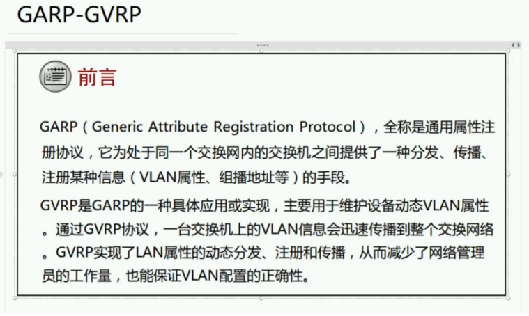
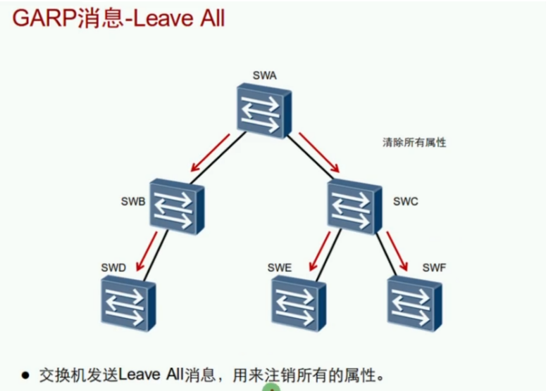
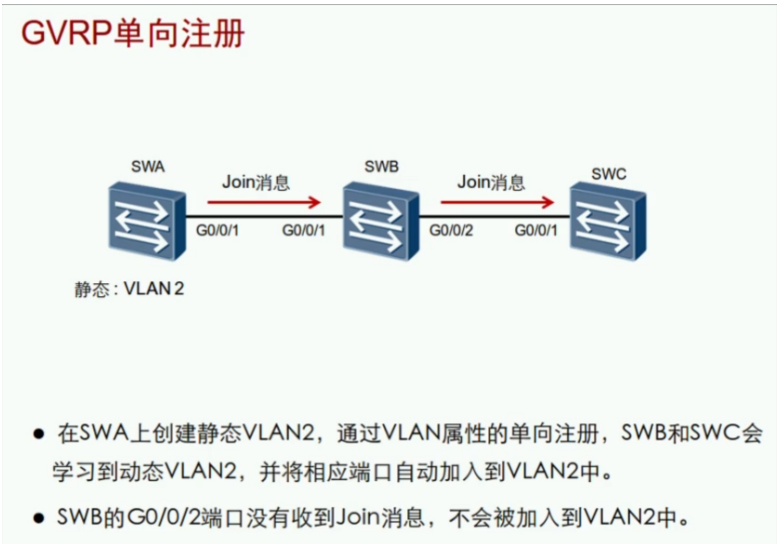

GARP:Generic Attribute Regisration Protocol 通用属性注册协议
- 在交换机间分发、传播、注册某种信息（VLAN属性、组播地址等）
- 主要用于大中型企业网络中，用来提升管理交换机的效率
- 一种协议规范

GARP消息类型:

| 类型      | 备注               |
| --------- | ------------------ |
| Join      | 加入，端口加入VLAN |
| Leave     | 注销，端口退出VLAN |
| Leave All | 注销所有           |

GVRP：GARP VLAN Registration Protocol，VLAN注册协议
- GVRP基于GARP的工作机制，是GARP的一种应用，传递VLAN信息

VLAN分为常规（静态）和动态VLAN

GVRP的结构：

- 工作于数据链路层
- 使用组播地址01：80：c2：00：00：21

GVRP的应用：
- 接收来自其他交换机的VLAN注册信息，并动态的更新本地的VLAN信息同步
- 将本地的VLAN注册信息向其他交换机传播，以便同一交换网内所有支持GVRP的设备VLAN信息同步
- 手动配置的VLAN是静态VLAN，通过GVRP创建的VLAN是动态VLAN
- GVRP传播的VLAN注册信息包括静态创建的VLAN信息和动态学习的VLAN信息

收到VLAN注册信息会将端口进行绑定，分发的端口不会进行绑定

GVRP注册模式：3种

Normal正常模式：允许静态和动态VLAN注册，同时会发送静态VLAN和动态VLAN的声明消息。

Forbidden禁止模式：不会接收动态VLAN注册，同时删除所有学习到的VLAN （只剩VLAN1）。

Fixed固定模式：不会发送和接收动态的注册信息，只会发送静态注册消息。

GVRP配置：

| 命令                                                         | 配置                              |
| ------------------------------------------------------------ | --------------------------------- |
| gvrp                                                         | 全局开启GVRP，默认关闭            |
| int g0/0/1gvrp                                               | 接口开启GVRP，接口类型必须是Trunk |
| gvrp registration fixedgvrp registration forbiddengvrp registration normal | 配置GVRP注册模式                  |
| display gvrp status                                          | 查看GVRP状态                      |

