# STP生成树协议

STP的背景：为了实现二层设备（Ethernet协议）之间的可靠性，企业网络通常拿多台设备或链路实现链路冗余备份，会引起环路

二层网络设计的需求和问题： 
- 为了提高可靠性，交换机之间会通过多条链路相连，从而避免单点故障。
- 但也会带来一些致命的环路问题。

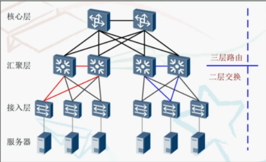

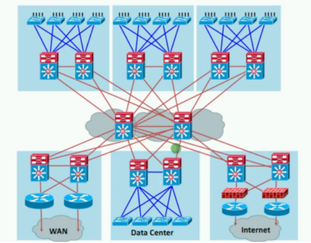

 

**环路问题给用户带来的后果**：网络体验差、延迟高、丢包
**环路引起的问题**：
1. 极大占用链路带宽资源和设备资源，造成大量的垃圾流量
2. 网络广播风暴
3. MAC地址表项不稳定
4. 重复的帧拷贝

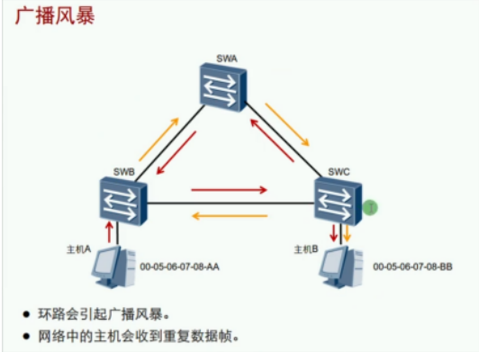

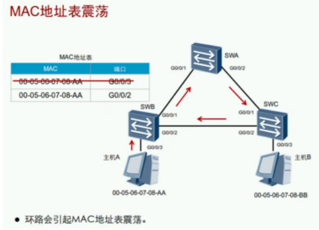

**STP**：Spanning Tree Protocol生成树协议
提供两大功能：

| 功能   | 备注                            |
| ---- | ----------------------------- |
| 消除环路 | 通过阻断冗余链路来消除网络中可能存在的环路         |
| 链路备份 | 当正常工作的链路出现问题，激活备份链路，及时恢复网络连通性 |

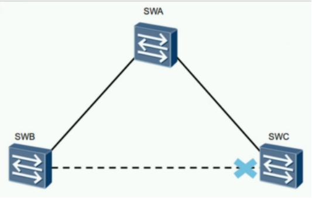

STP操作：通过构建一颗无环的树来消除网络中的环路。

BPDU：Bridge Protocol Data Unit - 桥协议数据单元

- 使用**组播**地址：01-80-C2-00-00-00

PID：STP的ID（无论是STP、RSTP、MSTP都是STP）
PVI：标识使用的是什么模式（STP、RSTP、MSTP）华为默认的模式是RSTP 
BPDU 类型：
- 配置BPDU：Configuration
- 选举根交换机以及确定每个交换机的角色和状态。
- 在初始过程中，每个桥都主动发送配置BPDU。
- 在网络拓扑稳定后，只有根桥主动发送配置BPDU，其他交换机在收到上游传来的配置BPDU后，才会发送自己的配置BPDU。
- 发送周期为Hello Time。
- 老化时间为Max Age。
- 拓扑变更通告BPDU：TCN BPDU
  - 下游交换机感知到拓扑变化时向上游发送的拓扑变化通知。

配置BPDU：
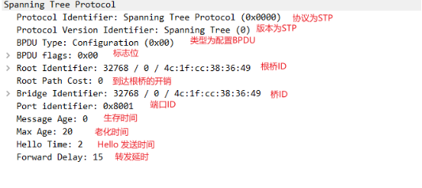

拓扑变更通知BPDU：
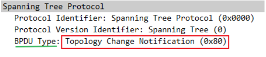

BPDU字段详解：

选举桥角色和端口状态靠该4个字段

| 参数                     | 描述                                                         |
| ------------------------ | ------------------------------------------------------------ |
| Root ldentifier根桥ID    | 发送此配置BPDU的交换机所认为的根交换机的标识                 |
| Root Path Cost根路径开销 | 从接收此根桥的配置BPDU的交换机到达根交换机的最短路径总开销（我到根桥有多远） |
| Bridge identifier桥ID    | 标识自己的BID                                                |
| Port Identifier端口ID    | 发送此配置BPDU的交换机端口的端口标识                         |

**桥ID具体示意**
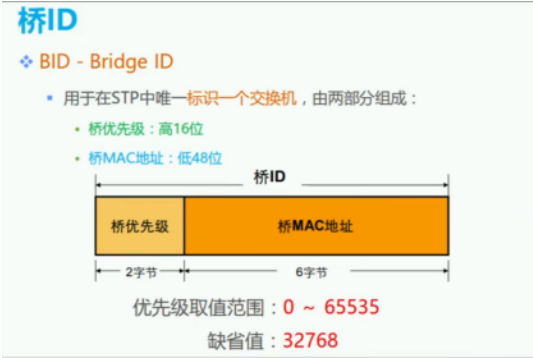

从高位比较再到低位；值越小越优先。（选值4096的倍数）

**端口ID具体示意**
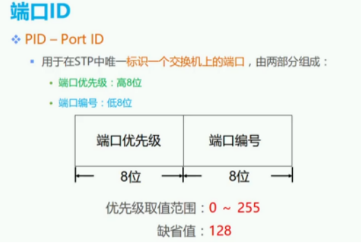

从高位比较再到低位；值越小越优先（端口编号与实际接口无关，选值16的倍数）

**路径开销示意**

（98年制定的旧链路开销标准，现在链路的带宽都不止10G，在计算带宽时存在不合理）
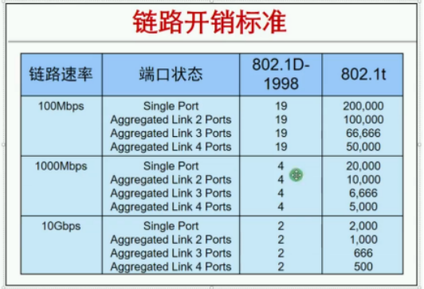

（华为设备现在所支持的链路开销标准802.1t，使用链路聚合的开销=开销标准/链路数量）

**根路径开销示意**（由路径开销计算出根路径开销,根桥发出的BPDU开销为0)
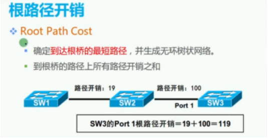

（从根桥发出的开销为0，在根据自己所有收到的接口到根桥的开销相加，取最小的开销值，就是根路径开销）

STP选举过程：（在STP中优先级是越小越好）
- BID最小的成为根桥（先比较优先级再比较交换机Mac地址）
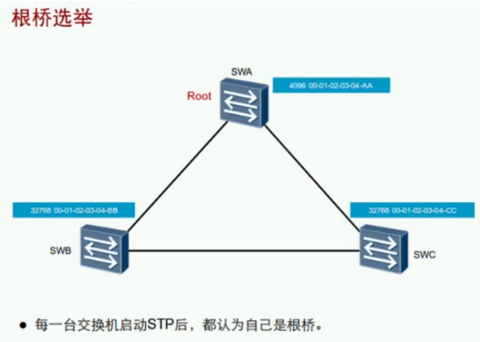

（开始都会发送BPDU，在收到与自己的参数比较，然后清楚自己的角色）
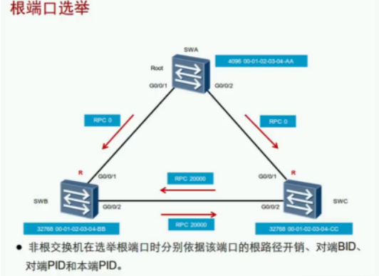

（先看RPC再看对端BID，然后比较对端PID，最后比较本地PID）
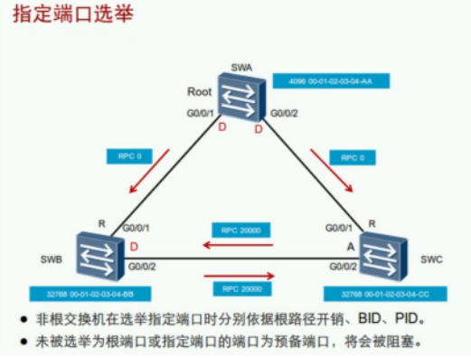

（在每条链路上选举一个指定端口负责数据的收发，“根路径开销”是比较端口的RPC越小越好，所以根桥的端口都是0，为指定端口//当拿一根线插在同一个根桥时，根桥的端口会比较到PID，就不会都是指定端口，其中一个为预备端口状态变成阻塞）

剩下的端口就是预备端口状态为阻塞
STP的端口状态：

| STP端口状态    | 接收BPDU | 转发BPDU | 学习MAC | 转发数据 | 过渡状态 | 稳定状态 |
| -------------- | -------- | -------- | ------- | -------- | -------- | -------- |
| Disabled禁用   | ×        | ×        | ×       | ×        | ×        | √        |
| Blocking阻塞   | √        | ×        | ×       | ×        | ×        | √        |
| Listening监听  | √        | √        | ×       | ×        | √        | ×        |
| Learning学习   | √        | √        | √       | ×        | √        | ×        |
| Forwarding转发 | √        | √        | √       | √        | ×        | √        |

1.禁用 disable     未开启STP协议
2.阻塞 blocking    接收BPDU
3.侦听 listening    接收BPDU 转发BPDU
4.学习 learning    接收BPDU 转发BPDU 学习MAC地址
5.转发 forwarding  接收BPDU 转发BPDU 学习MAC地址 转发用户流量

 注：华为交换机默认显示RSTP状态，附RSTP状态与STP端口状态对比

STP的计数器：

| 计时器                   | 备注                                                         |
| ------------------------ | ------------------------------------------------------------ |
| Hello                    | 2s，根桥发送BPDU的间隔                                       |
| Forwarding Delay转发延时 | 15s，监听和学习的持续实际（监听到学习需要15S，学习到转发需要15s） |
| MSG Age                  | 当前的年龄，每经过一个设备就加1（从根桥开始为0往下算），最大为20，超过20则丢弃.（不建议接太多设备影响交换机性能） |
| Max Age                  | 20s，保持阻塞的最大时间（每2秒收到一次，通过比较最后阻塞，若20秒没收到就不再阻塞） |

一个预备端口从阻塞状态到转发状态的时间：50S
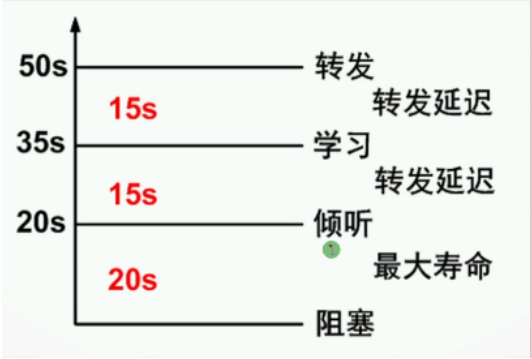

MSG Age
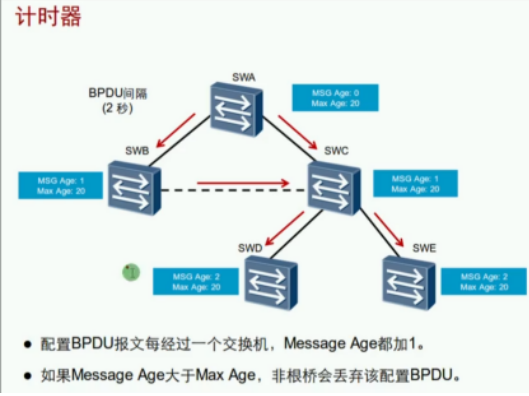

STP的端口状态转换：
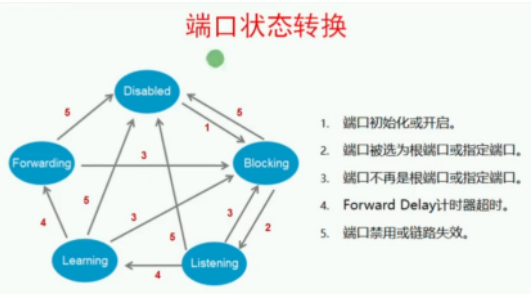

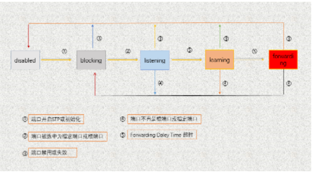

 

STP拓扑变化：

根桥故障需要等待50S，网络才会恢复正常（20S老化时间和30S变成转发状态）
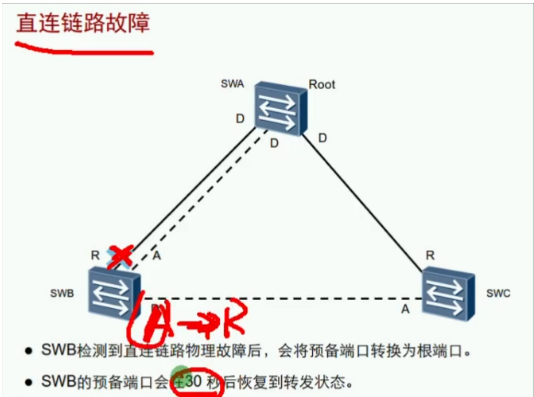

（SWB检测到自己的根端口与根桥断了，立马将预备端口从阻塞状态变成转发状态，需要经过2个forwarding delay阻塞——15s监听——15s转发）这个过程需要30s

（当SWB发生设备故障后，会发出我是根桥的BPDU，SWC收到2个对端发来的BPDU经过比较发现并不是最优的，接收但不会改变该角色，等到老化时间才会改变角色状态）这个过程需要50s

拓扑改变导致MAC地址表错误

MAC地址表老化太长，链路角色变换，但是MAC地址还是原来（要么等待300S或ARP老化）

解决方法：

- 检测到拓扑变化的交换机通过根端口向根桥发TCN，步骤1
- 上游交换机收到TCN后回应TCA，让下游交换机停止发送TCN，步骤2
- 再通过根端口发送TCN直到根桥收到，步骤3
- 根桥通过指定端口发送TC通知所有下游交换机把MAC地址表的老化时间300秒变成15秒。步骤4，5

BPDU字段中的Flags中：
- 1000 0000最高位为1作为TCA
- 0000 0001最低位为1作为TC

STP的配置

| 命令                                                   | 备注                                                         |
| ------------------------------------------------------ | ------------------------------------------------------------ |
| stp mode {mstp \| stp \| rstp}                         | 调整STP的模式，默认MSTP                                      |
| stp priority 4096                                      | 调整BID优先级值，0~61440，步长为4096的倍数                   |
| stp root primary / secondary                           | 自动修改优先级，指定主/备根桥                                |
| stp pathcost-standard{ dot1d-1998 \| dot1t \| legacy } | 配置计算路径开销值得标准                                     |
| 开销标准：                                             | legacy标准：cost=1~200000，华为私有802.1d标准：cost=1~65535802.1t标准：cost=1~200000000，默认 |
| stp cost 10                                            | 修改STP开销                                                  |
| stp port priority 144                                  | 修改PID优先级，0~240，步长为16的倍数                         |
