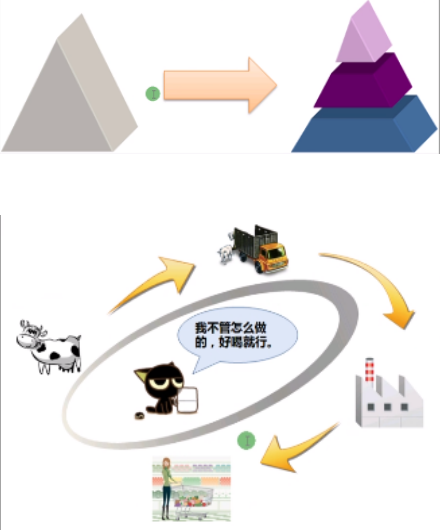
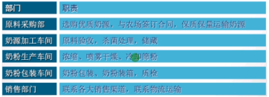
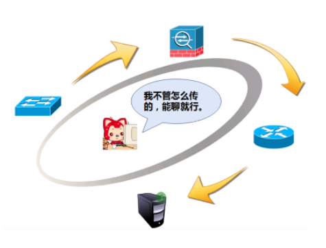
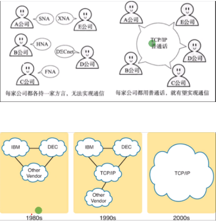
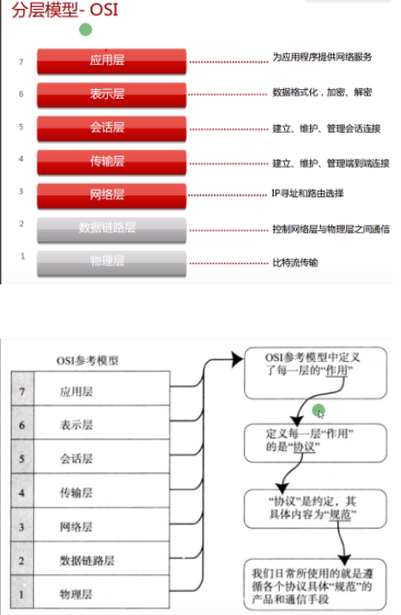
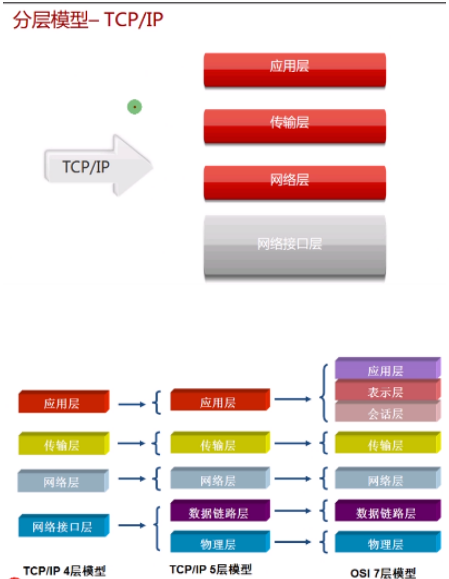
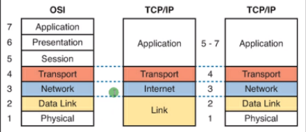
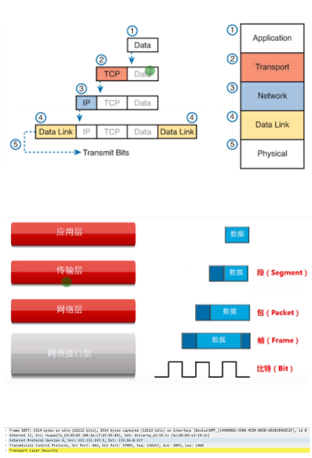
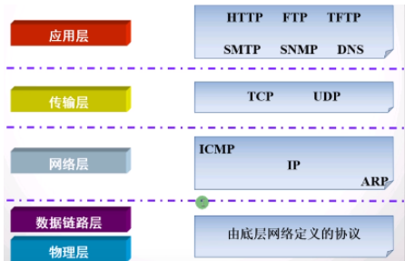

分层思想：将复杂的流程分解为几个功能相对单一的子过程
- 流程更加清晰，复杂问题简单化
- 更容易发现问题并针对性的解决问题

如：小黑喝牛奶不在乎中间的过程

用户不在乎中间的过程只在乎上网

制作牛奶的部门：就是为了方便管理，出现问题能够找到问题源

对于网络也需要分层：方便管理，出现问题能够找到问题源易于学习，各层之间的改变不影响其他层
网络标准化：规范不同的互联标准，互相兼容，加快网络发展

- 1974年前-各厂商都有自己的通信协议标准，导致不同厂商之间不兼容，影响互联网发展
- 1974年-提出OSI开放式互联参考模型协议，但是未被认可，TCP/IP协议认可
- 2000年至今通信都在使用遵守TCP/IP协议

OSI开放式互联参考模型：

OSI未被广泛认可原因：层次太多麻烦复杂、功能重复

网络排错思想：
- 从下层到上层开始
- 从上层到下层开始

TCP/IP开发早于OSI，最终在市场获取认可，目前所使用的通信标准

数据封装和解封装：

- 应用数据需要经过逐层处理后才能通过网络传递给对方
- OSI把每一层数据称为PDU（protocol data unit 协议数据单元）
- TCP/IP根据不同层分别使用段segment、包packet、帧frame、比特bit
- 发送者逐层向下传递数据，并添加报头和报尾的过程称为封装（打包）
- 反之，接收者逐层向上传递数据，称为解封装（拆包）

TCP/IP协议簇中的常见协议：

