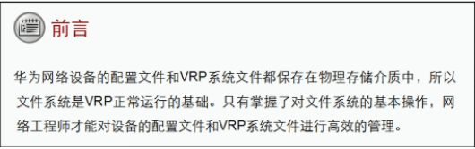

设备内存
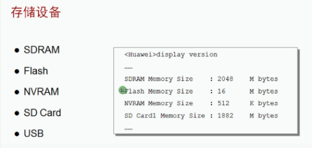

- SDRAM 内存 （临时性存储） 断电后配置文件丢弃 （内存较大）
- Flash 闪存  （永久性存储）
- NVRAM 内存 断电后配置文件还在 （内存小）
- SD card SD卡 （永久性存储）
- USB （移动存储）

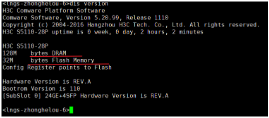

配置命令：
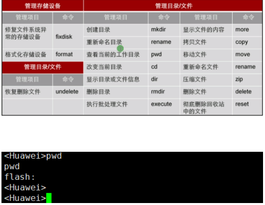
- pwd 显示当前所在的存储介质

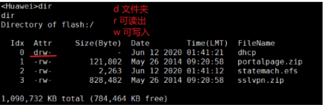
- dir 显示存储介质内的目录的文件

- Mkdir 创建文件

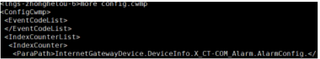
- More 显示记事本格式文件

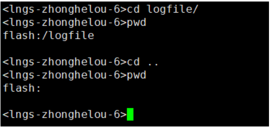
- CD /CD .. 进入目录 ，回到上一目录

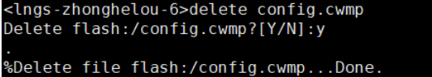
- Delete 将文件删除到回收站

- Undelete 恢复删除的文件

- Reset recycle-bin 清空回收站

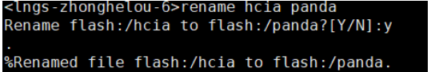
- rename重命名

- Move 移动文件

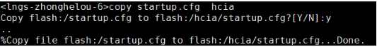
- Copy 复制文件

**配置文件管理**
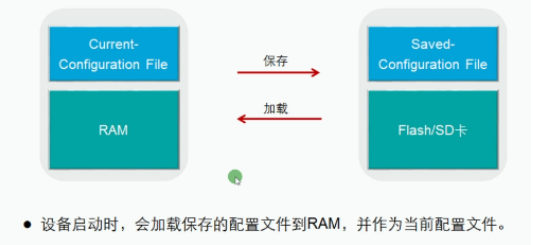

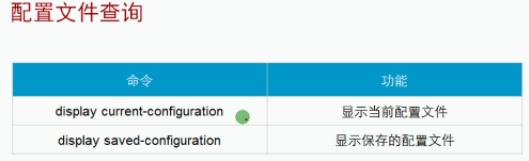

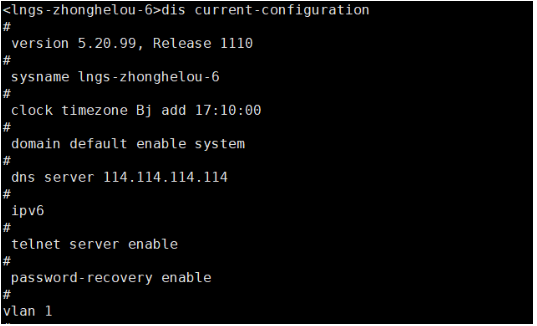
- 显示当前配置文件 （断电丢失）

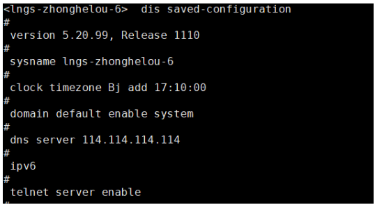
- 显示已保存的配置文件

- 保存当前配置文件

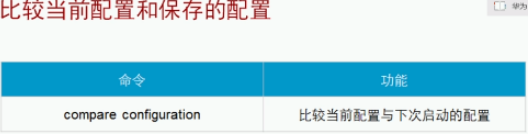

 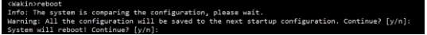
 - 一个问题是问是否保存当前文件
- 第二个问题是问是否重启

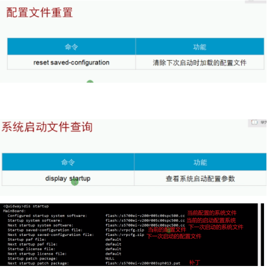

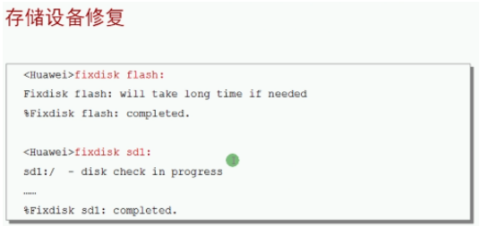
- 格式化文件
- 格式化存储盘

