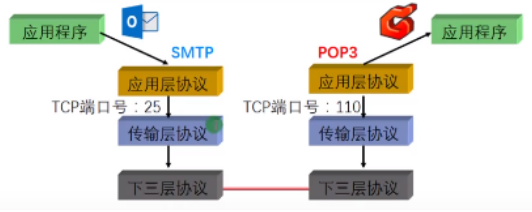
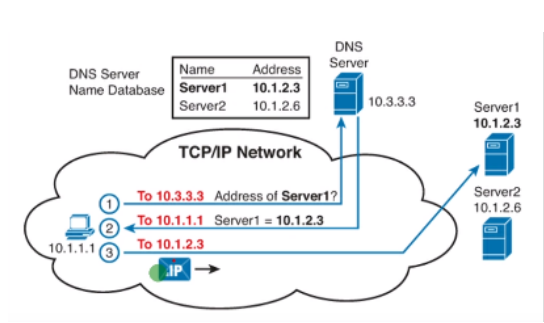
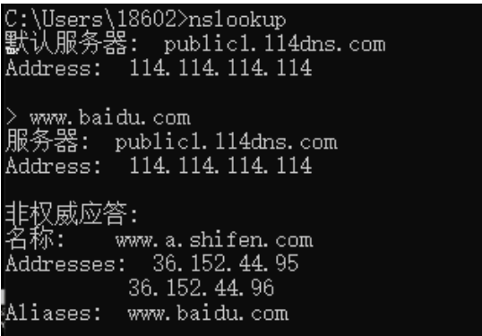
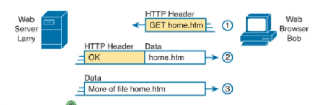
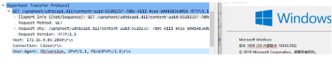
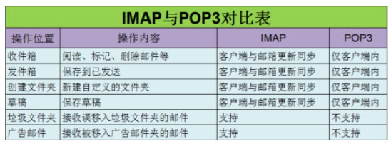
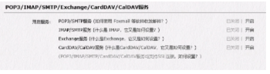
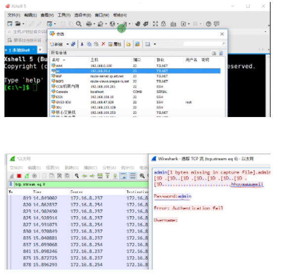

## 应用层概述：

- TCP/IP模型的最高层
- 直接为应用程序提供网络服务

​    

常用的**应用层协议**：
- DNS
- HTTP
- SMTP和POP3/IMAP
- Telnet和SSH
- FTP和TFTP

1. DNS：Domain Name system 域名解析系统 （域名为了方便人们记忆）
	- 建立IP地址与域名关系
	- 将域名解析为IP地址
	- 将IP地址解析为域名
	
	

每一次访问域名，都会向DNS服务器查询，DNS服务器进行响应，完成目的地址的封装

DNS大致分为请求报文request和响应报文relay

好用的DNS服务器：`114.114.114.114`

系统自带的DNS查询工具

| 命令                 | 备注        |
| -------------------- | ----------- |
| nslookup             | 进行DNS查询 |
| ipconfig /displayDNS | 查看DNS缓存 |
| ipconfig/flushDNS    | 清空DNS缓存 |

HTTP：hypertext transfer protocol 超文本传输协议
- 帮助客户端访问万维网 （World Wide Web）
- 网络浏览器通过翻译源代码（HTML超文本标识语言）文件来表示文本、图像、音乐、动作及视频

客户端首先发送get报文给服务器，请求将源代码发送
服务器将页面文件翻译文本、图像、音乐、动作及视频给客户端

HTTP不安全，抓包可以抓取到账号密码
SMTP和POP3：邮件服务

| 协议 | 备注                                                         |
| ---- | ------------------------------------------------------------ |
| SMTP | Simple mail transfer protocol 简单邮件传输协议用于发送邮件   |
| POP3 | Post office protocol v3 邮局协议版本3用于接收邮件            |
| IMAP | Internet massage access protocol 互联网邮件访问协议类似于POP3，功能更多 |

邮件绑定不成功，可能是邮件服务未开启

Telnet：terminal network 终端网络
- 远程管理的主要协议（网络设备、服务器、数据库等）
- 常用终端工具有：SecureCRT、Putty、Xshell

Telnet 不安全，在抓包可以看到账号密码，现在多数使用SSH

**FTP和TFTP：**

| 协议 | 备注                                                         |
| ---- | ------------------------------------------------------------ |
| FTP  | File transfer protocol 文件传输协议提供可靠的文件传输服务具有认证、权限等功能 |
| TFTP | Trivial file transfer protocol 简单文件传输协议提供不可靠的文件传输服务消耗资源较小，速度较快常用于网络设备的配置文件和系统文件传输 |
