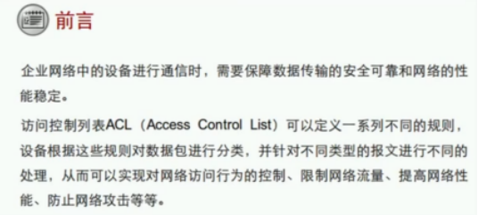
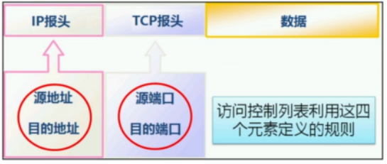
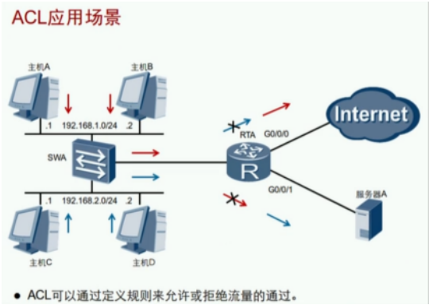
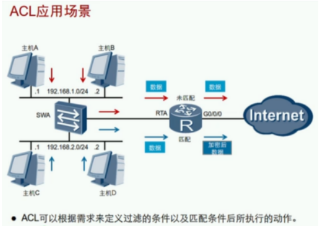
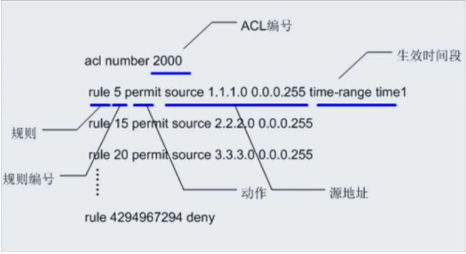
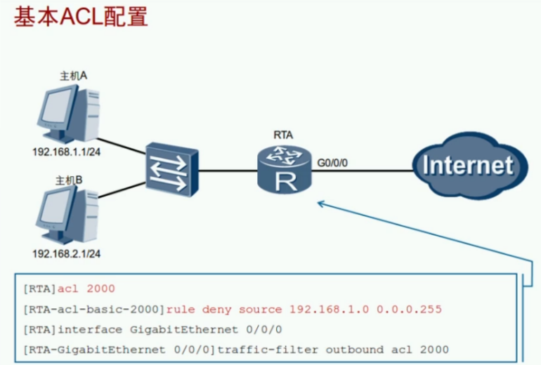

ACL：Access Control List 访问控制列表 （第一代防火墙）

ACL工作原理：先细后粗

- ACL由一条或多条规则组成
- 每条规则必须选择动作：允许permit或拒绝deny
- 每条规则都有一个id序列号（编号默认为5，间隔默认为5）
- 序列号越小越先进行匹配（规则序列号小的先匹配上后面的规则就不再进行匹配）
- 只要有一条规则和报文匹配，就停止查找，称为命中规则
- 查找完所有规则，如果没有符合条件的规则，称为未命中规则
- ACL只是一个流量匹配规则，必须要应用在某个接口或其他技术内才会激活
- 应用在接口时必须选择方向：入站或出站
- 不能过滤由设备自己产生的流量

ACL类型：分为数字型ACL和命名ACL

1. 数字式ACL：下列序号是比较熟悉的，对于高级的设备支持匹配的序号越多

| 分类                                      | 编号范围  | 匹配参数                                 |
| ----------------------------------------- | --------- | ---------------------------------------- |
| 基本ACL Basic access-list              | 2000~2999 | 源IP地址等                               |
| 高级ACL Advance access-list            | 3000~3999 | 源IP地址、目标IP地址、源端口、目标端口等 |
| 二层ACL Specify a L2 acl group         | 4000~4999 | 源MAC地址、目标MAC地址、以太帧协议类型等 |
| 用户自定义ACL User defined access-list | 5000~5999 | ipv4包头、ipv6包头、L2层包头、L4层包头等 |

2. 命名式ACL：如果后面有名字默认就是高级ACL，如果名字后有数字那就根据数字编号来确定

例：
- acl name noweb（高级ACL，从3999开始倒叙编号）
- acl name nochat 2266（基本ACL）

**正掩码、反掩码、通配符区别：**

| 名称   | 规则       | 作用           | 举例          | 备注                     |
| ------ | ---------- | -------------- | ------------- | ------------------------ |
| 正掩码 | 连续的1和0 | IP地址         | 255.255.255.0 | 1对应网络位，0对应主机位 |
| 反掩码 | 连续的1和0 | 路由协议OSPF等 | 0.0.0.255     | 0必须匹配，1无须匹配     |
| 通配符 | 任意的1和0 | ACL            | 0.0.255.0     | 0必须匹配，1无须匹配     |

| 举例                    | 备注               |
| ----------------------- | ------------------ |
| 192.168.0.1 0.0.0.0/0   | 匹配一个主机地址   |
| 192.168.0.0 0.0.0.255   | 匹配一个网段       |
| 192.168.0.1 0.0.0.254   | 匹配网段内奇数地址 |
| 192.168.0.0 0.0.0.254   | 匹配网段内偶数地址 |
| x.x.x.x 255.255.255.255 | 匹配所有地址       |

**ACL配置：**

| 命令                                                         | 配置                                                         |
| ------------------------------------------------------------ | ------------------------------------------------------------ |
| acl 2000                                                     | 创建一个基本ACL                                              |
| rule 5 permit source 192.168.1.0 0.0.0.255 rule 5 deny source 192.168.1.0 0.0.0.255 | 配置ACL的规则：允许或拒绝源地址为192.168.1.0/24网段内的所有流量 |
| acl 3000                                                     | 创建一个高级ACL                                              |
| rule 5permit/deny tcp source 192.168.1.0 0.0.0.255 destination 8.8.8.8 0 destination-port eq 80     eq  等于     gt   大于     lt   小于     range 范围 | 配置ACL的规则：允许或拒绝源地址为192.168.1.0/24网段内到8.8.8.8的http流量 |
| traffic-filter inbound acl 2000 traffic-filter outbound acl 2000 | 在接口上调用ACL过滤流量                                      |
| display acl 2000                                             | 验证ACL2000                                                  |
| display traffic-filter applied-record                        | 查看设备上所有基于ACL调用情况                                |

 ACL调用方向建议：基本在出接口，高级在内接口
- 基本ACL尽量调用在离目标最近的出站接口Outbound
- 高级ACL尽量调用在离源头最近的入站接口Inbound
- ACL的规则一般是先细后粗

