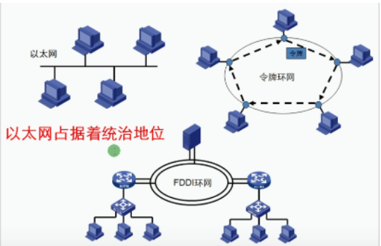
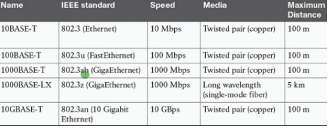
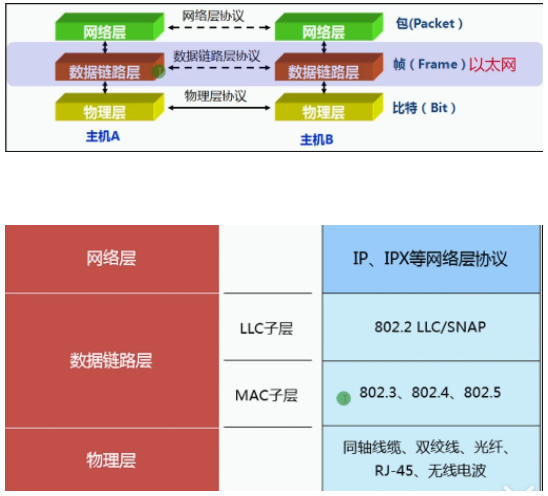
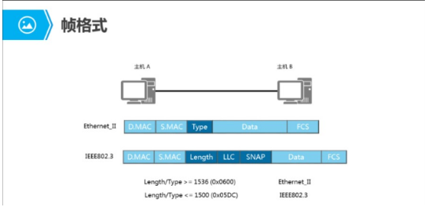
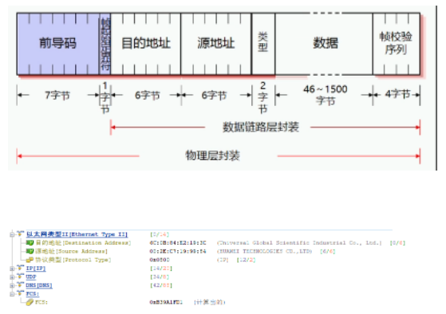
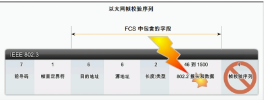
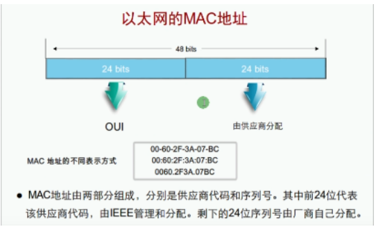
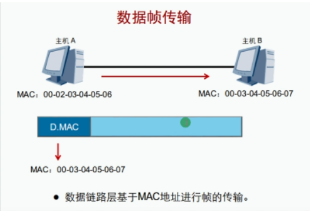
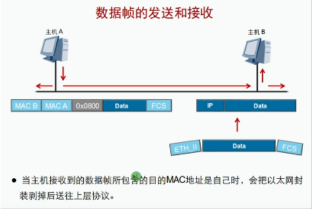

以太网：Ethernet 当今主导地位的局域网组网技术（只与物理层数据链路层有关）

以太网的发展史：
- 20世纪70年代，由Xerox公司联合Intel和DEC公司开发出以太网
- 1973年，传输速率3Mb/s
- 1980年，传输速率10Mb/s
- 1990年，出现双绞线介质的以太网
- 1992年，传输速率100Mb/s
- 1998年，传输速率1000Mb/s
- 2010年，IEEE发布40G/100G标准
- 2013年，400G的以太网标准工作正式启动！

以太网的分类：

| 类型        | 支持速率/模式      | 需不需要冲突检测CSMA/CD技术 |
| ----------- | ------------------ | --------------------------- |
| DIX以太网   | 10Mbit/S以太网     | 需要CSMA/CD                 |
| IEEE802.3   | 10Mbit/S以太网     | 需要CSMA/CD                 |
| IEEE802.3u  | 100Mbit/S以太网    | 可以选择使用CSMA/CD         |
| IEEE802.3z  | 1Gbit/S以太网      | 可以选择使用CSMA/CD         |
| IEEE802.3ae | 10Gbit/S以太网     | 不需要CSMA/CD               |
| IEEE802.3ba | 40/100Gbit/S以太网 | 不需要CSMA/CD               |
| IEEE802.3x  | 全双工             | 不需要CSMA/CD               |

- CSMA/CD载波侦听多路访问/冲突检测技术：用来避免在同一共享介质出现信号冲突的技术。
- 工作流程：发前先听，变发边听，冲突停发，计算后重发

数据链路层的分层设计：

在数据链路层定义了两个子层：LLC层和MAC层

| LLC  | Logical link control 逻辑链路控制负责识别网络层的协议类型并对网络层的数据进行封装向下层传递 |
| ---- | ------------------------------------------------------------ |
| MAC  | Media access config 介质访问控制负责控制物理层设备处理硬件设备的物理寻址、定义网络拓扑及数据帧的传递顺序 |

1. 以太网的帧结构：

IEEE802.3是Ethernet的前生，目前基本未使用

2. Ethernet帧结构：

| 协议类型   | 代表上层的协议 （IP=0*0800 ARP=0*0806 IPv6=86DD ）           |
| ---------- | ------------------------------------------------------------ |
| 帧大小范围 | 64B~1518B                                                    |
| MTU        | 最大传输单元，每次发送数据的最大值（默认为1500B，大于或小于该值的数据帧都有问题） |
| 帧校验     | 通过一定的计算公式来对数据包的完整性检查                     |
| MAC地址    | 代表一个网络接口的物理地址，全球唯一                         |

FCS帧校验序列 4B：用来检测数据的完整性，不完整的会被之间丢弃（不会重传，靠上层实现重传）

前24位是IEEE电气和电子工程师协会分配给厂商，后24位是厂商分配的用户

主机接收到数据帧的动作：
1. 检测FCS，通过下一步（反则丢弃）
2. 检测DMAC，通过交给上层（反则丢弃）
