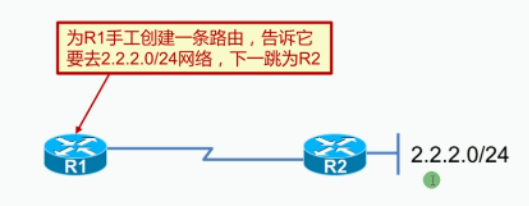
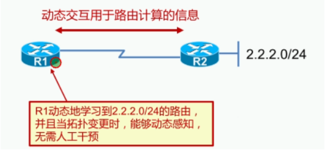
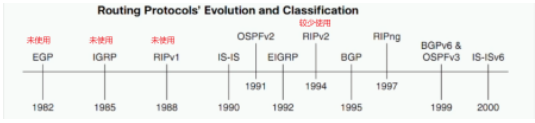
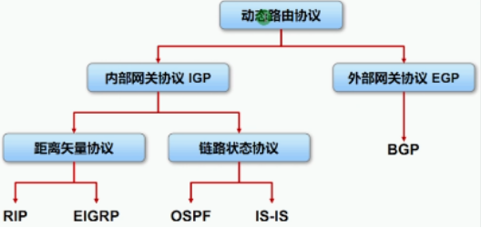
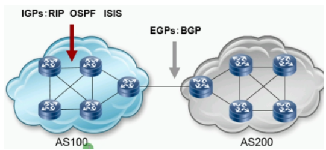
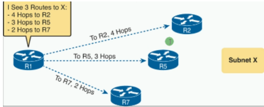
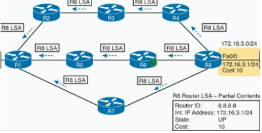
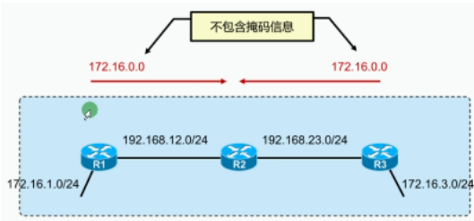
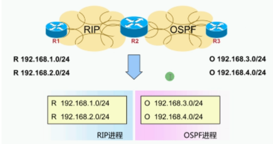
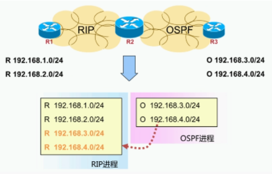

静态路由与动态路由的比较：

| 协议 | 备注                         |
| ---- | ---------------------------- |
| 静态 | 不能及时根据网络变化而自适应 |
| 动态 | 及时根据网络变化而自适应     |

路由协议**概述**：
- 路由器之间交互的一种语言
- 共享路由信息
- 维护路由器、提供最佳转发路径

路由协议**总览**：

| 类型 | 距离矢量协议 | 结合版         | 链路状态协议           | 路径矢量协议    |
| ---- | ------------ | -------------- | ---------------------- | --------------- |
| 有类 | RIPv1        | IGRP           |                        | EGP             |
| 无类 | RIPv2        | EIGRP          | OSPFv2   ISIS          | BGPv4           |
| IPv6 | RIPng        | EIGRP for IPv6 | OSPFv3   ISIS for IPv6 | BGPv4 for BGPv6 |

路由协议分类：根据作用范围

| 类型                                              | 备注                                                       |
| ------------------------------------------------- | ---------------------------------------------------------- |
| IGP 内部网关协议（Interior gateway protocol）     | 用于一个AS内部交互路由信息常用协议：RIP、OSPF、ISIS、EIGRP |
| EGP 外部网关路由协议（Exterior gateway protocol） | 用于不同AS之间交互路由信息常用协议:BGP                     |

AS（autonomous system）：处于同一管理机构下的网络（如：企业、电信、移动、联通）

IGP和EGP的区别：

| 类型 | 区别                                                         |
| ---- | ------------------------------------------------------------ |
| IGP  | 路由器相互信任 （同一管理机构）路由数量较少注重发现路由，不需要什么策略 |
| EGP  | 路由器并非相互信任 （不同管理机构）路由数量庞大注重于引入路由，策略丰富 |

路由协议分类：根据协议算法

| 类型                           | 备注                                                         |
| ------------------------------ | ------------------------------------------------------------ |
| DV 距离矢量（distance-vector） | 基于距离矢量算法，路由器并不了解网络拓扑信息交互路由信息都会修改原始参数 （类似路旁，道听途说）如：RIP、EIGRP |
| LS 链路状态 （link-state）     | 基于SPF算法（shortest path first 最短路径优先），路由器了解完整的网络交互路由信息直接传递不会修改原始参数（类似地图，完整）如：OSPF、ISIS |

根据链路带宽来选择路由

**路由协议分类**：根据发送的更新是否携带掩码

| 类型         | 备注                                |
| ------------ | ----------------------------------- |
| Classful有类 | 不携带掩码如：RIPv1、IGRP、EGP      |
| clasless无类 | 携带掩码如：RIPv2、EIGRP、OSPF、BGP |

不携带掩码：默认的路由掩码都是默认的，影响路由选路

路由协议分类：根据业务应用

| 类型                                   | 备注                            |
| -------------------------------------- | ------------------------------- |
| Unicast routing protocol单播路由协议   | 如：RIP、EIGRP、OSPF、BGP、ISIS |
| Multicast routing protocol组播路由协议 | 如：DVMRP、PIM-SM、PIM-DM       |

路由协议配置规则：
- 协议是在接口运行的 （需要宣告接口的IP地址/接口开启协议）
- 只能学习和发布运行相同协议的路由信息（不同路由协议之间互不干扰）
- 不同路由协议之间需要交互路由信息，需要进行引入/注入（Import）

注：引入必须要同时运行多个协议的路由器做中间人/代理

路由器收敛：
- 当所有路由表的信息都有一致的网络可达信息（相同的目的地址）
- 网络（路由）进入一个稳定状态
- 网络在达到收敛前无法完全正常工作
选择/衡量动态路由协议的一些性能指标：

| 指标   | 备注                                  |
| ------ | ------------------------------------- |
| 正确性 | 能够正确的找到最优且无环的路由        |
| 收敛快 | 当网络发生变化后，能够快速做出响应    |
| 低开销 | 协议自身的开销（占用内存、CPU、带宽） |
| 安全性 | 协议具有安全机制                      |
| 普适度 | 适合各种拓扑结构和各种规模的网络      |
