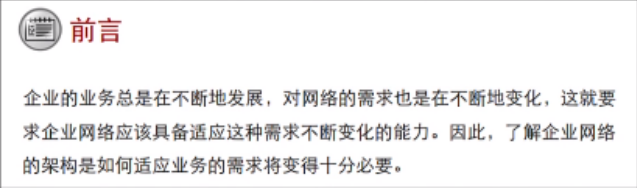

**网络**：似宇宙洪荒，浩瀚无边，深不可测；网络案例似璀璨群星，千变万化，闪耀环宇。学习网络技术似夜观星象，每有所得，便拍案惊奇，夜不能寐。

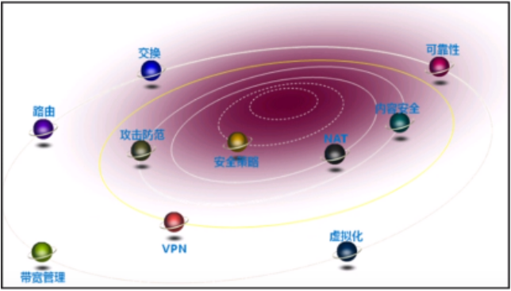

路由交换类似于“路”，只有把路建好了，才能去别人家。

主要设备：交换机、路由器、防火墙

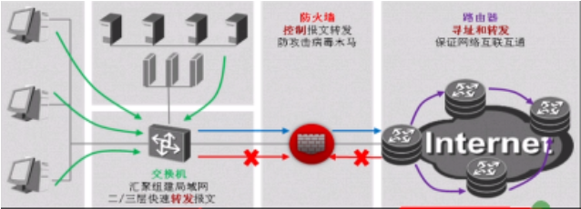

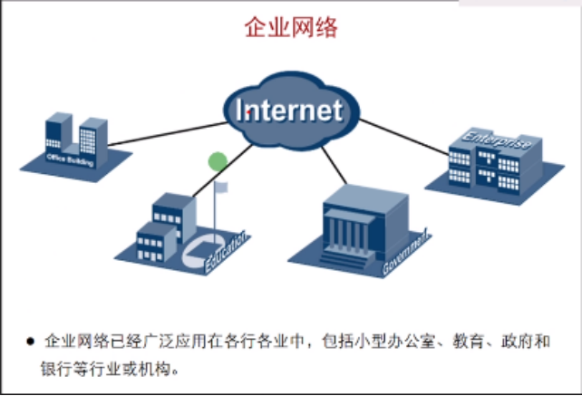

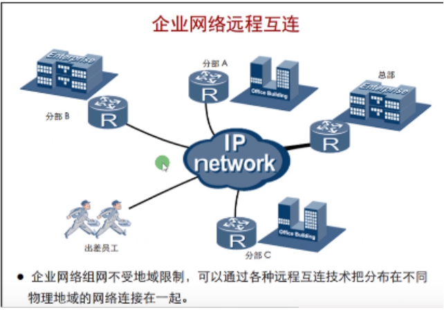

上网通常使用的是私网地址，并不能直接访问Internet，可以通过NAT技术

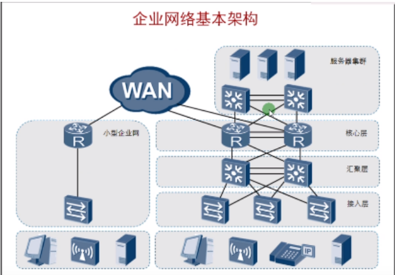

企业架构分层：
1. 核心层：对用户流量进行高速处理转发
2. 汇聚层：对用户的流量进行汇聚
3. 接入层：用于接入用户，供用户访问服务

企业网络架构很大程度取决于企业或机构的业务需求：

|      |                                                                                                                                                                              |
| ---- | ---------------------------------------------------------------------------------------------------------------------------------------------------------------------------- |
| 小型企业 | 通常只有一个办公地点，一般采用扁平网络架构（没有层次化）进行组网。扁平网络架构能够满足用户对资源的基本访问需求，具有较强的灵活性，同时又能够大大减少部署和维护成本。网络通常缺少冗余机制，可靠性不高，容易发生业务中断。                                                                 |
| 大型企业 | 业务对网络的连续性要求很高，所以通常会通过冗余备份来保证网络的可用性和稳定性，从而保证企业的日常业务运营。网络也会对业务资源的访问进行控制，所以通常采用多层网络架构来优化流量分布，并应用各种策略进行流量管理和资源访问控制。多层网络设计也可以使网络易于扩展。网络采用模块化设计能够有效实现网络隔离并网络维护，避免某一区域产生的故障影响到整个网络。 |

运营商网络：
- 覆盖范围大（全省，全国……）
- 网络复杂
- 多厂商共存（华为、思科、华三……）
- 网络安全可靠性要求高（不能出现断网、被攻击……）
- 涉及的网络制式多（涉及多种协议）

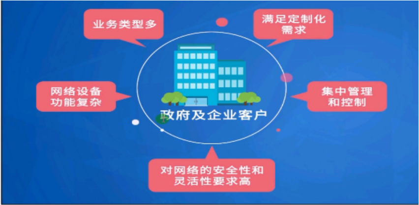

 

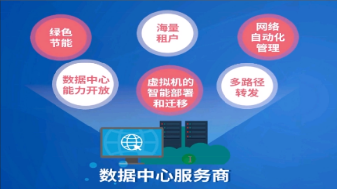

IDC数据中心

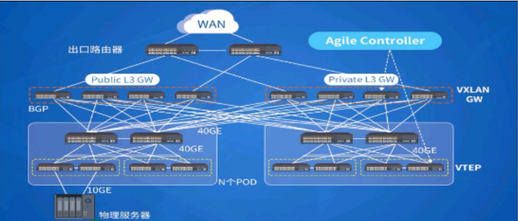

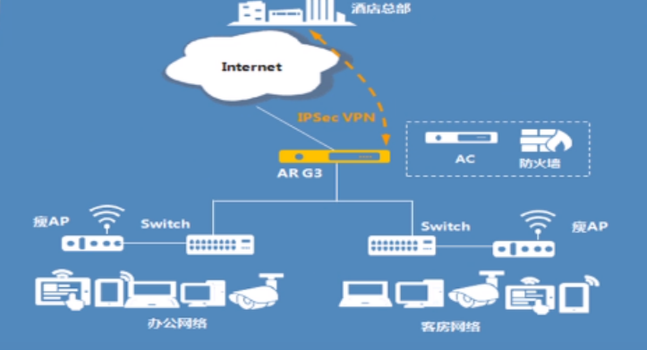

校园网

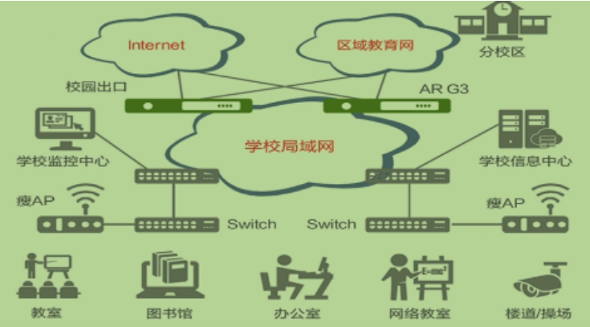

五大网：中国移动、中国电信、中国联通、教育网、科研网

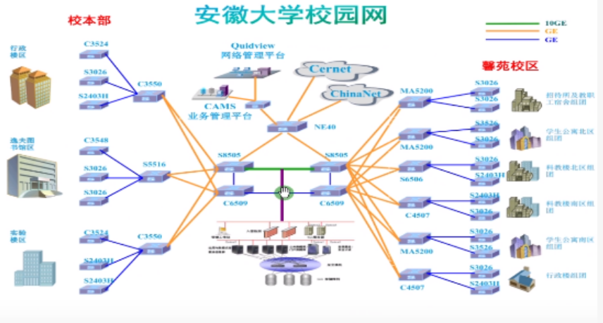

 

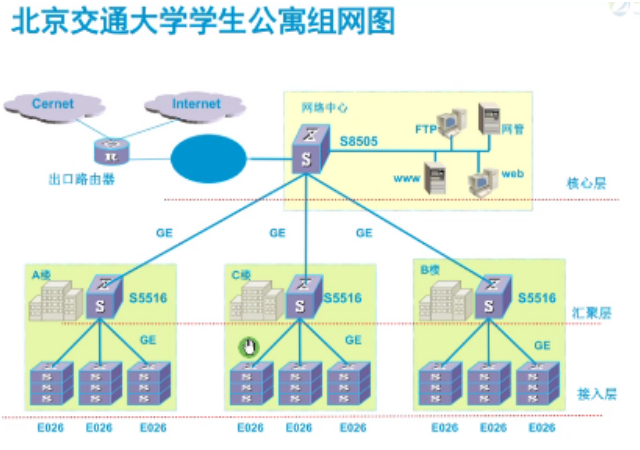
