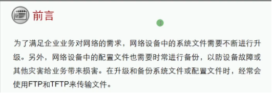
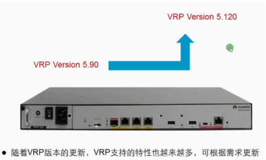
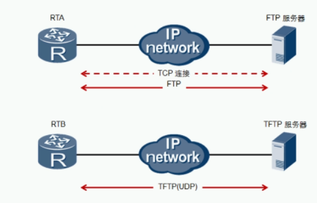
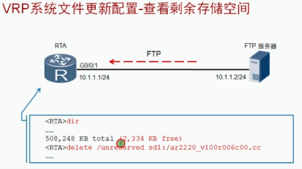
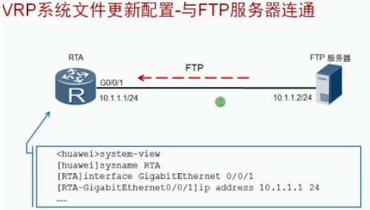
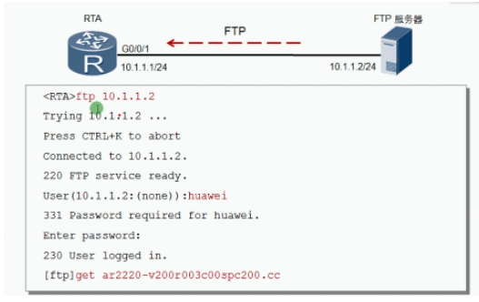
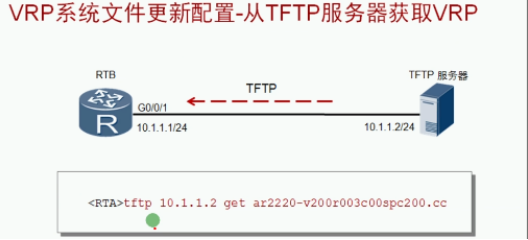

VRP命名规则：
- 由VRP自身版本号和关联产品版本号两部分组成
- 产品版本格式包含设备型号 Vxxx （产品码），Rxxx（大版本号），Cxx（小版本号）
- 如果VRP产品版本有补丁，VRP产品版本中还包含SPC部分

**文件传输协议**

FTP可靠（在跨网段或广域网之间使用较好），TFTP不可靠 （在局域网内对可靠性要求不高使用较好）

| FTP传输的命令：          | TFTP传输的命令：           |
| ------------------------ | -------------------------- |
| Ftp 服务器地址Get 文件名 | Tftp 服务器地址 get 文件名 |

FTP与TFTP的区别：
  1. 设备登入FTP需要输入账号密码，TFTP不需用
  2. FTP传输会显示进度，TFTP不显示进度
  3. FTP可用查看文件，TFTP不能查看
