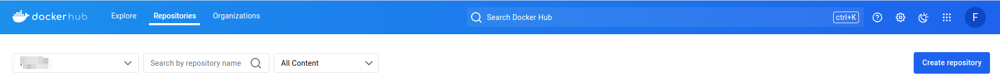
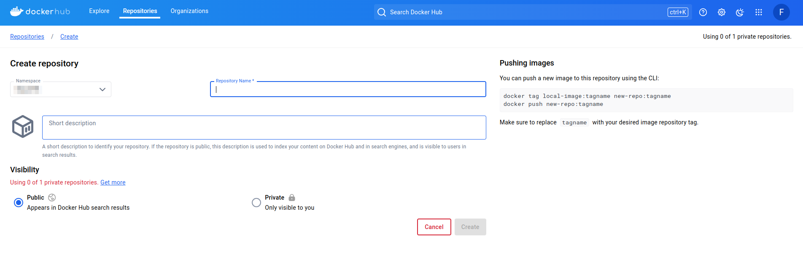

# 1、Docker hub创建仓库

官网注册账号：https://hub.docker.com/

登陆后进入仓库界面创建仓库



输入仓库名和描述(可选)进行创建，记住仓库选择公开



# 2、在本地shell登录docker

```bash
[root@localhost ~]# docker login
Log in with your Docker ID or email address to push and pull images from Docker Hub. If you don't have a Docker ID, head over to https://hub.docker.com/ to create one.
You can log in with your password or a Personal Access Token (PAT). Using a limited-scope PAT grants better security and is required for organizations using SSO. Learn more at https://docs.docker.com/go/access-tokens/

Username: xxxx
Password: 

WARNING! Your password will be stored unencrypted in /home/feiyu/.docker/config.json.
Configure a credential helper to remove this warning. See
https://docs.docker.com/engine/reference/commandline/login/#credential-stores

Login Succeeded
```

# 3、查看需推送镜像

```bash
[root@localhost ~]# docker images 
REPOSITORY   TAG        IMAGE ID       CREATED          SIZE
centos       7.9.2009   eeb6ee3f44bd   2 years ago      204MB
```

# 4、给镜像修改标签与名称

规范：docker tag 原镜像名:原镜像tag dockerhub用户名/仓库名:标签

```bash
[root@localhost ~]# docker tag centos:7.9.2009 user/centos7.9:stable
[root@localhost ~]# docker images ls
REPOSITORY       TAG        IMAGE ID       CREATED          SIZE
user/centos7.9   stable     853aab1a35f1   27 minutes ago   204MB
```

# 5、Push到DockerHub仓库

```bash
[root@localhost ~]# docker push user/centos7.9:stable

```

之后可以在自己dockerhub账号的仓库中看到push的镜像，测试也可以正常pull下来到本地

# 6、配置代理

## Dockerd 代理

在执行docker pull时，是由守护进程dockerd来执行。因此，代理需要配在dockerd的环境中。而这个环境，则是受systemd所管控，因此实际是systemd的配置。

```text
sudo mkdir -p /etc/systemd/system/docker.service.d
sudo touch /etc/systemd/system/docker.service.d/proxy.conf
```

在这个proxy.conf文件（可以是任意*.conf的形式）中，添加以下内容：

```text
[Service]
Environment="HTTP_PROXY=http://127.0.0.1:7893/"
Environment="HTTPS_PROXY=http://127.0.0.1:7893/"
Environment="NO_PROXY=localhost,127.0.0.1,.example.com"
```
