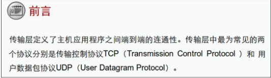

- 传输层提供端到端的连接（会话之间）
- 网络层提供点到点的连接（节点之间）
根据端口号可以区分不同的应用协议
传输层端口：Port

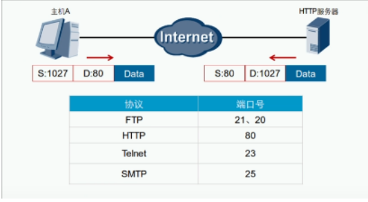

- 0~1023 属于公认端口/知名端口（给一些重要的协议使用的端口）
- 1024~49151属于注册端口/登记端口（应用注册使用的端口）
- 49152~65535属于私有端口/动态端口（主机/客户端使用的端口）

- 端口是根据需求自行更改的
- 可以通过更改端口可以让非信任用户访问不到应用
- 如FTP的端口默认为21，修改端口为9999，让非信任用户访问不到FTP服务器

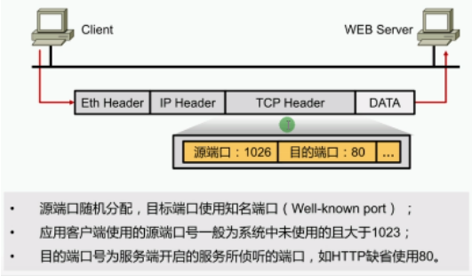

客户端（source port 49152~65535）
服务器（source port 0~49152）
端口对应了一种应用协议，真正提供服务的是服务器

传输层协议：

| 协议 | 备注                                                         |
| ---- | ------------------------------------------------------------ |
| TCP  | Transmission control protocol 传输控制协议可靠的、面向连接的协议传输效率低，类似于打电话 |
| UDP  | User datagram protocol 用户数据报协议不可靠、无连接的服务传输效率高，类似于群聊 |

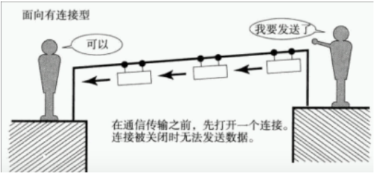
TCP在通信前需要建立关系来确认之间状态

 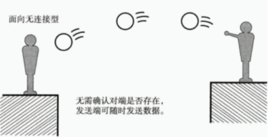
UDP在通信前不需要建立关系来确认之间的状态

TCP与UDP数据包结构对比：
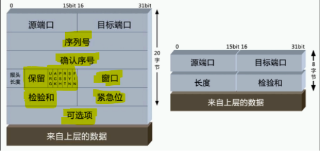

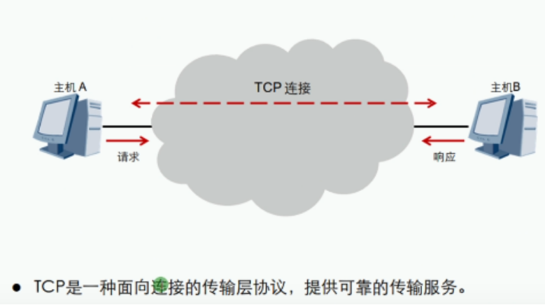
## TCP可靠，效率低

TCP会话的建立-三次握手：涉及标志位SYN,ACK
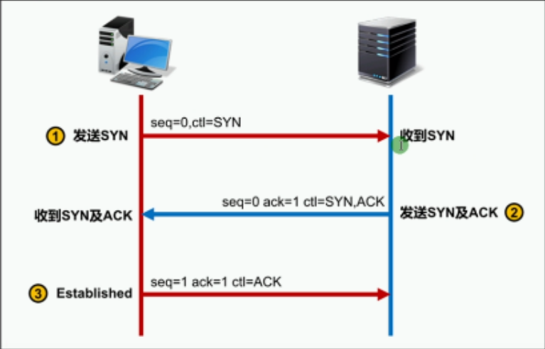

三次握手机制类似打电话：（确保身份状态的可靠性）

1. 第一次握手：
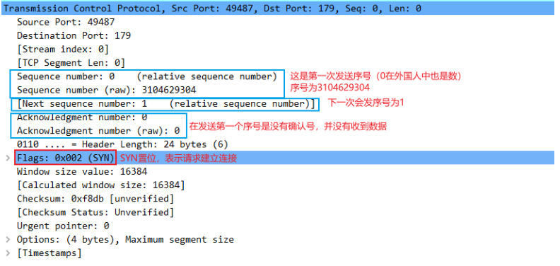

2. 第二次握手：
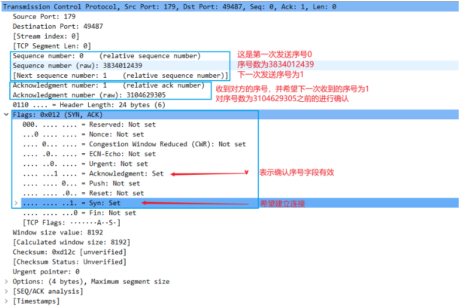

3. 第三次握手：
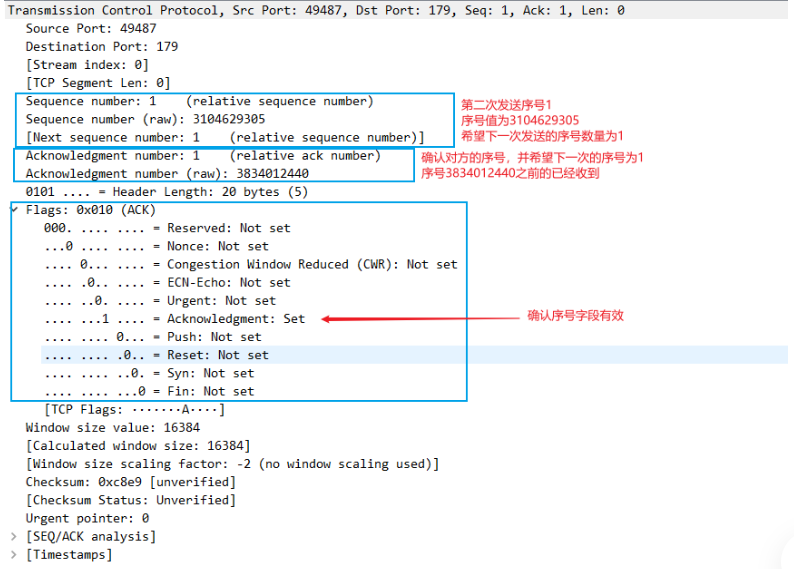

TCP会话的确认：对每个数据包都会进行确认（影响资源的消耗，推出滑动窗口机制，只对部分进行确认）
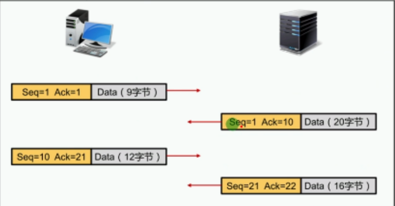

**TCP会话的拥塞和流量控制**
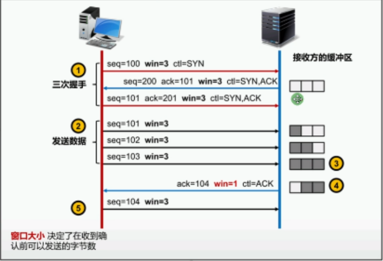

根据窗口机制来控制网络拥塞（网络拥塞，主机接收服务器的数据不过来，服务器接收主机的请求不过来，可以根据窗口大小来调整）

TCP会话的结束-四次握手：涉及ACK、FIN
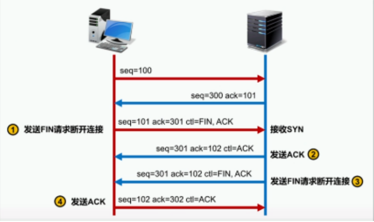

- TCP的三次握手一定是三次交互报文，四次握手可能不会有四次交互报文（主机直接拔电）

网络中最霸道的攻击 DDos
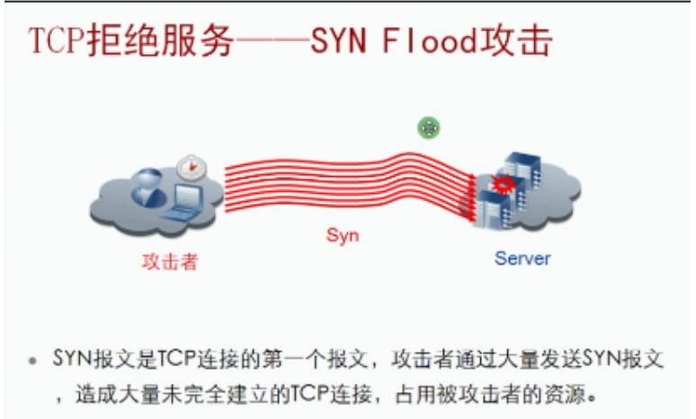

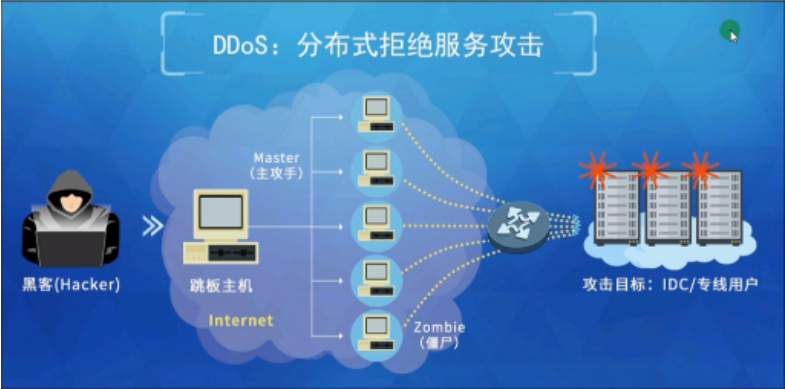

黑客控制僵尸网络向服务器发送TCP SYN ，并不会对服务器的回应。

## UDP：用户数据报协议
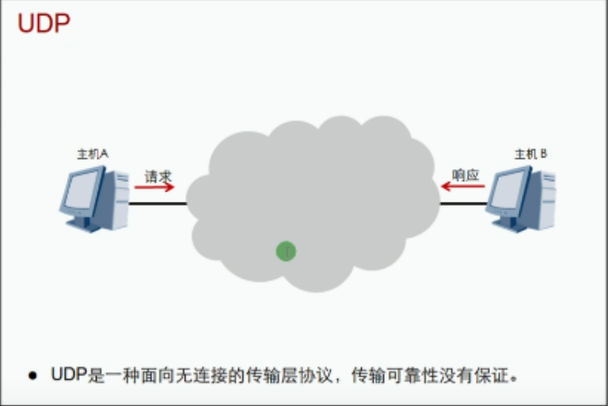

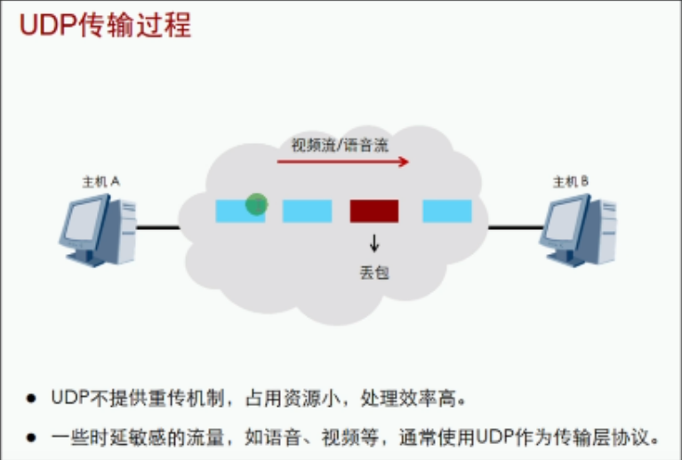

TCP与UDP的区别：

| 传输控制协议TCP        | 用户数据报协议UDP                    |
| ---------------------- | ------------------------------------ |
| 面向连接               | 无连接                               |
| 可靠传输               | 尽力而为的传输                       |
| 支持流控及窗口机制     | 无流控及窗口机制                     |
| 仅支持点对点通信       | 支持任意通信方式（点对点，点对多点） |
| 多用于注重数据的完整性 | 不要求数据的完整性，开销小           |

