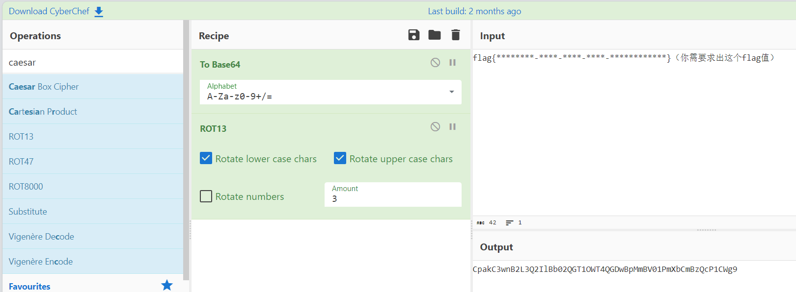
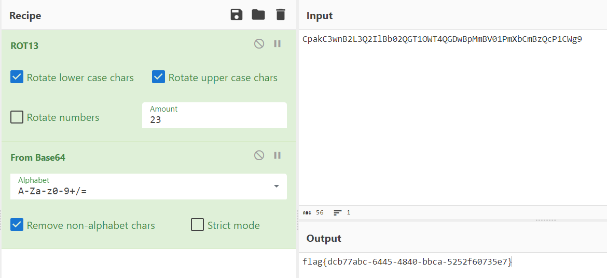

## 题目描述

CyberChef是一款开源的编码转换器，它可以在web浏览器中轻松完成各种网络操作，例如加解密、压缩、散列、解析等。它不仅可以帮助你分析和解密数据，还可以用于反混淆恶意脚本。小蓝同学把他在CyberChef中的操作步骤保存为静态网页，并把原始的flag删除了，你能解密出来吗？

## 解题

下载附件是一个`CyberChef`网页：

可以看到先是进行了`base64`加密，然后进行了`ROT13`移位

> **ROT13简介**
>
> ROT13（回转13位）是一种简易的替换式密码算法。它是一种在英文网络论坛用作隐藏八卦、妙句、谜题解答以及某些脏话的工具，目的是逃过版主或管理员的匆匆一瞥。
>
> ROT13 也是过去在古罗马开发的凯撒密码的一种变体。
>
> ROT13是它自身的逆反，即：要还原成原文只要使用同一算法即可得，故同样的操作可用于加密与解密。该算法并没有提供真正密码学上的保全，故它不应该被用于需要保全的用途上。它常常被当作弱加密示例的典型。
>
> 应用ROT13到一段文字上仅仅只需要检查字母顺序并取代它在13位之后的对应字母，有需要超过时则重新绕回26英文字母开头即可。A换成N、B换成O、依此类推到M换成Z，然后串行反转：N换成A、O换成B、最后Z换成M。只有这些出现在英文字母里的字符受影响；数字、符号、空白字符以及所有其他字符都不变。替换后的字母大小写保持不变。

所以我们只要实现该加密的逆过程就行：

`ROT13`逆过程需要改变偏移量为`26-3=23`：

得到`flag{dcb77abc-6445-4840-bbca-5252f60735e7}`