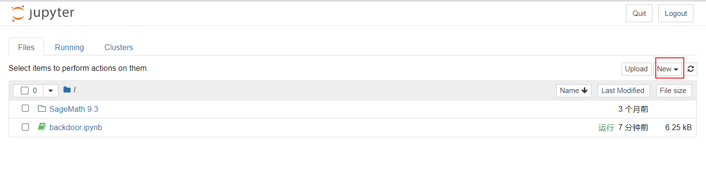

## 题目描述

无

## 解题

下载附件得到源代码和代码输出，代码解释如下，：

```python
from Crypto.Util.number import *
from Crypto.Util.Padding import pad
from random import randint
from Crypto.Util.strxor import strxor
from Crypto.Cipher import AES
from hashlib import sha256
from hashlib import md5

flag = b'xxx'

def Get_Parameters():
    w = getPrime(25)  # 生成一个25位的素数w
    a = getPrime(15)  # 生成一个15位的素数a
    b = getPrime(15)  # 生成一个15位的素数b
    x = getPrime(30)  # 生成一个30位的素数x
    return w, a, b, x

def Malicious_ECDH():
    w, a, b, x = Get_Parameters()  # 获取参数w, a, b, x

    P = getPrime(512)  # 生成一个512位的素数P
    A = getRandomNBitInteger(30)  # 生成一个30位的随机整数作为曲线参数A
    B = getRandomNBitInteger(40)  # 生成一个40位的随机整数作为曲线参数B
    F = GF(P)
    E = EllipticCurve(F, [A, B])  # 创建椭圆曲线对象E
    G = E.random_point()  # 在椭圆曲线上随机选择一个点作为基点G
    k1 = getRandomNBitInteger(50)  # 生成一个50位的随机整数作为私钥k1
    M1 = k1 * G  # 计算公钥M1 = k1 * G

    Y = x * G
    t = 1
    z = (k1 - w * t) * G + (-a * k1 - b) * Y  # 计算z，这是恶意的ECDH计算
    k2 = sha256(str(z[0]).encode()).digest()[:6]  # 根据z的x坐标生成共享密钥的前6字节
    k2 = bytes_to_long(k2)
    M2 = k2 * G
    k_rec = getRandomNBitInteger(50)
    B_ = k_rec * G
    shared_key1 = k_rec * M2  # 计算发送方共享密钥
    shared_key2 = k2 * B_
    assert shared_key1 == shared_key2

    print((w, a, b, x))
    print((A, B, P))
    print(G.xy())
    print(M1.xy())
    print(M2.xy())
    print(B_.xy())
    return shared_key1

def easy_enc(pt, key):
    key = md5(str(int(key[0])).encode()).digest()  # 使用共享密钥的x坐标生成密钥
    cipher = AES.new(key, AES.MODE_ECB)  # 创建AES ECB模式加密对象
    ct = cipher.encrypt(pad(pt, 16))  # 使用AES加密明文并填充到16字节倍数
    print(ct)  # 打印密文

key = Malicious_ECDH()  # 执行恶意ECDH计算获取共享密钥
easy_enc(flag, key)  # 使用共享密钥对明文进行AES加密

'''
输出结果：
(w, a, b, x) = (31889563, 31153, 28517, 763220531)
(A, B, P) = (1064988096, 802063264240, 12565302212045582769124388577074506881895777499095598016237085270545754804754108580101112266821575105979557524040668050927829331647411956215940656838233527)
G = (359297413048687497387015267480858122712978942384458634636826020013871463646849523577260820163767471924019580831592309960165276513810592046624940283279131, 9290586933629395882565073588501573863992359052743649536992808088692463307334265060644810911389976524008568647496608901222631270760608733724291675910247770)
M1 = (10930305358553250299911486296334290816447877698513318419802777123689138630792465404548228252534960885714060411282825155604339364568677765849414624286307139, 7974701243567912294657709972665114029771010872297725947444110914737157017082782484356147938296124777392629435915168481799494053881335678760116023075462921)
M2 = (497353451039150377961380023736260648366248764299414896780530627602565037872686230259859191906258041016214805015473019277626331812412272940029276101709693, 8439756863534455395772111050047162924667310322829095861192323688205133726655589045018003963413676473738236408975953021037765999542116607686218566948766462)
B_ = (5516900502352630982628557924432908395278078868116449817099410694627060720635892997830736032175084336697081211958825053352950153336574705799801251193930256, 10314456103976125214338213393161012551632498638755274752918126246399488480437083278584365543698685202192543021224052941574332651066234126608624976216302370)
ct = b'\x1a\xfb\xa2\xe1\x86\x04\xfak\x9a\xa3\xd15\xb8\x16\x1d\xbc\xa9S\xf5;\xfa\xf1\x08dn~\xd4\x94\xa4;^*\xf6\xd7\xf10\xa3\xe1k`\x1f-\xef\x80\x16\x80\x80\xe2'

代码流程：
1. `Get_Parameters()`函数：生成四个随机素数作为参数返回：`w, a, b, x`

2. `Malicious_ECDH()`函数：实现了一个恶意的椭圆曲线Diffie-Hellman密钥交换算法。具体流程如下：
   - 生成椭圆曲线参数：`P, A, B`
   - 随机选择曲线上的点G
   - 生成随机私钥k1，并计算公钥M1 = k1 * G
   - 生成公钥Y = x * G，随机选择比特t，计算z
   - 生成共享密钥k2，并计算公钥M2 = k2 * G
   - 随机生成k_rec作为接收方私钥，计算接收方公钥B_
   - 确定共享密钥并打印输出
   
3. `easy_enc()`函数：使用MD5散列共享密钥的x坐标，然后使用AES ECB模式对明文进行加密，并打印输出密文。
'''
```

可以看到代码使用的椭圆曲线密码加密计算`key`和`AES`加密计算`flag`，椭圆曲线密码（私钥加密）除了函数随机得出的`key1`外还计算了一个共享密钥`key2`，而这个`key2`是我们可以通过计算得出的，通过这个`key2`和源代码计算的加密结果`ct`可以计算出最终的`flag`。

代码如下：

*注：需要安装`sagemath`库`pip install sagemath`*

但经过尝试，`pycharm`识别不了`sagemath`里的这两个方法`GF，EllipticCurve`

所以我这里是使用`sagemath`的软件进行计算相关参数[Sagemath下载镜像地址](https://mirrors.aliyun.com/sagemath/win/index.html "阿里云镜像")：

打开`Sagemath notebook`：


以下是`sagemath`代码（语法规则与`python`完全相同)：

```sagemath
(w, a, b, x) = (31889563, 31153, 28517, 763220531)
(A, B, P) = (1064988096, 802063264240, 12565302212045582769124388577074506881895777499095598016237085270545754804754108580101112266821575105979557524040668050927829331647411956215940656838233527)
G = (359297413048687497387015267480858122712978942384458634636826020013871463646849523577260820163767471924019580831592309960165276513810592046624940283279131, 9290586933629395882565073588501573863992359052743649536992808088692463307334265060644810911389976524008568647496608901222631270760608733724291675910247770)
M1 = (10930305358553250299911486296334290816447877698513318419802777123689138630792465404548228252534960885714060411282825155604339364568677765849414624286307139, 7974701243567912294657709972665114029771010872297725947444110914737157017082782484356147938296124777392629435915168481799494053881335678760116023075462921)
M2 = (497353451039150377961380023736260648366248764299414896780530627602565037872686230259859191906258041016214805015473019277626331812412272940029276101709693, 8439756863534455395772111050047162924667310322829095861192323688205133726655589045018003963413676473738236408975953021037765999542116607686218566948766462)
B_ = (5516900502352630982628557924432908395278078868116449817099410694627060720635892997830736032175084336697081211958825053352950153336574705799801251193930256, 10314456103976125214338213393161012551632498638755274752918126246399488480437083278584365543698685202192543021224052941574332651066234126608624976216302370)
ct = b'\x1a\xfb\xa2\xe1\x86\x04\xfak\x9a\xa3\xd15\xb8\x16\x1d\xbc\xa9S\xf5;\xfa\xf1\x08dn~\xd4\x94\xa4;^*\xf6\xd7\xf10\xa3\xe1k`\x1f-\xef\x80\x16\x80\x80\xe2'

F = GF(P)
E = EllipticCurve(F, [A, B])

G=E(G)
M1=E(M1)
M2=E(M2)
B_=E(B_)
z=M1-w*G-a*x*M1-x*b*G
print('z =',z)

k2=276004822811606
shared_key2 = k2 * B_
print('shared_key2 =',shared_key2)

'''
z = (2920789563659569373163147548402475799176312294208007526555549238616116689537016760237807061726607670926891615111013956193007747857795096909984003496048581 : 10517297501880005702839316775363523598197119104340092276316129735895299215931339984161377716927383514544697252095888746635319905909087037545258917591357583 : 1)
shared_key2 = (9751713826770088626736040788378150184071687079840675547785877284335197312359729041753523349743487117150780761756105828674983574764479611594768748239874895 : 2250077606864053092007237232409491862234509553289408945633405821153363755346944630269370109761926800971684134797654522760858880304874610003720749376827378 : 1)
'''
```

将`sagemath`得到的两个元组变量中的`：`改为`,`，放入`python`中使用，达到`python`代码：

```python
from Crypto.Util.number import *
from Crypto.Util.Padding import pad
from random import randint
from Crypto.Util.strxor import strxor
from Crypto.Cipher import AES
from hashlib import sha256
from hashlib import md5
import sagemath

(w, a, b, x) = (31889563, 31153, 28517, 763220531)
(A, B, P) = (1064988096, 802063264240, 12565302212045582769124388577074506881895777499095598016237085270545754804754108580101112266821575105979557524040668050927829331647411956215940656838233527)
G = (359297413048687497387015267480858122712978942384458634636826020013871463646849523577260820163767471924019580831592309960165276513810592046624940283279131, 9290586933629395882565073588501573863992359052743649536992808088692463307334265060644810911389976524008568647496608901222631270760608733724291675910247770)
M1 = (10930305358553250299911486296334290816447877698513318419802777123689138630792465404548228252534960885714060411282825155604339364568677765849414624286307139, 7974701243567912294657709972665114029771010872297725947444110914737157017082782484356147938296124777392629435915168481799494053881335678760116023075462921)
M2 = (497353451039150377961380023736260648366248764299414896780530627602565037872686230259859191906258041016214805015473019277626331812412272940029276101709693, 8439756863534455395772111050047162924667310322829095861192323688205133726655589045018003963413676473738236408975953021037765999542116607686218566948766462)
B_ = (5516900502352630982628557924432908395278078868116449817099410694627060720635892997830736032175084336697081211958825053352950153336574705799801251193930256, 10314456103976125214338213393161012551632498638755274752918126246399488480437083278584365543698685202192543021224052941574332651066234126608624976216302370)
ct = b'\x1a\xfb\xa2\xe1\x86\x04\xfak\x9a\xa3\xd15\xb8\x16\x1d\xbc\xa9S\xf5;\xfa\xf1\x08dn~\xd4\x94\xa4;^*\xf6\xd7\xf10\xa3\xe1k`\x1f-\xef\x80\x16\x80\x80\xe2'

# z变量在sagemath中得到
z = (2920789563659569373163147548402475799176312294208007526555549238616116689537016760237807061726607670926891615111013956193007747857795096909984003496048581, 10517297501880005702839316775363523598197119104340092276316129735895299215931339984161377716927383514544697252095888746635319905909087037545258917591357583, 1)
# shared_key2变量在sagemath中得到
shared_key2 = (9751713826770088626736040788378150184071687079840675547785877284335197312359729041753523349743487117150780761756105828674983574764479611594768748239874895, 2250077606864053092007237232409491862234509553289408945633405821153363755346944630269370109761926800971684134797654522760858880304874610003720749376827378, 1)

k2 = sha256(str(z).encode()).digest()[:6]
k2 = bytes_to_long(k2)
print(f'k2 = {k2}')
# shared_key2 = k2 * B_
print(f'saged_key2 = {shared_key2}')

# AES解密过程
key = md5(str(int(shared_key2[0])).encode()).digest()
cipher = AES.new(key, AES.MODE_ECB)
ct = cipher.decrypt(ct)
print(f'flag = {ct}')

'''
k2 = 5364609264917
saged_key2 = (9751713826770088626736040788378150184071687079840675547785877284335197312359729041753523349743487117150780761756105828674983574764479611594768748239874895, 2250077606864053092007237232409491862234509553289408945633405821153363755346944630269370109761926800971684134797654522760858880304874610003720749376827378, 1)
flag = b'flag{63259ab8-4916-4095-8888-d92c2b003e18}\x06\x06\x06\x06\x06\x06'
'''
```

代码中出一些变量外，其他代码几乎就是原版照抄！！！

*`sagemath`代码中的`z`变量表达式就是**题目源代码**括号拆开带入`M1=k1*G`*

最终得到flag：`flag{63259ab8-4916-4095-8888-d92c2b003e18}`


