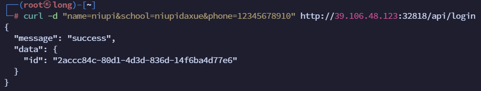
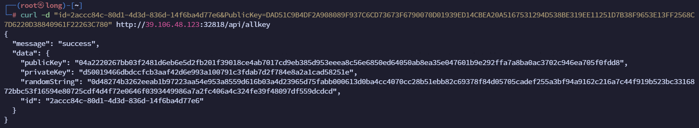
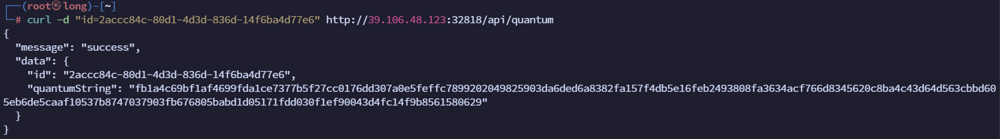

## 题目描述

完整题目背景及描述请见附件。

补充说明：如成功完成题目，flag会显示在/api/search返回的 json中，如果使用工具发包卡顿，可尝试使用 curl发送数据包

（本题下发后，请通过http访问相应的ip和port，例如 nc ip port ，改为http://ip:port/ ；本题启动慢，请静待一会）


## 分析

根据题目给的附件，按照步骤进行操作：

1. 选手上传身份信息（姓名、学校、手机）；`/api/login`
2. 查询选手`id`并记录；`/api/login`
3. 选手生成密钥对**A**(公钥A_Public_Key、私钥A_Private_Key)，将密钥对A的**公钥**(A_Public_Key)传输给服务器；`/api/allkey`
4. 服务器使用国密SM2算法生成密钥对**B**(公钥B_Public_Key、私钥B_Private_Key)，
   1. 使用量子随机数发生器产生16字节**随机数C**；
   2. 服务器首先使用16字节**随机数C**对私钥B_Private_Key采用**SM4ECB**算法加密得到**私钥B_Private_Key密文**；
   3. 然后使用**A_Public_Key**对16字节**随机数C**进行SM2加密得到随机数**C密文**。
5. 选手查询服务器信息，并记录；`/api/allkey`
   1. 选手公钥sm2加密后的随机数**c密文**；
   2. 服务端公钥；
   3. 随机数c明文sm4加密后的服务端**私钥B_Private_Key密文**。 

6. 选手使用私钥A_Private_Key，对随机数C密文进行SM2解密，获取16字节**随机数C明文**；用户使用16字节随机数C明文，对私钥B_Private_Key密文，采用SM4ECB算法解密，得到**私钥B_Private_Key明文**；
7. 选手向服务器请求密钥，服务器使用公钥B_Public_Key明文，对**密钥D**(16字节)采用SM2算法加密，将密钥D密文传输给用户
8. 选手使用私钥B_Private_Key明文，对密钥D密文进行解密，得到**密钥D明文**；`/api/quantum`

7. 选手将密钥D明文，上报至服务器进行验证，服务器返回参赛结果；`/api/check`

8. 选手信息查询得到`flag`。`/api/search`

### 信息记录

```markdown
姓名=niupi
学校=niupidaxue
手机=12345678910

选手公钥A_Public_Key=DAD51C9B4DF2A908089F937C6CD73673F6790070D01939ED14CBEA20A5167531294D538BE319EE11251D7B38F9653E13FF2568C7D6220D38840961F22263C780
选手私钥A_Private_Key=E3BF24F92C062BA1ED1D5933E56E318FC09569098C86DAC0869977B6EA4F3B13

id=2accc84c-80d1-4d3d-836d-14f6ba4d77e6

服务器私钥B_Private_Key密文=d50019466dbdccfcb3aaf42d6e993a100791c3fdab7d2f784e8a2a1cad58251e
服务器随机数C密文=0d48274b3262eeab1b97223aa54e953a8559d616b03a4d23965d75fabb000613d0ba4cc4070cc28b51ebb82c69378f84d05705cadef255a3bf94a9162c216a7c44f919b523bc3316872bbc53f16594e80725cdf4d4f72e0646f0393449986a7a2fc406a4c324fe39f48097df559dcdcd

服务器公钥B_Public_Key明文=04a2220267bb03f2481d6eb6e5d2fb201f39018ce4ab7017cd9eb385d953eeea8c56e6850ed64050ab8ea35e047601b9e292ffa7a8ba0ac3702c946ea705f0fdd8
服务器私钥B_Private_Key明文=
服务器随机数C明文=

密钥D密文=
密钥D明文=


```

## 解题

题目IP：`http://39.106.48.123:32818`

#### 一、上传信息

`curl -d "name=niupi&school=niupidaxue&phone=12345678910" http://39.106.48.123:32818/api/login`



`id=2accc84c-80d1-4d3d-836d-14f6ba4d77e6`

#### 二、上传选手公钥A、获取密钥密文

`curl -d "id=2accc84c-80d1-4d3d-836d-14f6ba4d77e6&PublicKey=DAD51C9B4DF2A908089F937C6CD73673F6790070D01939ED14CBEA20A5167531294D538BE319EE11251D7B38F9653E13FF2568C7D6220D38840961F22263C780" http://39.106.48.123:32818/api/allkey`



1. 服务器私钥B_Private_Key密文：`d50019466dbdccfcb3aaf42d6e993a100791c3fdab7d2f784e8a2a1cad58251e`
2. 服务器随机数C密文：`0d48274b3262eeab1b97223aa54e953a8559d616b03a4d23965d75fabb000613d0ba4cc4070cc28b51ebb82c69378f84d05705cadef255a3bf94a9162c216a7c44f919b523bc3316872bbc53f16594e80725cdf4d4f72e0646f0393449986a7a2fc406a4c324fe39f48097df559dcdcd`
3. 服务器公钥B_Public_Key明文：`04a2220267bb03f2481d6eb6e5d2fb201f39018ce4ab7017cd9eb385d953eeea8c56e6850ed64050ab8ea35e047601b9e292ffa7a8ba0ac3702c946ea705f0fdd8`

##### 密钥密文：

`curl -d "id=2accc84c-80d1-4d3d-836d-14f6ba4d77e6" http://39.106.48.123:32818/api/quantum`



密钥密文：`fb1a4c69bf1af4699fda1ce7377b5f27cc0176dd307a0e5feffc7899202049825903da6ded6a8382fa157f4db5e16feb2493808fa3634acf766d8345620c8ba4c43d64d563cbbd605eb6de5caaf10537b8747037903fb676805babd1d05171fdd030f1ef90043d4fc14f9b8561580629`

#### 三、处理得到的密文信息

1. 用选手私钥通过SM2算法解密随机数C：


2. 
