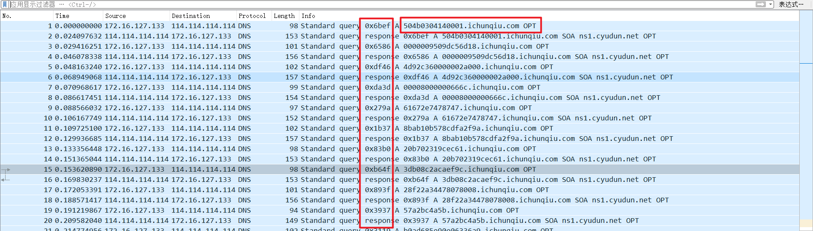
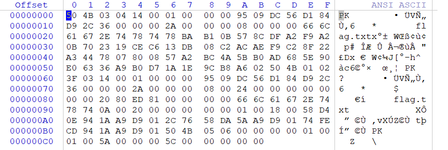

## 题目描述

在小蓝进行应急响应期间，他发现了一些可疑的 DNS 外带流量，这引起了他的关注。经过进一步分析，他怀疑这些流量中隐藏了一些敏感信息或者用于隐蔽通信的数据。

## 解题
下载附件，得到流量包，打开包中**内容**无明显特征，但发现两个明显外部特征：


左边的十六进制数和DNS地址。
进过尝试，前面的十六进制并无特征，猜测在后面的DNS地址上，
仔细观察，第一个包的DNS的前缀为`504b0304140001`；
想到zip文件的文件头为PK（504B）

创建一个空文件改后缀为zip，将每个包的DNS前缀复制上去：
```txt
504b03041400010000009509dc56d184d92c360000002a00000008000000666c61672e74787478bab10b578cdfa2f9a20b702319cec613db08c2acaef9c28f22a3447807800857a2bc4a5bb0ad685e90e06336a9b0d71a1e9cb8a602504b01023f031400010000009509dc56d184d92c360000002a000000080024000000000000002080ed8100000000666c61672e7478740a002000000000000100180058d40e941aa9d9012c7658da5aa9d90174fecd941aa9d901504b050600000000010001005a0000005c0000000000
```

删除重复包流量，得到压缩包：


解压发现有密码，进行爆破：
使用archpr：
选择暴力破解，长度先选择1-8：
等待破解完成：


得到密码smile，解压文件得到`flag{6cdbc0ca-2416-4d11-96e8-2f39e3e1f66f}`
