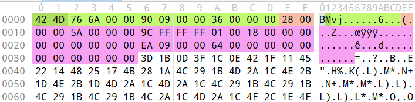
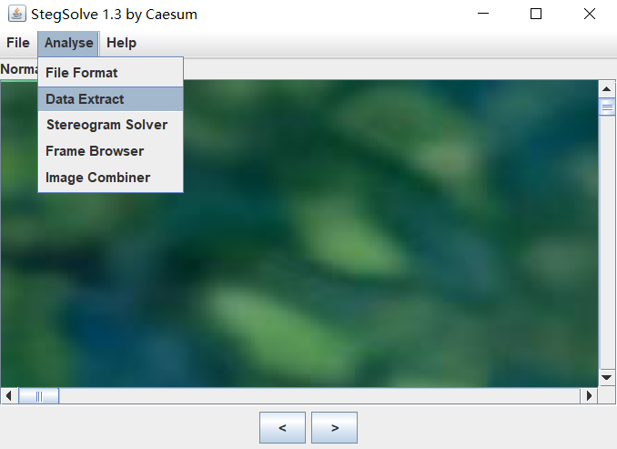
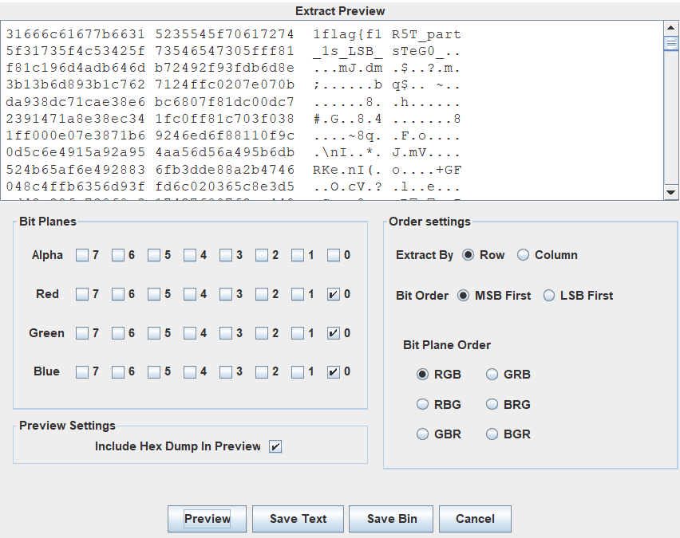
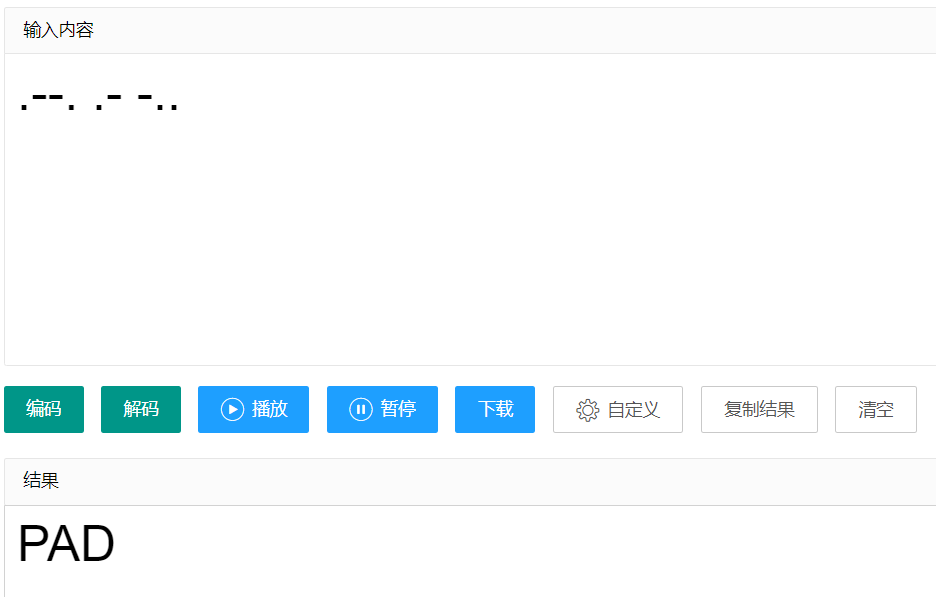

# 题目描述

你会拼图么

> [点击跳转结语](# 结语)

# 前置知识

> BMP（全称Bitmap）是Windows操作系统中的标准图像文件格式，可以分成两类：设备相关位图（DDB）和设备无关位图（DIB），使用非常广。它采用位映射存储格式，除了图像深度可选以外，不采用其他任何压缩，因此，BMP文件所占用的空间很大。BMP文件的图像深度可选lbit、4bit、8bit及24bit。BMP文件存储数据时，图像的扫描方式是按从左到右、从下到上的顺序。由于BMP文件格式是Windows环境中交换与图有关的数据的一种标准，因此在Windows环境中运行的图形图像软件都支持BMP图像格式。


#### bmp文件格式

BMP格式的文件从头到尾依次是如下信息：

- bmp文件头（bmp file header）：共14字节；
- 位图信息头（bitmap information）：共40字节；
- 调色板（color palette）：可选；
- 位图数据；

*如:*



其中绿色的是bmp文件头，粉色为位图信息；

1. bmp文件头
   a. 0-1：`bfType`，表示文件类型，BMP格式的文件这两个字节是0x4D42，字符显示就是‘BM’；
   b. 2-5：`bfSize`，表示文件的大小；
   c. 6-7：`bfReserved1`，保留位，必须设置为0；
   d. 8-9：`bfReserved2`，保留位，必须设置为0；
   e. a-d：`bfOffBits`，4字节的偏移，表示从文件头到位图数据的偏移。

2. 位图信息头

   位图信息头一共40字节，包含如下内容：

| 变量名        | 大小  | 作用                                                                      |
| ---------- | --- | ----------------------------------------------------------------------- |
| `biSize`   | 4字节 | **信息头的大小**，即40；                                                         |
| `biWidth`  | 4字节 | 以像素为单位说明图像的**宽度**；                                                      |
| `biHeight` | 4字节 | 以像素为单位说明图像的**高度**，同时如果为**正**，**说明位图倒立**（即数据表示从图像的左下角到右上角），如果为**负说明正向**； |
| ...        | ... | ...                                                                     |

# 解题思路

下载附件，发现是很多`bmp`图片，根据对`bmp`文件的分析，我们知道想要拼接`bmp`图片，需要知道它的`x，y，width，height`信息，而这些信息都在图片中

> CTF中，`tmp`类型的拼图，因为`tmp`文件特性，在文件头的位置会有其在原图片上的位置坐标。
>
> 因为文件头中其他字段都有用，所以`x，y`坐标一般在文件头中的两个保留字段中

所以这些信息位置是：

- `x= file[6:8]`
- `y= file[8:10]`
- `width = file[0x12:0x16]`
- `width = file[0x16:0x1A]`

编写代码，首先计算原图片大小，然后根据坐标对小图片进行拼接

代码如下：

```python
from PIL import Image, ImageOps
import os

# 计算原图片大小
files = os.listdir('D:/ctfbase/LanQiao/Misc/puzzle/tmp4/')  # 列出指定目录下的文件和子目录赋给files,返回的是列表
size = []  # 用来存储每个图大小
for i in files:
    with open('D:/ctfbase/LanQiao/Misc/puzzle/tmp4/' + i, 'rb') as f:
        data = f.read()  # 得到的data值类型是bytes，需要将其转换成int型
    x = int.from_bytes(data[6:8], 'little')  # 用litte是因为数据存储时前面的数据储存在高位
    y = int.from_bytes(data[8:10], 'little')
    width = int.from_bytes(data[0x12:0x16], 'little')
    # height = int.from_bytes(data[0x16:0x1A], 'little')
    height = 100
    size.append([(y, x), (height, width)])
sorted_size = sorted(size, key=lambda x: x[0])  # 按照第一位进行排序,即（y,x）排序
print(sorted_size)
imgwidth = sorted_size[-1][0][1] + sorted_size[-1][1][1]
imgheigth = sorted_size[-1][0][0] + sorted_size[-1][1][0]
print(imgwidth, imgheigth)


# 拼接图片
img_mod = Image.open('D:/ctfbase/LanQiao/Misc/puzzle/tmp4/16993501.bmp')
image = Image.new(img_mod.mode, (imgwidth, imgheigth))

for i in files:
    with open('D:/ctfbase/LanQiao/Misc/puzzle/tmp4/' + i, 'rb') as f:
        data = f.read()
    x = int.from_bytes(data[6:8], 'little')
    y = int.from_bytes(data[8:10], 'little')
    
    img = Image.open('D:/ctfbase/LanQiao/Misc/puzzle/tmp4/' + i)
    
    image.paste(img, (x, y))
image.save('D:/ctfbase/LanQiao/Misc/puzzle/flag.bmp')
print('已保存图片，路径为：D:/ctfbase/LanQiao/Misc/puzzle/flag.bmp')

```

得到图片1：


发现有一部分小图片是反的，我们通过判断height的正负来翻转反的图片

```python
height = int.from_bytes(data[0x16:0x1A], 'little', signed=True)	# signed=True代表该值带正负
```

更改代码得到完整的图片：

```python
...
# 拼接图片
img_mod = Image.open('D:/ctfbase/LanQiao/Misc/puzzle/tmp4/16993501.bmp')
image = Image.new(img_mod.mode, (imgwidth, imgheigth))

for i in files:
    with open('D:/ctfbase/LanQiao/Misc/puzzle/tmp4/' + i, 'rb') as f:
        data = f.read()
    x = int.from_bytes(data[6:8], 'little')
    y = int.from_bytes(data[8:10], 'little')
    height = int.from_bytes(data[0x16:0x1A], 'little', signed=True)     # 判断该图片是否被翻转，signed=True代表该值带正负
    img = Image.open('D:/ctfbase/LanQiao/Misc/puzzle/tmp4/' + i)
    if height < 0:      # 代表该图片被翻转
        img = ImageOps.flip(img)    # 用flip函数翻转图片
        print('该图片为反，已翻转')
    image.paste(img, (x, y))
image.save('D:/ctfbase/LanQiao/Misc/puzzle/flag.bmp')
print('已保存图片，路径为：D:/ctfbase/LanQiao/Misc/puzzle/flag.bmp')
...
```


使用图片隐写神器`stegsolve`查看，并对其进行数据提取：



选择RGB的最低位通道，作用是在于把最低位的二进制全部提取出来：



可以看到有flag，但是只有一部分，`flag{f1R5T_part_1s_LSB_sTeG0_`，还有一部分，好像思路又断了，但是在之前拼接图片时，有部分图片是反的猜测这些数据是不是就是flag的另一部分，更改代码，将图片通过二进制表示出来，翻转的图片为`0`，未翻转的为`1`：

```python
......
# 拼接图片
img_mod = Image.open('D:/ctfbase/LanQiao/Misc/puzzle/tmp4/16993501.bmp')
image = Image.new(img_mod.mode, (imgwidth, imgheigth))
bindata = []
for i in files:
    with open('D:/ctfbase/LanQiao/Misc/puzzle/tmp4/' + i, 'rb') as f:
        data = f.read()
    x = int.from_bytes(data[6:8], 'little')
    y = int.from_bytes(data[8:10], 'little')
    height = int.from_bytes(data[0x16:0x1A], 'little', signed=True)     # 判断该图片是否被翻转，signed=True代表该值带正负
    img = Image.open('D:/ctfbase/LanQiao/Misc/puzzle/tmp4/' + i)
    if height < 0:      # 代表该图片被翻转
        temp = '0'
        img = ImageOps.flip(img)    # 用flip函数翻转图片
        # print('该图片为反，已翻转')
    else:
        temp = '1'
    image.paste(img, (x, y))
    bindata.append([(y, x), temp])  # 将得到的二进制数据放入bindata数组中，在加入x，y方便排序图片顺序
image.save('D:/ctfbase/LanQiao/Misc/puzzle/flag.bmp')
print('已保存图片，路径为：D:/ctfbase/LanQiao/Misc/puzzle/flag.bmp')

# 排序二进制数据
bindata_sorted = sorted(bindata, key=lambda x: x[0])
b2_flag = ''

# 得到二进制数据
for i in bindata_sorted:
    b2_flag += i[1]
print(long_to_bytes(int(b2_flag, 2)))   # 以二进制形式输出b2_flag字符串
......
```

得到flag的di二部分：`2nd_paRT_15_reVeRSe_bMp_`

并且在flag2后面还有一段摩斯密码`.--. .- -..`，猜测是对第三部分flag的提示




解码得到`PAD`，想到`python`的`pad`函数，也就是填充函数，

> 考虑到bmp文件特性，bmp是按⾏绘制的，每⾏数据都需要为4的倍数，当像素数据不满⾜这个条件时，会⾃动填充相应字节的0。而在这道题中出题人很明显修改了这个填充的值，我们需要把这个值按照拼图的排列方式提取出来。

所以我们需要再次对小图片进行操作，将文件后面多出来的填充字段进行提取；

代码如下：

```python
......
# 第三部分flag代码
files = os.listdir('D:/ctfbase/LanQiao/Misc/puzzle/tmp4/')
sorted_data = []

for i in files:
    with open('D:/ctfbase/LanQiao/Misc/puzzle/tmp4/' + i, 'rb') as f:
        data = f.read()
    x = int.from_bytes(data[6:8], 'little')
    y = int.from_bytes(data[8:10], 'little')
    width = int.from_bytes(data[0x12:0x16], 'little', signed=True)
    if 4 - 3 * width % 4 == 4:
        padding_size = 0
    else:
        padding_size = 4 - 3 * width % 4
    img_data_size = 3 * width
    length = len(data[54:])
    img_data = data[54:]
    padding_data = b''
    for j in range(img_data_size, length, img_data_size + padding_size):
        padding_data += img_data[j:j + padding_size]
    sorted_data.append([(y, x), padding_data])
sorted_data = sorted(sorted_data, key=lambda x: x[0])

padding_wenjian = b''
for i in sorted_data:
    padding_wenjian += i[1]
print(padding_wenjian[:1000])
with open('D:/ctfbase/LanQiao/Misc/puzzle/3_flag', 'wb') as f:
    f.write(padding_wenjian)
......
```

通过winhex查看数据发现该文件的文件头与jpg一样，直接改成jpg格式：得到图片，看到图片中是第三部分flag：

`3rd_ parT_ 1s_ paddINGINGING}`


拼接flag得到完整flag：

[点击跳转](1)

下面是完整代码：

```python
from PIL import Image, ImageOps
import os
from Crypto.Util.number import long_to_bytes

# 计算原图片大小
files = os.listdir('D:/ctfbase/LanQiao/Misc/puzzle/tmp4/')  # 列出指定目录下的文件和子目录赋给files,返回的是列表
size = []  # 用来存储每个图大小
for i in files:
    with open('D:/ctfbase/LanQiao/Misc/puzzle/tmp4/' + i, 'rb') as f:
        data = f.read()  # 得到的data值类型是bytes，需要将其转换成int型
    x = int.from_bytes(data[6:8], 'little')  # 用litte是因为数据存储时前面的数据储存在高位
    y = int.from_bytes(data[8:10], 'little')
    width = int.from_bytes(data[0x12:0x16], 'little')
    # height = int.from_bytes(data[0x16:0x1A], 'little')
    height = 100
    size.append([(y, x), (height, width)])
sorted_size = sorted(size, key=lambda x: x[0])  # 按照第一位进行排序,即（y,x）排序

imgwidth = sorted_size[-1][0][1] + sorted_size[-1][1][1]
imgheigth = sorted_size[-1][0][0] + sorted_size[-1][1][0]


# 拼接图片
img_mod = Image.open('D:/ctfbase/LanQiao/Misc/puzzle/tmp4/16993501.bmp')
image = Image.new(img_mod.mode, (imgwidth, imgheigth))
bindata = []
for i in files:
    with open('D:/ctfbase/LanQiao/Misc/puzzle/tmp4/' + i, 'rb') as f:
        data = f.read()
    x = int.from_bytes(data[6:8], 'little')
    y = int.from_bytes(data[8:10], 'little')
    height = int.from_bytes(data[0x16:0x1A], 'little', signed=True)     # 判断该图片是否被翻转，signed=True代表该值带正负
    img = Image.open('D:/ctfbase/LanQiao/Misc/puzzle/tmp4/' + i)
    if height < 0:      # 代表该图片被翻转
        temp = '0'
        img = ImageOps.flip(img)    # 用flip函数翻转图片
        # print('该图片为反，已翻转')
    else:
        temp = '1'
    image.paste(img, (x, y))
    bindata.append([(y, x), temp])  # 将得到的二进制数据放入bindata数组中，在加入x，y方便排序图片顺序
image.save('D:/ctfbase/LanQiao/Misc/puzzle/1_flag.bmp')
print('已保存图片1_flag.bmp，路径为：D:/ctfbase/LanQiao/Misc/puzzle/1_flag.bmp')

bindata_sorted = sorted(bindata, key=lambda x: x[0])    # 排序二进制数据
b2_flag = ''
for i in bindata_sorted:    # 得到二进制数据
    b2_flag += i[1]
print("flag2数据：", long_to_bytes(int(b2_flag, 2)))   # 以二进制形式输出b2_flag字符串


# 第三部分flag代码
files = os.listdir('D:/ctfbase/LanQiao/Misc/puzzle/tmp4/')
sorted_data = []

for i in files:
    with open('D:/ctfbase/LanQiao/Misc/puzzle/tmp4/' + i, 'rb') as f:
        data = f.read()
    x = int.from_bytes(data[6:8], 'little')
    y = int.from_bytes(data[8:10], 'little')
    width = int.from_bytes(data[0x12:0x16], 'little', signed=True)
    if 4 - 3 * width % 4 == 4:
        padding_size = 0
    else:
        padding_size = 4 - 3 * width % 4
    img_data_size = 3 * width
    length = len(data[54:])
    img_data = data[54:]
    padding_data = b''
    for j in range(img_data_size, length, img_data_size + padding_size):
        padding_data += img_data[j:j + padding_size]
    sorted_data.append([(y, x), padding_data])
sorted_data = sorted(sorted_data, key=lambda x: x[0])

padding_wenjian = b''
for i in sorted_data:
    padding_wenjian += i[1]
print(padding_wenjian[:1000])
with open('D:/ctfbase/LanQiao/Misc/puzzle/3_flag', 'wb') as f:
    f.write(padding_wenjian)

flag1 = 'flag{f1R5T_part_1s_LSB_sTeG0_'
flag2 = '2nd_paRT_15_reVeRSe_bMp_'
flag3 = '3rd_parT_1s_paddINGINGING}'

print(flag1 + flag2 + flag3)

# flag{f1R5T_part_1s_LSB_sTeG0_2nd_paRT_15_reVeRSe_bMp_3rd_parT_1s_paddINGINGING}
```


# 结语

**79**位的flag。。。人麻了，纯纯有病！！！

1. 第一个flag需要知道bmp的文件头信息，根据这些信息得到原图大小，在将每个小图片在新建大小画布上进行拼接得到原图，再将原图通过图片隐写神器提取数据得到flag1；
2. 第二个flag需要注意在拼接第一个flag是会出现的图片翻转的问题，根据此猜测，由于图片翻转只有两种情况（正反），想到二进制`0 1`，在将flag1得到的图片通过`0 1`输出，再将二进制数据转换成字节类型得到flag2和一个flag3的提示；
3. 第三个flag需要根据flag2后出现的摩斯密码`PAD`，搜索`python PAD`得知PAD是python中的填充函数，猜测flag3与填充有关，在根据bmp打印时是按行打印，并且打印数据必须是4的倍数，少的填充0，二在本题中作者更改了填充的0为其他数据，需要我们将这些填充的数据提取出来，提取出后，查看提取数据的特征，发现首部与jpg文件头相同，猜测该数据是一段jpg图片，将其输出为jpg图片，得到flag3


