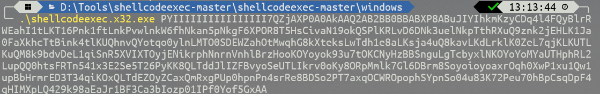
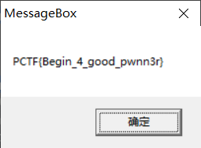

## 题目描述
作为一个黑客，怎么能不会使用shellcode?
这里给你一段shellcode，你能正确使用并最后得到flag吗？

文件：[shellcode](https://static2.ichunqiu.com/icq/resources/fileupload/phrackCTF/basic/shellcode)
flag格式：PCTF{flag}

## 解题
下载打开，是一段shellcode代码，搜索得知有一个shellcode代码运行器
[GitHub - bdamele/shellcodeexec: Script to execute in memory a sequence of opcodes](https://github.com/bdamele/shellcodeexec)

下载好后再cmd中运行代码：

弹窗得到flag：`PCTF{Begin_4_good_pwnn3r}`

