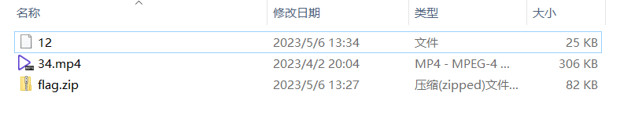
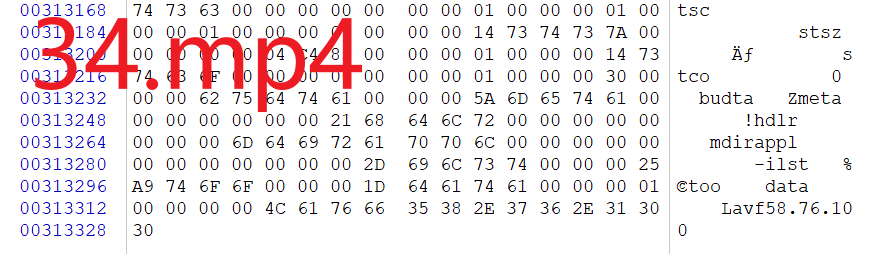
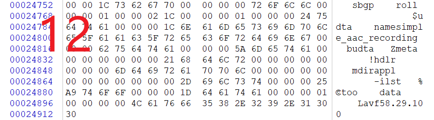
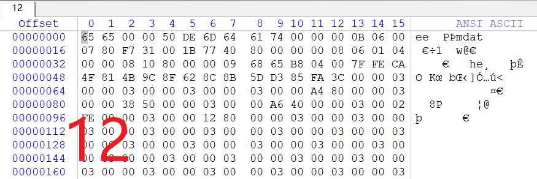
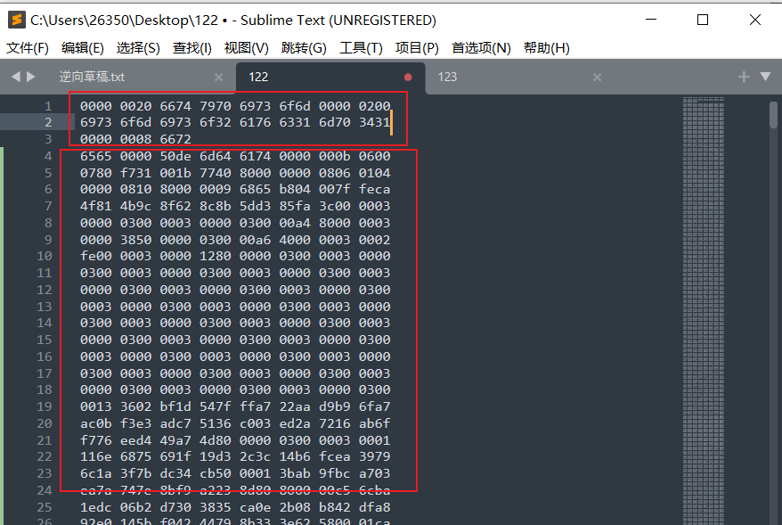
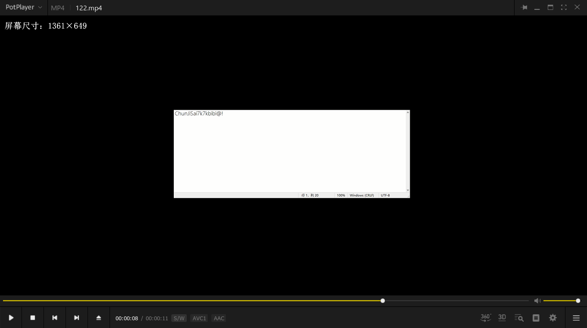
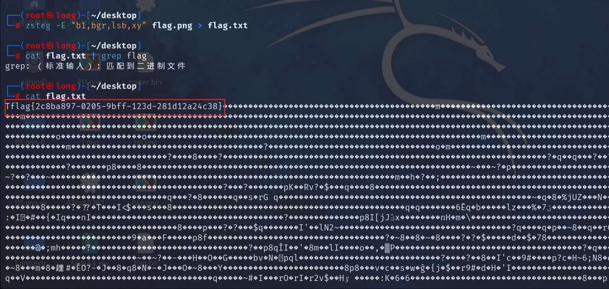

## 题目描述

无信息

## 解题

下载附件，打开有三个文件，`flag.zip`中有张图片，但是需要密码，下一步应该就是找到密码查看两个文件，`34.mp4`中没有相关有用信息，文件无后缀。

​    

用`winhex`查看他们的16进制数据，发现两个文件尾部信息非常相似，猜测文件`12`也是`mp4`文件，但是没有文件头，我们将`34.mp4`的文件头补全`12`的文件头

尾部信息：

​    

​    

头部信息：

在34.mp4中搜索6565关键信息，将6565前面的信息填充到文件12中（可以分别将12所有数据和34.MP4需要数据都复制至新文件，然后再将两个文件的内容合并），然后将合并之后的文件修改后缀为mp4，可以看到可以打开正常播放视频

可以看到一段信息，将该字符串（`ChunJiSai7k7kbibi@!`）作为密码解压`flag.zip`文件得到图片`flag.png`

​    

在kali中用图片隐写查看神器`zsteg`摘取所有特征

可以发现在`b1,bgr,lsb,xy`通道中发现有flag部分信息，再用-E选项进行详细操作

得到`flag：flag{2c8ba897-0205-9bff-123d-281d12a24c38}`

