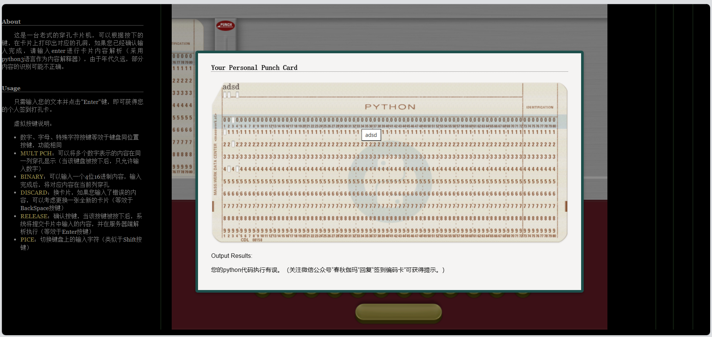
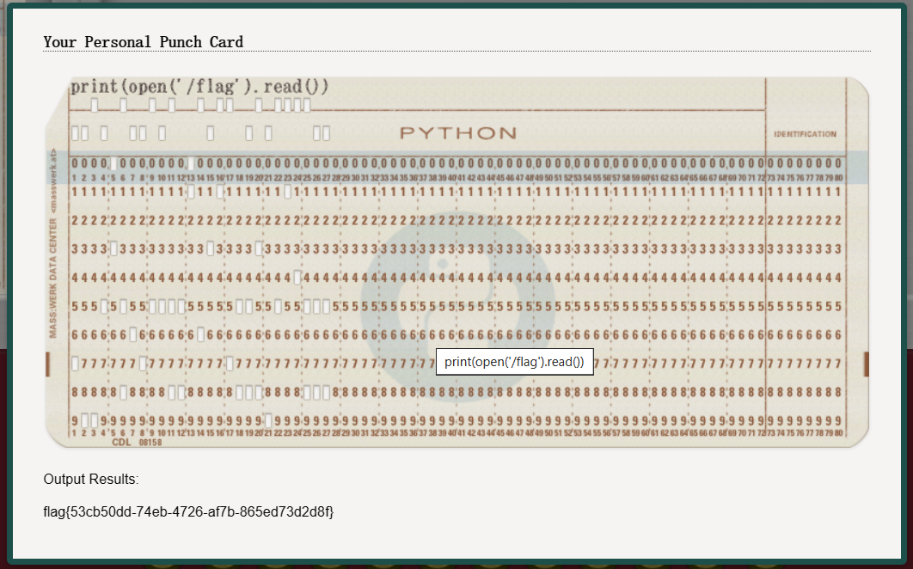

## 题目描述

早在1928年，IBM发明了80列、矩形孔卡片，并将它们用于数字计算机中，开启
了穿孔卡片在计算领域中的应用之路。随着技术的进步，穿孔卡片的字符表示方式
也不断更新，从6比特的BCDIC发展到1964年8比特的EBCDIC。
现在，春秋GAME伽玛实验室团队模拟了一台IBM 029型打孔机，再通过模拟IBM
System/360功能，让其具备了执行代码命令的功能。请点击下发按钮，跟随着打
孔机的滴答声，重返计算科技的辉煌岁月~!

## 解题

先输入几个字符测试

（`Output Results`：您的`python`代码执行有误。（关注微信公众号“春秋伽玛”回复“签到编码卡”可获得提示。））

按照要求关注得到提示`print(open('/etc/passwd').read())`

先尝试看根目录下有无flag文件并尝试输出：`print(open('/flag').read())`

直接得到`flag：flag{53cb50dd-74eb-4726-af7b-865ed73d2d8f}`

