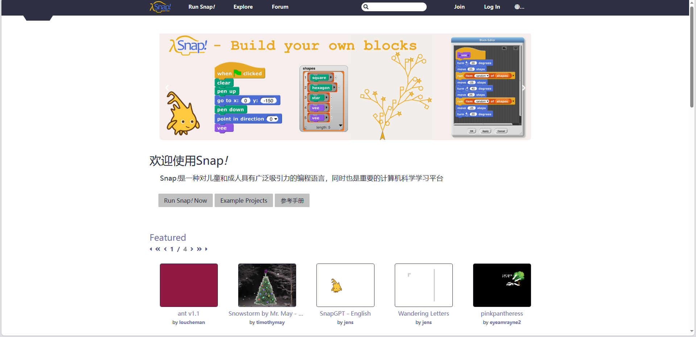
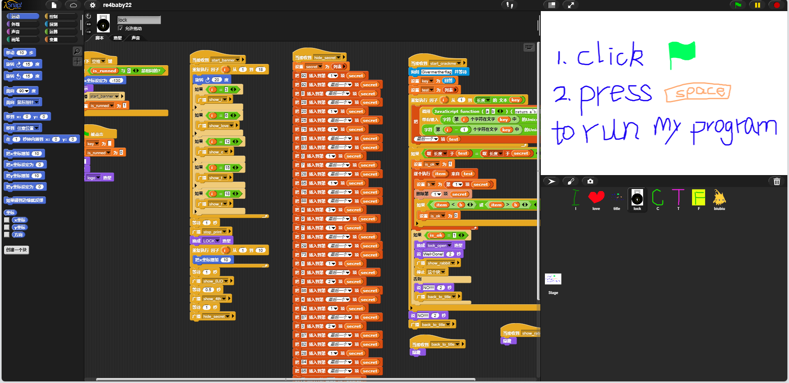

## 题目描述

baby也能做出来的RE

## 解题

下载附件，一个`xml`文件，打开可以看待一系列代码，但是看不懂，搜索flag看到关键字`flag{o_shit_i_dont_know_that}`和一个`test`数组，在题目中尝试发现并不是正确答案，

*换条思路*

在文件开头发现一个网站，进入发现是一个儿童编程学习网站环境，进入



搜索得知`snap`是一个在线的编程环境，并且可以在`github`上找到克隆到本地，点击`run`进入在线环境（可调整语言为中文），打开题目文件



可以在`lock`中看到flag验证过程

有两个变量`key`，`test`和一个数组`secret`，调用函数，参数分别为`a`，`b`；`a = key[i]`， `b = key[i - 1]`，将a和b进行异或操作，将得到的值写入`test`数组中，最后将得到的`test`数组与`secret`进行比对相等，则程序正常运行。根据程序的执行流程可以看出`key`就是我们输入的`flag`，根据此写出解题代码如下：

```c
#include <stdio.h>
#include <stdlib.h>
#include <string.h>

int main(){
    int test[] = { 102,10,13,6,28,74,3,1,3,7,85,0,4,75,20,92,92,8,28,25,81,83,7,28,76,88,9,0,29,73,0,86,4,87,87,82,84,85,4,85,87,30 };
    for(int i = 1; i < 43; i++){
        test[i] = test[i - 1] ^ test[i];
        printf("%c", test[i - 1]);
    }
    return 0;
}
// flag{12307bbf-9e91-4e61-a900-dd26a6d0ea4c}
```

