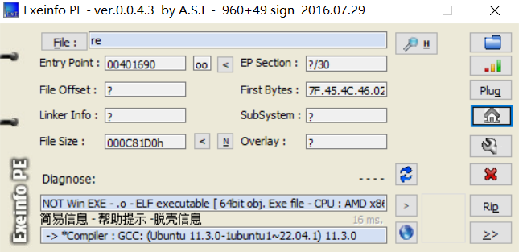
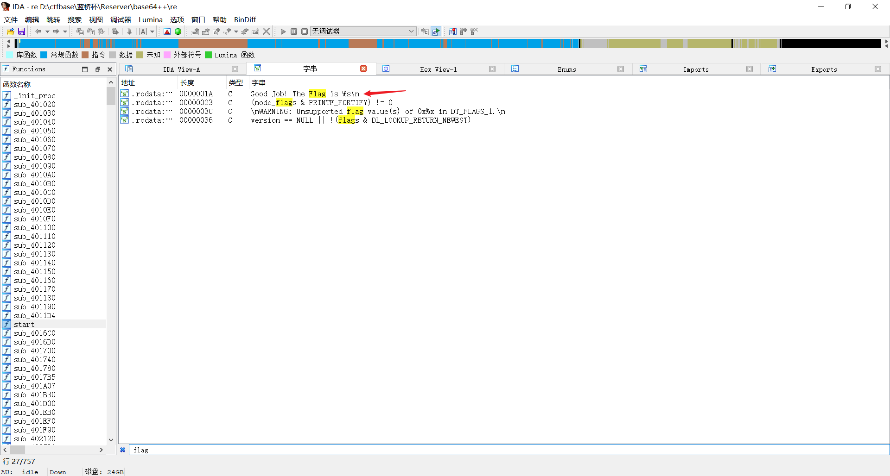
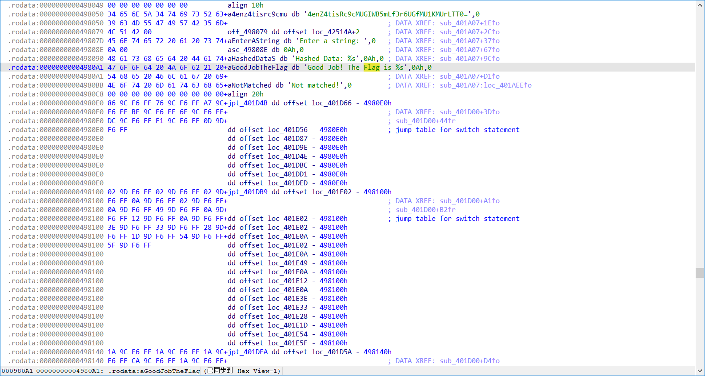
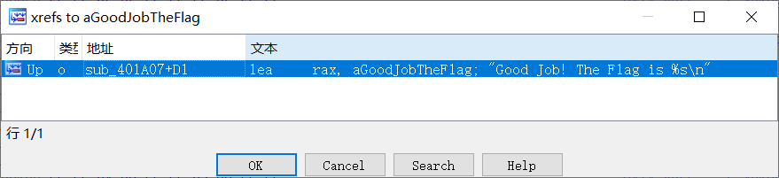
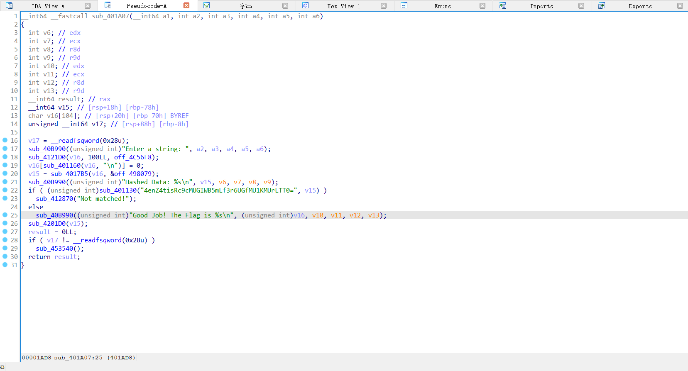
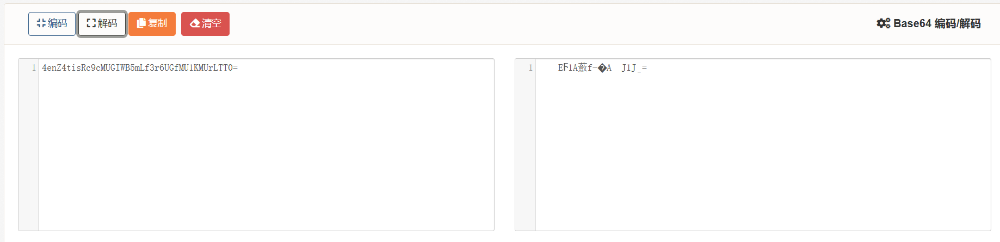
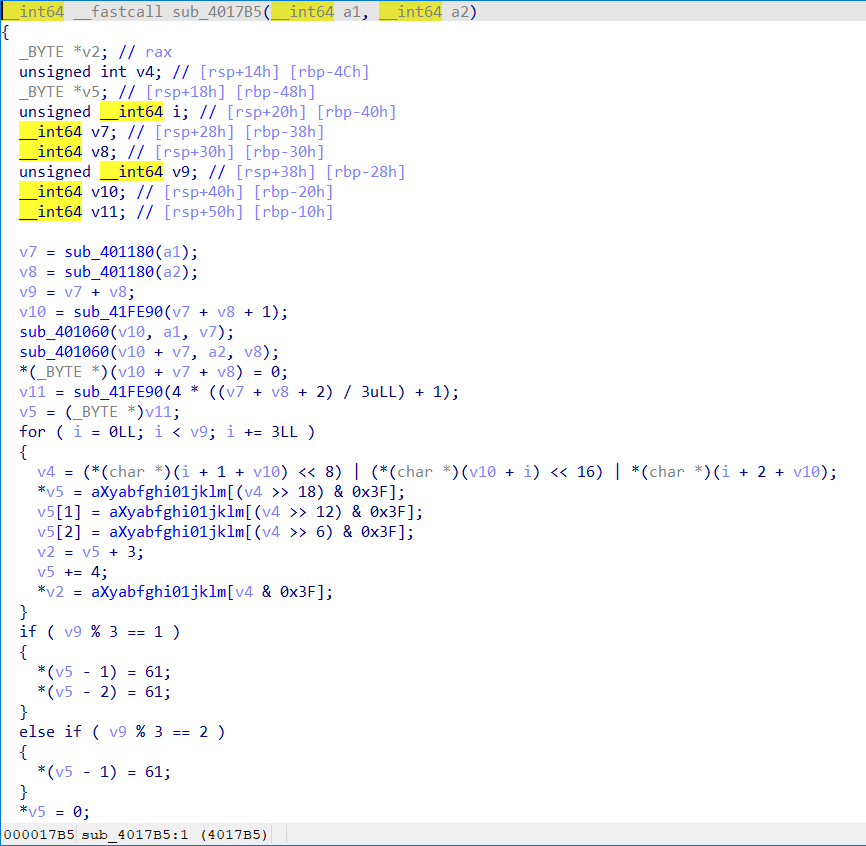
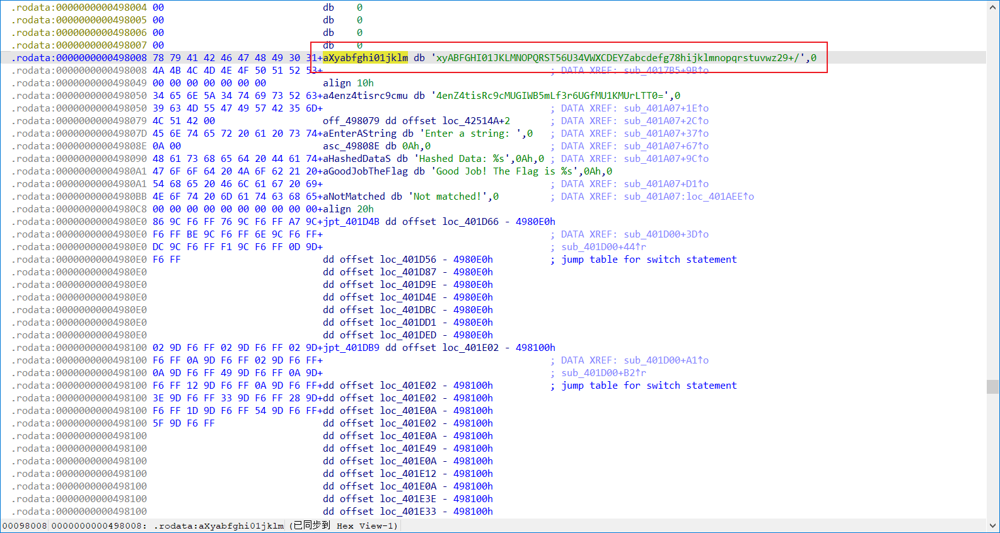

# Reverse--Base64++

## 题目描述

小蓝同学再给你发来一个可执行文件， 说是一个逆向工程和base64编码
的挑战，看看你能否解开。

## 解题

猜测与`base64`相关；

1、先扔到`exeinfope`中查看有没有加壳



可以看到并未加壳，并且可以看到相关信息（C语言编写，64为的elf程序）

2、将其扔到`64`为IDA中查看

1.在左侧函数框中搜索`main`函数，发现没有`main`函数，改变思路使用`shift+F12`可以查看字符串，在其中搜索关键字`flag`可以看到



双击进入可以跳转到该语句在程序中的位置，选择`flag`使用`Ctrl+x`进行交叉引用，可以知道该语句在那个函数中被调用



​    

继续跳转到正确主函数位置，按`F5`进行反汇编查看伪C代码



对代码进行查看可以知道一些信息：`v16`是我们输入的`flag`，`v15`是程序计算的`hash`值，再根据程序信息不难推断出程序的大概执行流程：

1. 先输入`flag`；
2. 再将flag计算hash值后与一个出题者给出的hash只进行比较，若相同则表示flag正确。

并且根据给定的`hash`特征和题目描述可以知道是`base64`编码，先用`base64`网站将`4enZ4tisRc9cMUGIWB5mLf3r6UGfMU1KMUrLTT0=`进行解码



可以看到结果明显不对，继续查看代码：

跟踪程序对`v15`变量进行操作的`sub_4017B5`函数，双击进入



可以看出确实是`base64`编码的函数，查看其中进行编码的转换表`aXyabfghi01jklm[]`双击可以看到该数组的内容



可以看到该表并不是正常的`base64`转换表，而是变表。

## 二、结题

根据上面分析的信息，写出结题`exp`，不用关注其它代码，可以套用（建议自行学习一下base64编码代码编写），重点关注编码表。运行程序得到最终`flag{6JOd5qGl5p2v5Yqg5rK5}`。

*注*：`elf`程序是典型的`linux`可执行文件。

```c
#include <stdio.h>
#include <stdlib.h>
#include <string.h>

// 定义base64编码表, 共64个；解码表，共256个
    unsigned char base64_entable[64] = {
        'x', 'y', 'A', 'B', 'F', 'G', 'H', 'I', '0', '1', 'J', 'K', 
        'L', 'M', 'N', 'O', 'P', 'Q', 'R', 'S', 'T', '5', '6', 'U', 
        '3', '4', 'V', 'W', 'X', 'C', 'D', 'E', 'Y', 'Z', 'a', 'b', 
        'c', 'd', 'e', 'f', 'g', '7', '8', 'h', 'i', 'j', 'k', 'l', 
        'm', 'n', 'o', 'p', 'q', 'r', 's', 't', 'u', 'v', 'w', 'z', 
        '2', '9', '+', '/'}, base64_detable[256];
 
// 输出解码表，在解码时使用
void de_table(unsigned char *encode_table, unsigned char *decode_table){
    unsigned char c;
    for (int i = 0; i < 256; i++){
        decode_table[i] = 255;
    }
    for (int i = 0; i < 64; i++){
        c = encode_table[i];
        decode_table[(int)c] = i;
    }
}
 
static char cmove_bits(unsigned char src, unsigned lnum, unsigned rnum) {
    src <<= lnum; // src = src << lnum;
    src >>= rnum; // src = src >> rnum;
    return src;
}
 
int base64_encode(const char *indata, int inlen, char *outdata, int *outlen) {
 
    int ret = 0; // return value
    if (indata == NULL || inlen == 0) {
        return ret = -1;
    }
    int i;
    int in_len = 0; // 源字符串长度, 如果in_len不是3的倍数, 那么需要补成3的倍数
    int pad_num = 0; // 需要补齐的字符个数, 这样只有2, 1, 0(0的话不需要拼接, )
    if (inlen % 3 != 0) {
        pad_num = 3 - inlen % 3;
    }
    in_len = inlen + pad_num; // 拼接后的长度, 实际编码需要的长度(3的倍数)
 
    int out_len = in_len * 8 / 6; // 编码后的长度
 
    char *p = outdata; // 定义指针指向传出data的首地址
 
    //编码, 长度为调整后的长度, 3字节一组
    for (i = 0; i < in_len; i+=3) {
        int value = *indata >> 2; // 将indata第一个字符向右移动2bit(丢弃2bit)
        char c = base64_entable[value]; // 对应base64转换表的字符
        *p = c; // 将对应字符(编码后字符)赋值给outdata第一字节
 
        //处理最后一组(最后3字节)的数据
        if (i == inlen + pad_num - 3 && pad_num != 0) {
            if(pad_num == 1) {
                *(p + 1) = base64_entable[(int)(cmove_bits(*indata, 6, 2) + cmove_bits(*(indata + 1), 0, 4))];
                *(p + 2) = base64_entable[(int)cmove_bits(*(indata + 1), 4, 2)];
                *(p + 3) = '=';
            } else if (pad_num == 2) { // 编码后的数据要补两个 '='
                *(p + 1) = base64_entable[(int)cmove_bits(*indata, 6, 2)];
                *(p + 2) = '=';
                *(p + 3) = '=';
            }
        } else { // 处理正常的3字节的数据
            *(p + 1) = base64_entable[cmove_bits(*indata, 6, 2) + cmove_bits(*(indata + 1), 0, 4)];
            *(p + 2) = base64_entable[cmove_bits(*(indata + 1), 4, 2) + cmove_bits(*(indata + 2), 0, 6)];
            *(p + 3) = base64_entable[*(indata + 2) & 0x3f];
        }
 
        p += 4;
        indata += 3;
    }
 
    if(outlen != NULL) {
        *outlen = out_len;
    }
 
    return ret;
}
 
 
int base64_decode(const char *indata, int inlen, char *outdata, int *outlen) {
    de_table(base64_entable, base64_detable);
    int ret = 0;
    if (indata == NULL || inlen <= 0 || outdata == NULL || outlen == NULL) {
        return ret = -1;
    }
    if (inlen % 4 != 0) { // 需要解码的数据不是4字节倍数
        return ret = -2;
    }
 
    int t = 0, x = 0, y = 0, i = 0;
    unsigned char c = 0;
    int g = 3;
 
    while (indata[x] != 0) {
        // 需要解码的数据对应的ASCII值对应base64_detable的值
        c = base64_detable[indata[x++]];
        if (c == 255) return -1;// 对应的值不在转码表中
        if (c == 253) continue;// 对应的值是换行或者回车
        if (c == 254) { c = 0; g--; }// 对应的值是'='
        t = (t<<6) | c; // 将其依次放入一个int型中占3字节
        if (++y == 4) {
            outdata[i++] = (unsigned char)((t>>16)&0xff);
            if (g > 1) outdata[i++] = (unsigned char)((t>>8)&0xff);
            if (g > 2) outdata[i++] = (unsigned char)(t&0xff);
            y = t = 0;
        }
    }
    if (outlen != NULL) {
        *outlen = i;
    }
    return ret;
}


int main(){
    char message[] = "enstr";
    char cipher[] = "4enZ4tisRc9cMUGIWB5mLf3r6UGfMU1KMUrLTT0="; //注意长度要给够
    int len = 0;

    // base64_encode(str1,(int)strlen(str1),str2,&len);
    // printf("%s, len = %d\n", str2, len);
    
    char str3[64] = {0};
    base64_decode(cipher, (int)strlen(cipher), str3, &len);
    
    printf("%s, len = %d\n", str3, len);
    
    
    return 0;
}
```

由于我的电脑中有`bsae64`的算法代码，我就直接拿来用，还可以尝试使用`python`库实现。

