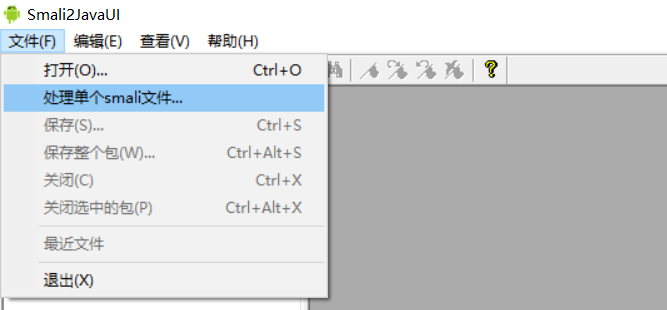
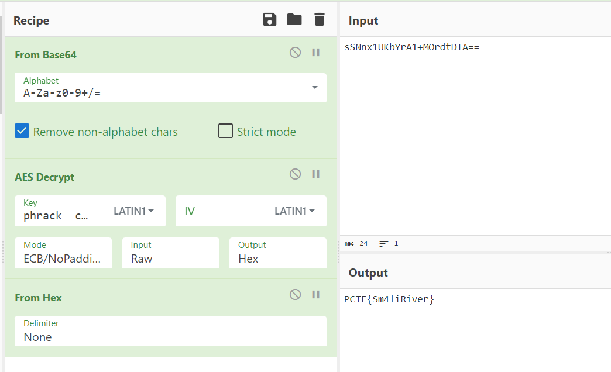

## 题目描述
都说学好Smali是学习Android逆向的基础，现在刚好有一个smali文件，大家一起分析一下吧~~

## 解题
下载附件，如题所述是一个smali文件，搜索得知这是一种语言，因为题目说与android有关，
进而搜索两者关系，得知有工具可以将smali语言编译为java语言
[Smali2Java.zip_免费高速下载|百度网盘-分享无限制 (baidu.com)](https://pan.baidu.com/s/1Cr1E4Cw7d_djRkU92R12kQ)



点击处理文件，得到java代码：
```java
/**
  * Generated by smali2java 1.0.0.558
  * Copyright (C) 2013 Hensence.com
  */

package net.bluelotus.tomorrow.easyandroid;

import android.util.Base64;
import java.io.PrintStream;
import java.security.NoSuchAlgorithmException;
import javax.crypto.NoSuchPaddingException;
import java.security.InvalidKeyException;
import javax.crypto.IllegalBlockSizeException;
import javax.crypto.BadPaddingException;
import javax.crypto.spec.SecretKeySpec;
import javax.crypto.Cipher;
import java.security.Key;
import java.security.GeneralSecurityException;

public class Crackme {
    private String str2 = "cGhyYWNrICBjdGYgMjAxNg==";
    
    public Crackme() {
        GetFlag("sSNnx1UKbYrA1+MOrdtDTA==");
    }
    
    private String GetFlag(String p1) {
        byte[] "content" = Base64.decode(p1.getBytes(), 0x0);
        String "kk" = new String(Base64.decode(str2.getBytes(), 0x0));
        System.out.println(decrypt("content", "kk"));
        return null;
    }
    
    private String decrypt(byte[] p1, String p2) {
        String "m" = 0x0;
        try {
            byte[] "keyStr" = p2.getBytes();
            SecretKeySpec "key" = new SecretKeySpec("keyStr", "AES");
            Cipher "cipher" = Cipher.getInstance("AES/ECB/NoPadding");
            "cipher".init(0x2, "key");
            byte[] "result" = "cipher".doFinal(p1);
            return "m";
        } catch(NoSuchPaddingException "e") {
            "e".printStackTrace();
        }
        return  "m";
    }
}

```

可以看到代码将两个base64字符串分别进行解码作为decrypt函数的参数：
将两个字符串解码后得知
- `cGhyYWNrICBjdGYgMjAxNg==`解码后为`phrack  ctf 2016`；
- `sSNnx1UKbYrA1+MOrdtDTA==`解码后为乱码

在根据decrypt函数使用的是AES加密，不难得到两个一个是作为密钥，一个作为密文。
用CyberChef解密得到flag：`PCTF{Sm4liRiver}`



