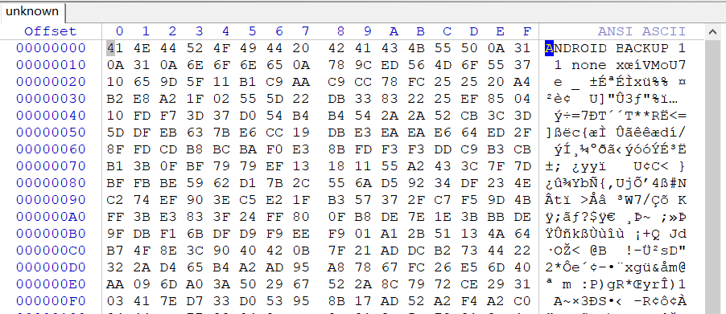
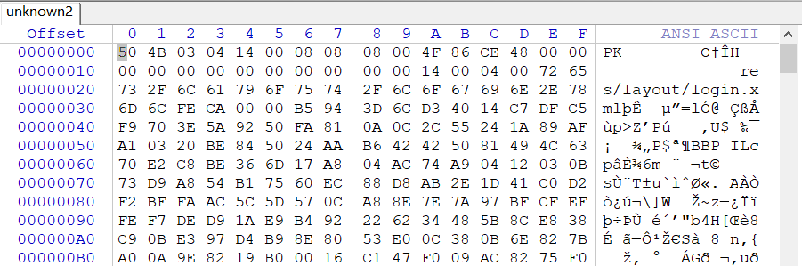
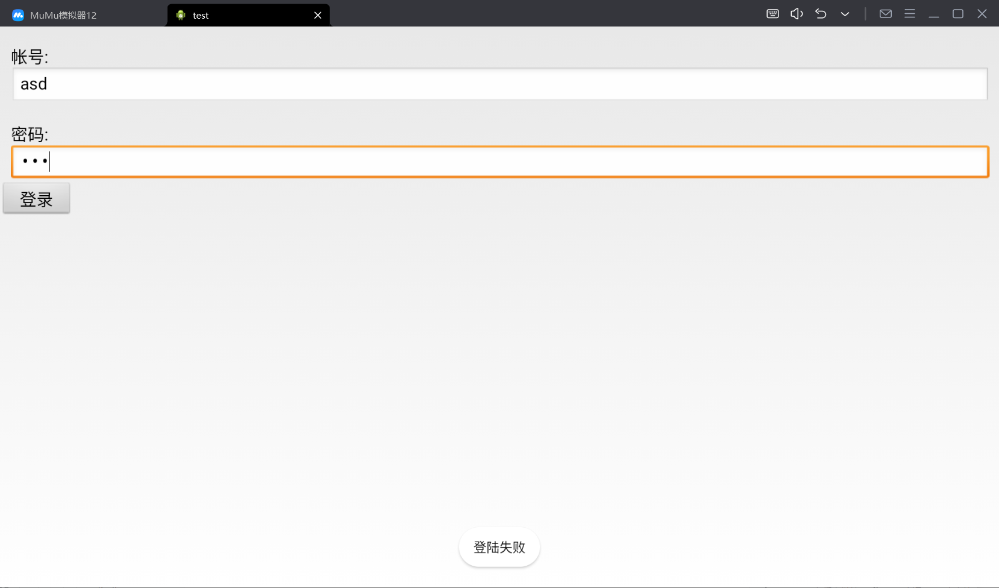
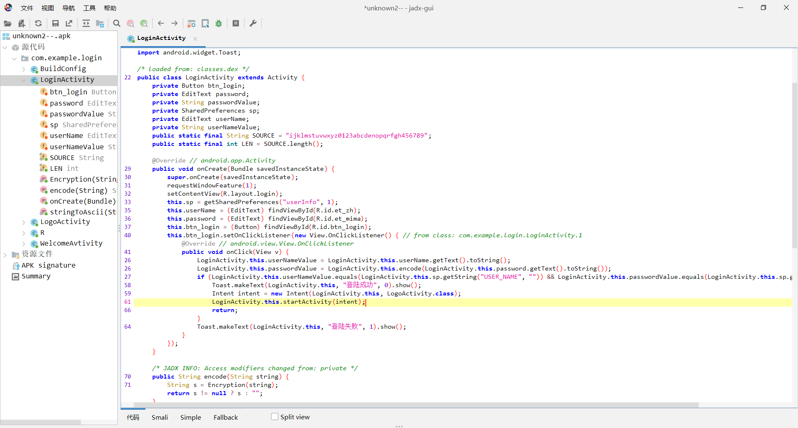
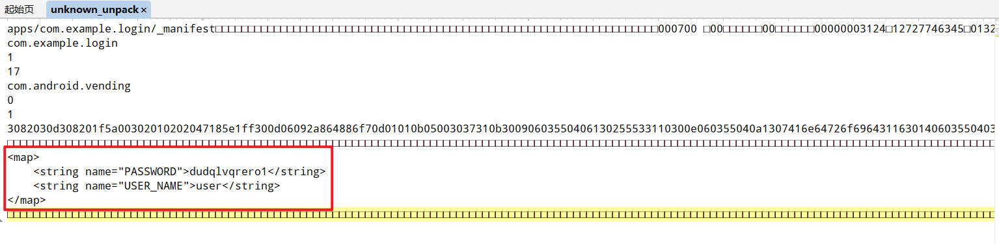

## 题目描述
你无意间得到了一些珍贵资料，可惜他们看起来不知道是什么，据说解开它可以得到flag神器。
tips：flag是flag{结果}

附件描述：
文件名：[珍贵资料.zip](https://static2.ichunqiu.com/icq/resources/ctf/download/F20A2C5E7F261D798192A65018790DB8.zip)
校验（SHA1）：4EF84DF5B34C12DED8EC3F603CFBC065251864B4

## 解题
下载附件，有两个文件unknown和unknown2，
通过查看文件头和经验可知：


看似是一个pk文件，但是该文件是一个apk包。


修改unknown2后缀为apk，使用模拟器打开：


用jadx-gui打开，找到主要登录代码：


可以看到程序是将
- 用户输入的账号与USER_NAME匹配
- 用户输入的password加密后的字符串与PASSWORD

加密代码：
```java
/* JADX INFO: Access modifiers changed from: private */
    public String encode(String string) {
        String s = Encryption(string);
        return s != null ? s : "";
    }

    public static String Encryption(String s) {
        StringBuilder sb = new StringBuilder();
        if (s == null || s.length() < 1) {
            System.out.println("you Input nothing.");
            return null;
        }
        String s2 = s.toLowerCase();
        int len = s2.length();
        for (int j = 0; j < len; j++) {
            char c = s2.charAt(j);
            int a = SOURCE.indexOf(c);
            if (a == LEN - 1) {
                a = -1;
            }
            if (a == LEN - 2) {
                a = -2;
            }
            if (a == LEN - 3) {
                a = -3;
            }
            sb.append(SOURCE.charAt(a + 3));
        }
        return sb.toString();
    }

```

根据这个可以很轻易写出解题脚本，但是我们并不知道程序中的PASSWORD是什么，猜测在文件unknown中。
经过百度得知`ANDROID BACKUP`文件可以被提取，使用abe工具（项目地址：<https://github.com/nelenkov/android-backup-extractor>）
使用方法如下：
*注意：需要安装Java环境*
```shell
java -jar .\abe.jar unpack [被提取文件路径] [提取出的文件路径]
```
提取出来后，使用010的文本模式可以看到用户名和密码：


知道字符串后，写出解题脚本：
```c++
#include<iostream>
using namespace std;

int main()
{
    char source[] = "ijklmstuvwxyz0123abcdenopqrfgh456789";
    char password[] = "dudqlvqrero1";
    char flag[] = "";

    int len = 12;
    int LEN = 36;
    for (int j = 0; j < len; j++) {
        char c = password[j];

        int a;
        for (int i = 0; i < LEN; i++)
        {
            if (source[i] == c) a = i;
        }

        if (a - 3 == -1) {
            a = LEN - 1;
        }
        if (a - 3 == -2) {
            a = LEN - 2;
        }
        if (a - 3 == -3) {
            a = LEN - 3;
        }
        flag[j] = source[a - 3];
    }
    cout << "flag{" << flag << "}";
}
// flag{amanisnobody1}
```

得到`flag{amanisnobody1}`
