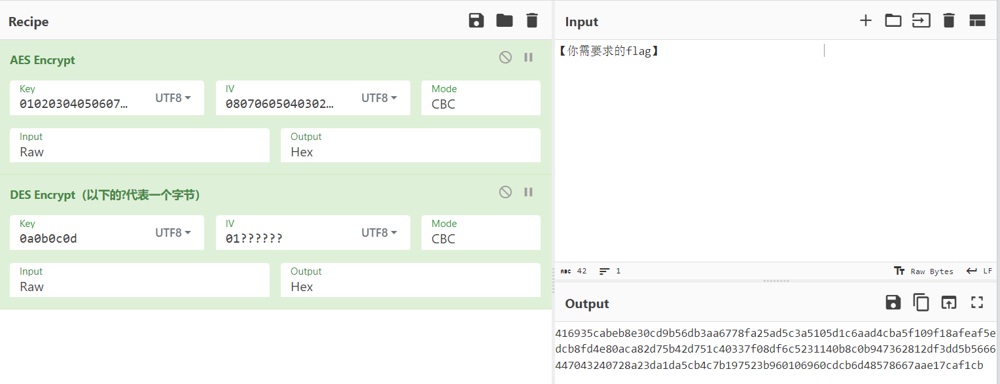
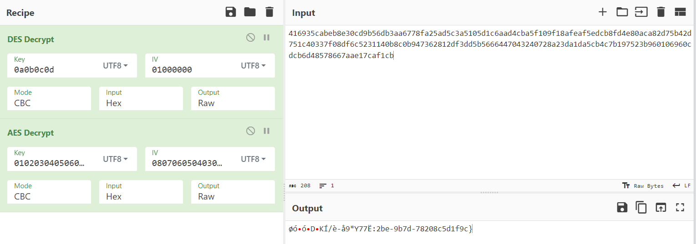
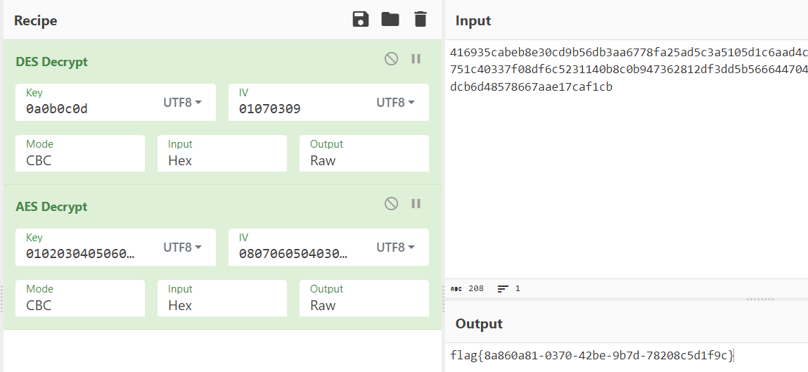

## 题目描述

小蓝同学把他在`CyberChef`中的操作步骤保存为静态网页，并把原始的flag删除了，还把DES的iv值隐去了6个字节，你能解密出来吗？

## 解题

下载附件，打开网页：

可以看到题目先进行了AES加密，再进行了DES加密，并且两种加密都使用了CBC填充和iv值：

> 在CBC（不光是DES算法）模式下，iv通过随机数（或伪随机）机制产生是一种比较常见的方法。iv的作用主要是用于产生密文的第一个block，以使最终生成的密文产生差异（明文相同的情况下），使密码攻击变得更为困难，除此之外iv并无其它用途。
>
> 最大的好处是，即使相同的明文，相同的密钥，也能产生不同的密文。

进行逆过程，可以看到出题人让我们看到了一部分的`flag`，

> 出现上述现象，是因为CBC模式在加密时，只会使用向量iv与第一个明文分组进行异或、加密得到第一组密文，从第二组之后的每一次操作都将前一组密文与明文进行异或、加密，得到密文；

但是`DES`的`iv`值我们并不知道，但根据规律可以才出`iv=010x0x0x`：

题目看似无解，但是在我们修改iv值时，发现只有在iv最后一位为8或9的时候，网页输出会有所不同，所以我们大胆猜测直接通过爆破的方式解题，

**从最后一位开始往上猜测iv的值**

最终得到正确的`iv=01070309`。

得到`flag{8a860a81-0370-42be-9b7d-78208c5d1f9c}`

