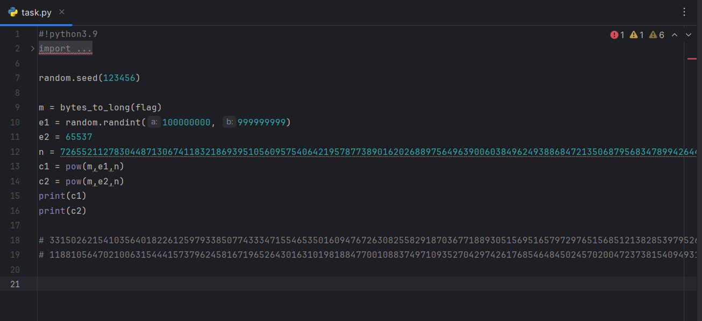

# 题目描述

某公司为了保护其重要数据，使用了RSA加密算法。该公司以同一个N
为模数，为Alice和Bob分别生成了不同的公钥和与之相应的私钥。Alice
和Bob都使用自己的公钥对同一条明文m进行加密，分别得到密文c 1和c
2。假设你是一名密码安全研究者， 你获取了N值、两个密文和公钥，
能否使用RSA的相关知识还原出明文m呢?

## 分析题目

分析题目，已知n值，两个密文和公钥，根据题目描述和积累，判断该题为RSA的公模攻击（以下内容摘抄自互联网）

> ​    所谓共模攻击指的是在针对多个RSA密钥，它们所使用的模数是相同的情况下，通过求数学关系来破解其中的某个密钥。    在实际应用中，由于性能和时间成本的原因，使用相同的模数往往是必要的。这种情况下，RSA密钥中的指数d和e必须满足d×e=1 mod φ(n)，其中φ(n)是n的欧拉函数。攻击者可以通过计算求解d或e，从而轻松破解RSA加密。 具体来说，共模攻击流程如下：  
>
> 1. 攻击者获得两个或多个RSA公钥，它们共用相同的模数n。  
> 2.  攻击者选取一个消息m，并对其进行加密，得到密文c1=m^e1 mod n和c2=m^e2 mod n，其中e1和e2分别是两个公钥中的指数。  
> 3.  攻击者寻找模数n和两个指数e1和e2的最大公约数gcd(e1,e2)，并将其命名为g。  
> 4.  如果g不等于1，则说明攻击者找到了至少一个质因数p或q，并可以用它来推导RSA私钥中的指数d。  
> 5.  通过继续计算，攻击者可以确定私钥中的指数d，并从而获得原始消息m。

先打开文件



根据代码已知两个输出的密文，两个公钥e1，e2（e1可以更具random种子重现得知），n值

由此写出结题程序，得到`flag{359a1693-7bce-4fbc-87fa-111cdffaa0e8}`

```python
from Crypto.Util.number import *
import gmpy2
import random

random.seed(123456)
c1 = 3315026215410356401822612597933850774333471554653501609476726308255829187036771889305156951657972976515685121382853979526632479380900600042319433533497363
c2 = 1188105647021006315444157379624581671965264301631019818847700108837497109352704297426176854648450245702004723738154094931880004264638539450721642553435120

n = 7265521127830448713067411832186939510560957540642195787738901620268897564963900603849624938868472135068795683478994264434459545615489055678687748127470957

# e1 = random.randint(100000000, 999999999)
# print(e1)
e1 = 965035544
e2 = 65537

_, r, s = gmpy2.gcdext(e1, e2)  # 拓展的欧几里得
m = pow(c1, r, n) * pow(c2, s, n) % n   # 有数学逻辑在里面，咱也不知道，咱也不敢问，反正以后的共模攻击就用这个代码

print(long_to_bytes(m))

```

