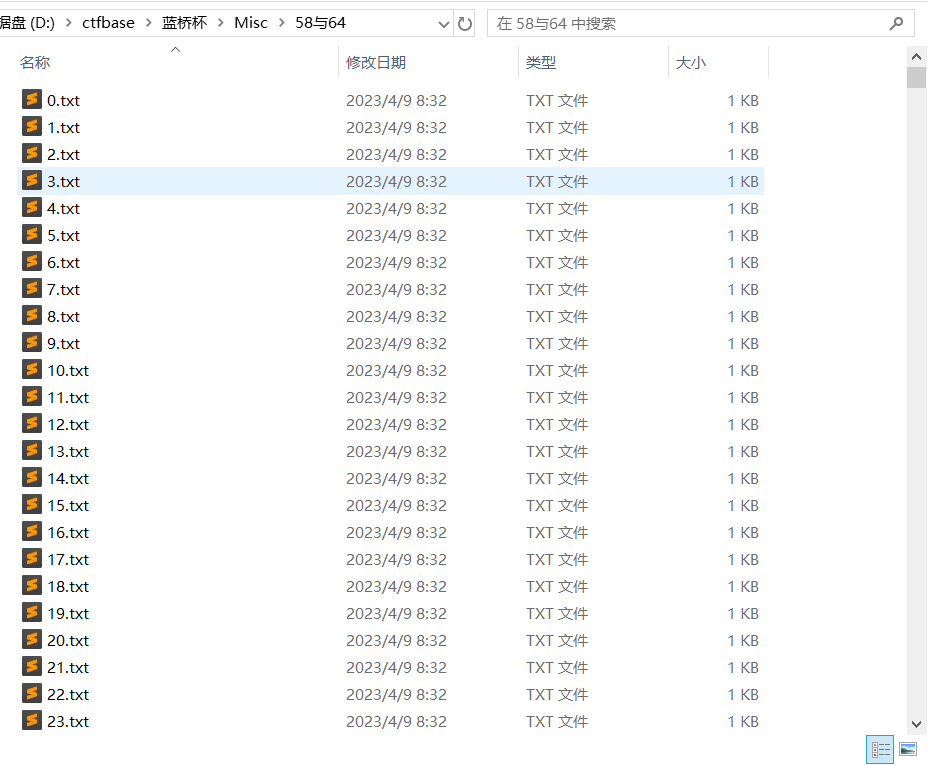

## 题目描述

好多文件..得想办法把他们弄在一起

下载附件查看文件，可以看到一共14267个文件

## 错误思路

根据题意将他们合并



合并文件脚本（注意是`shell`脚本，需在`linux`环境运行），合并后文件为`book`

```shell
#!/bin/bash

# 循环遍历0-14267的文件名，并逐个合并到book.txt中
for i in {0..14267}; do
    file="${i}.txt"        # 将文件序号转为3位数的文件名，如1.txt、2.txt、...、999.txt
    if [ -f $file ]; then  # 检查文件是否存在
        cat $file >> book  # 使用cat命令将当前文件内容追加到文件book中
        echo "合并成功: $file"
    else
        echo "文件不存在: $file"
    fi
done

echo "合并完成！"

```


将合并后的文件中的数据进行`base58`解码，然后循环进行`base64`解码，代码如下：

```python
import base64
import base58

c = ...		# 字符串太大
str58 = ''
for i in range(0, len(c)):
    data = base58.base58_decode(c[i])
    str58 += data

while True:
    str58 = base64.b64decode(str58)
    print(str58)

```

运行后可以看到报错显示为填充不正确，猜测是`base58`解码后的字符串不符合进行`base64`填充解码的条件。

## 正确思路

将`14267`个文件中的内容分别进行`base58`解码，将得到的字符串再进行循环`base64`解码，到最后得到flag，代码如下：

```python
import base58
import base64

flag = ''
for i in range(0, 14268):
    f = open(f'D:/ctfbase/lanqiao/Misc/58与64/{i}.txt').read()
    data = base58.base58_decode(f)
    flag += data

while True:
    try:
        flag = base64.b64decode(flag)
        print(flag)
    except:
        exit()
```

运行后得到`flag{640ce012-3d3a-446d-9d0e-5d2fe840063b}`

