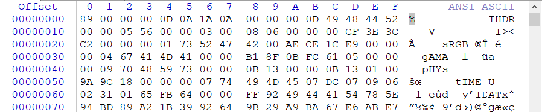
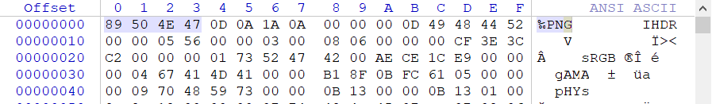
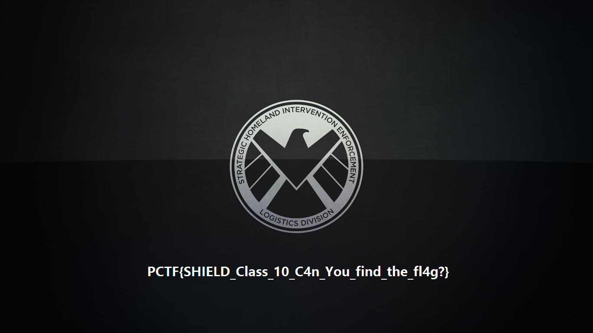
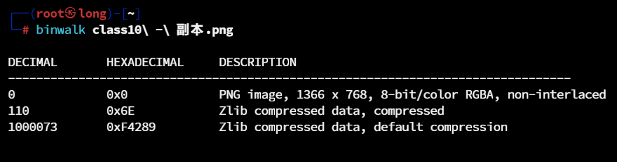
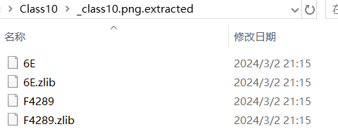
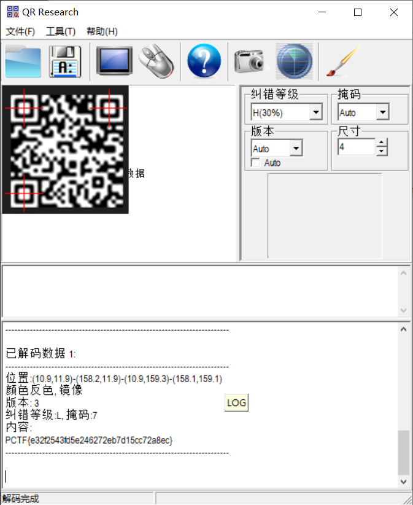

## 题目描述
听说神盾局的网络被日穿之后，有人从里面挖出来一个神秘的文件咋一看也没什么，可是这可是class10保密等级的哦，里面一定暗藏玄机，你能发现其中暗藏的玄机吗？

## 解题
下载附件，得到一个未知后缀文件，用winhex打开，
查看头尾，猜测可能是png图片，修改文件头：


改为


更改后缀为png得到图片：


输入flag发现不对，继续观察，
使用Stegsolve提取数据并未发现问题，
再次使用binwalk查看是否具有隐藏文件：


提取出来得到文件：
`binwalk -Me class10\ -\ 副本.png`


查看文件F4289内容发现是一系列`01`数据，
搜索后猜测可能是[二维码](https://baike.baidu.com/item/%E4%BA%8C%E7%BB%B4%E7%A0%81/2385673)，
编写脚本，复原二维码：
```python
from PIL import Image  
  
MAX = 29  
pic = Image.new("RGB", (MAX, MAX))  
with open("D:/ctfbase/LanQiao/Misc/Class10/_class10.png.extracted/F4289", "r") as f:  
    data = f.read()  
i = 0  
for y in range(0, MAX):  
    for x in range(0, MAX):  
        if data[i] == '1':  
            pic.putpixel([x, y], (0, 0, 0))  
        else:  
            pic.putpixel([x, y], (255, 255, 255))  
        i += 1  
pic.show()  
pic.save("D:/ctfbase/LanQiao/Misc/Class10/flag.png")
```

得到二维码：


使用QR_Research扫描得到：`PCTF{e32f2543fd5e246272eb7d15cc72a8ec}`


