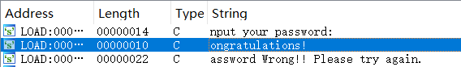
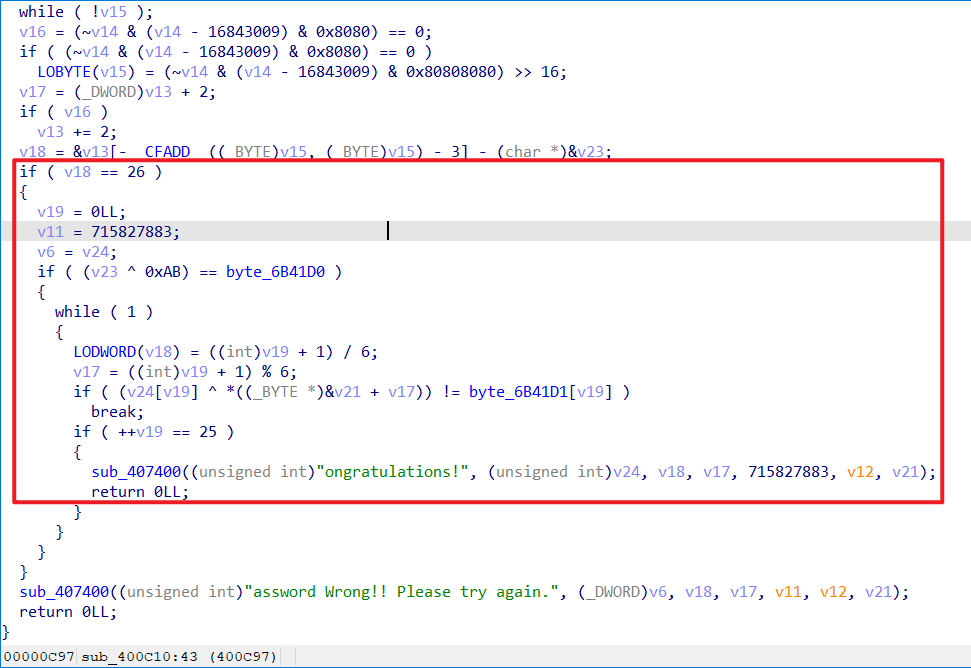
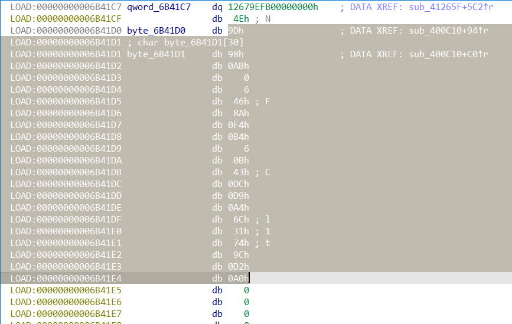
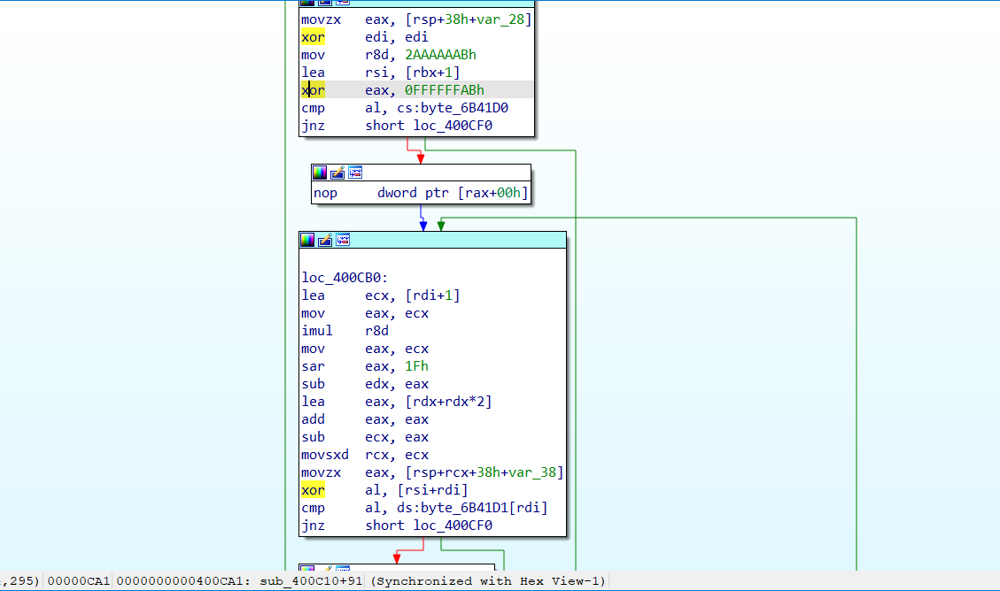

## 题目描述
都说逆向挺难的，但是这题挺容易，反正我不会，大家来挑战一下吧~~:)

文件：[点击下载附件](https://static2.ichunqiu.com/icq/resources/fileupload/phrackCTF/basic/easycrackme)

## 解题
下载附件，得到一个elf文件，放入exeinfope查看，是64位，
放入IDA反汇编，报错得到偏移量过大，但是可以不用管，

继续找到关键字：


双击进入，Ctrl+X交叉引用找到主程序：


1. 大概就是要求我们输入值也就是flag；并且知道flag为26位
2. 再将输入的**值的第一位与`0xAB`异或与`byte_6B41D0`比较**；
3. 然后再将输入的**其他值与地址在`v21`变量出的数组进行取`模6`的异或，与`byte_6B41D1`数组比较**；
4. 相同则返回正确

所以我们需要找到**v21变量地址处的值**与**byte_6B41D1的30位值**

1. byte_6B41D1值
点击`byte_6B41D1`进入找到值，但是导出时发现只有21位：


在想到文件打开时具有地址偏移，猜测影响到了该变量，将byte_6B41D1上方的qword_6B41C7变量一起导出再去掉变量结尾的`0`，发现刚好30位，但是变量开始有一串0，再想到flag是26位，于是去掉开始的0得到26位数据：

```c++
unsigned char ida_chars[] =
{ /*0x00, 0x00, 0x00, 0x00, */
  0xFB, 0x9E, 0x67, 0x12, 0x4E, 0x9D, 0x98, 0xAB, 0x00, 0x06, 
  0x46, 0x8A, 0xF4, 0xB4, 0x06, 0x0B, 0x43, 0xDC, 0xD9, 0xA4, 
  0x6C, 0x31, 0x74, 0x9C, 0xD2, 0xA0
};
```

2. v21数组
在伪代码中查看，发现并不能找到该变量的值，于是返回查看汇编代码，找到异或代码引用的地方：


一步步跟踪，发现rsp+rcx寄存器中存储了该值，往上找到6个数据，得到数据，
提取出来，*注意取值是应从高位到低位*：
```c++
int xor_data[] = {0xAB, 0xDD, 0x33, 0x54, 0x35, 0xEF};
```

由此写出exp：
```python
ida_chars = [  
        0xFB, 0x9E, 0x67, 0x12, 0x4E, 0x9D, 0x98, 0xAB, 0x00, 0x06,  
        0x46, 0x8A, 0xF4, 0xB4, 0x06, 0x0B, 0x43, 0xDC, 0xD9, 0xA4,  
        0x6C, 0x31, 0x74, 0x9C, 0xD2, 0xA0]  
xor_data = [0xAB, 0xDD, 0x33, 0x54, 0x35, 0xEF]  
flag = ""  
  
for i in range(0, 26):  
    flag += chr(xor_data[i % 6] ^ ida_chars[i])  
print(flag)

# PCTF{r3v3Rse_i5_v3ry_eAsy}
```
运行得到flag：`PCTF{r3v3Rse_i5_v3ry_eAsy}`