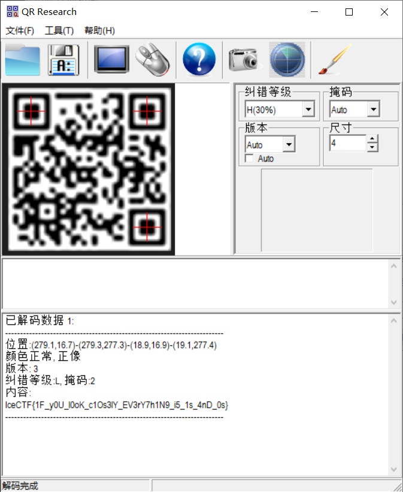

## 题目描述
I like to approach problems with a fresh perspective and try to visualize the problem at hand.

> 翻译：
> 我喜欢用全新的视角来解决问题，并尝试将手头的问题图像化。

## 解题
下载文本得到33行：
```txt
0x00000000
0xff71fefe
0x83480082
0xbb4140ba
0xbb6848ba
0xbb4a80ba
0x83213082
0xff5556fe
0xff5556fe`重复
0x00582e00
0x576fb9be
0x707ef09e
0xe74b41d6
0xa82c0f16
0x27a15690
0x8c643628
0xbfcbf976
0x4cd959aa
0x2f43d73a
0x5462300a
0x57290106
0xb02ace5a
0xef53f7fc
0xef53f7fc`重复
0x00402e36
0xff01b6a8
0x83657e3a
0xbb3b27fa
0xbb5eaeac
0xbb1017a0
0x8362672c
0xff02a650
0x00000000
```

根据题目描述是猜测让我们将这些数据转化成图片，
想到二维码，编写代码获取二维码：
```python
from PIL import Image  
  
MAX = 31  
pic = Image.new("RGB", (MAX, MAX))  
  
hexdata = []  
with open("D:/ctfbase/LanQiao/Misc/Matrix/matrix.txt", "r") as f:  
    for i in range(33):  
        hexdata.append(f.readline().strip('\n'))  
# 移除7行和22行的重复值  
hexdata.pop(22)  
hexdata.pop(7)  
print(hexdata)  
  
with open("D:/ctfbase/LanQiao/Misc/Matrix/bindata.txt", "w") as f:  
    binint = bin(int(hexdata[0], 16))  
    f.write(str(binint[2:].zfill(33)))  
    for i in range(1, 31):  
        binint = bin(int(hexdata[i], 16))  
        f.write('\n' + str(binint[2:].zfill(33)))   # 限定写入行数为31  
  
bindata = ''  
with open("D:/ctfbase/LanQiao/Misc/Matrix/bindata.txt", "r") as f:  
    for i in range(31):  
        data = f.readline().strip('\n')  
        print(data)  
        for j in range(32, -1, -1):  
            # 同样删除第7列和第22列，使矩阵行列相同  
            if j == 22:  
                continue  
            if j == 7:  
                continue  
            bindata += data[j]  
print(bindata)  
  
# 二维码打印代码，需要记住  
i = 0  
for y in range(0, MAX):  
    for x in range(0, MAX):  
        if bindata[i] == '1':  
            pic.putpixel([x, y], (0, 0, 0))  
        else:  
            pic.putpixel([x, y], (255, 255, 255))  
        i += 1  
pic.show()  
pic.save("D:/ctfbase/LanQiao/Misc/Matrix/flag.png")
```
得到二维码：


扫描得到flag：`IceCTF{1F_y0U_l0oK_c1Os3lY_EV3rY7h1N9_i5_1s_4nD_0s}`


