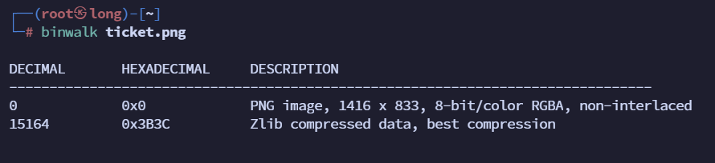
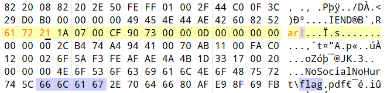
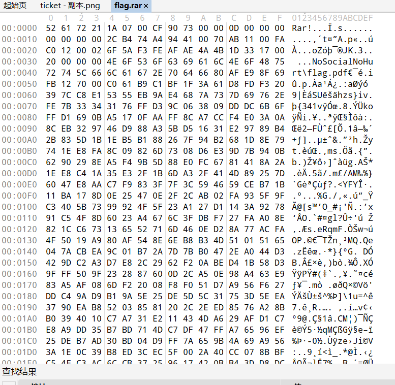
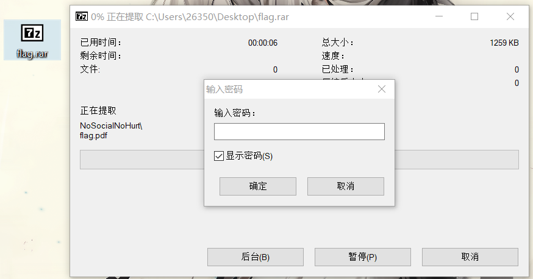
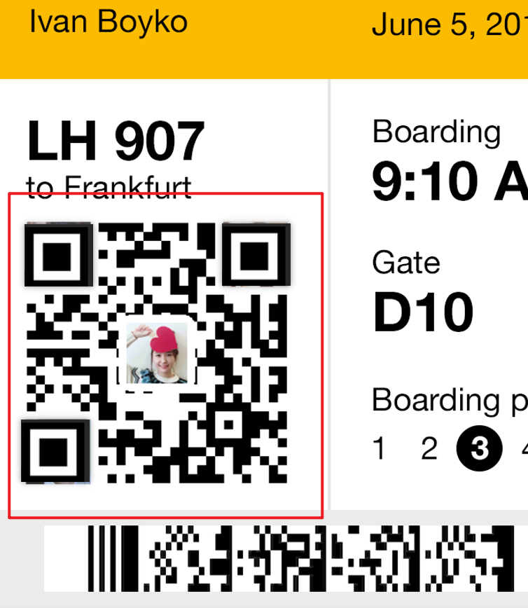
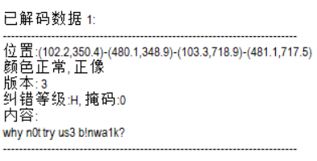
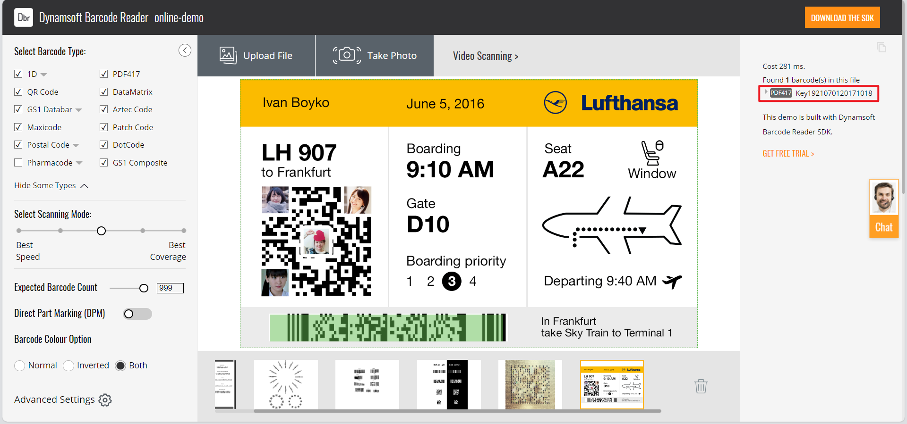
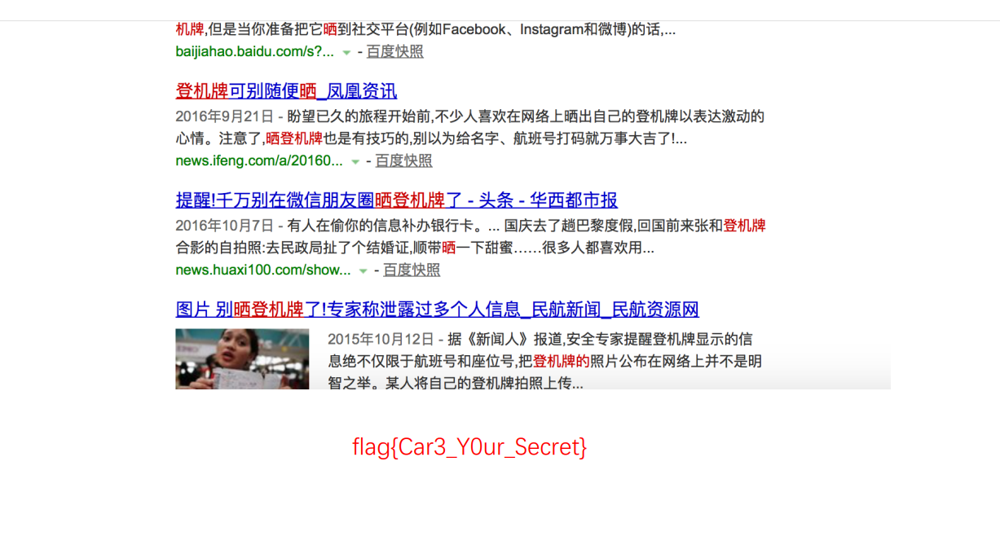

## 题目描述
大家好，给大家介绍一下，这是我的登机牌。

## 解题
下载附件，一张png图片，
用图片隐写神器打开查看并未发现有效信息；
用winhex打开查看十六进制信息，搜索flag，只发现一个信息：

可以看到有一个flag.pdf文件，但是通过foremost分离文件发现没用，
使用binwalk分析图片发现除了图片外，有一个压缩包文件：

再次查看十六进制信息，发现在`flag.pdf`上方有一个rar关键字，猜测是一个rar文件，但是rar文件的文件头并不是这个，修改文件头，

常见文件头：

| 文件类型                        | 文件头                          | ASCII码             | 文件尾         |
| --------------------------- | ---------------------------- | ------------------ | ----------- |
| JPEG (jpg)                  | FFD8FF                       | \|ÿØÿ\|            | FF D9       |
| PNG (png)                   | 89504E47                     | \|.PNG\|           | AE 42 60 82 |
| GIF (gif)                   | 47494638 或GIF89A             | \|GIF8\|           | 00 3B       |
| ZIP Archive (zip)           | 504B0304                     | \|PK..\|           | 50 4B       |
| RAR Archive (rar)           | 52617221                     | \|Rar!\|           |             |
| bmp                         | 424D                         | \|BM\|             |             |
| HTML (html)                 | 68746D6C3E                   | \|html>\|          |             |
| Wave (wav)                  | 57415645                     | \|WAVE\|           |             |
| AVI (avi)                   | 41564920                     | \|AVI \|           |             |
| Email [thorough only] (eml) | 44656C69766572792D646174653A | \|Delivery-date:\| |             |
| Adobe Acrobat (pdf)         | 255044462D312E               | \|%PDF-1.\|        |             |
| Photoshop (psd)             | 38425053                     | \|8BPS\|           |             |
| XML (xml)                   | 3C3F786D6C                   | \|\<?xml\|         |             |

再将rar文件头后面的数据全部复制到新文件并命名为rar后缀，提取发现需要密码：

猜测密码在图片中的二维码中，但是扫描不出来
搜索后发现二维码相关信息知道需要修补二维码的三个角用作二维码定位：

用QR Research扫描得到信息：`why n0t try us3 b!nwa1k?`

我们上面已经知道所以该信息已经没用：
所以只剩下最后的条形码，经过尝试若干在线扫描器最终在：[Online Barcode Scanner | Barcode Reader SDK | Dynamsoft](https://demo.dynamsoft.com/barcode-reader/)该扫描器扫描出密码：`1921070120171018`

破解密码得到flag.pdf和一张图片：

看到flag就在pdf中：`flag{Car3_Y0ur_Secret}`

