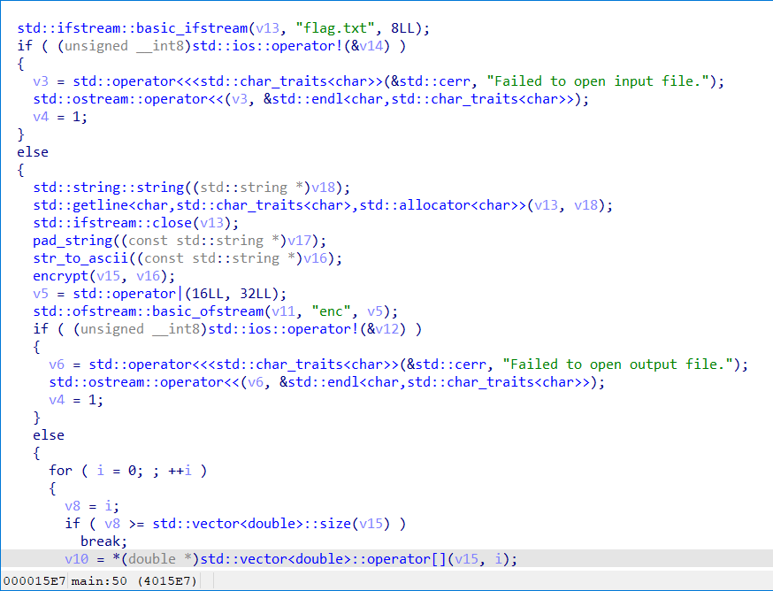
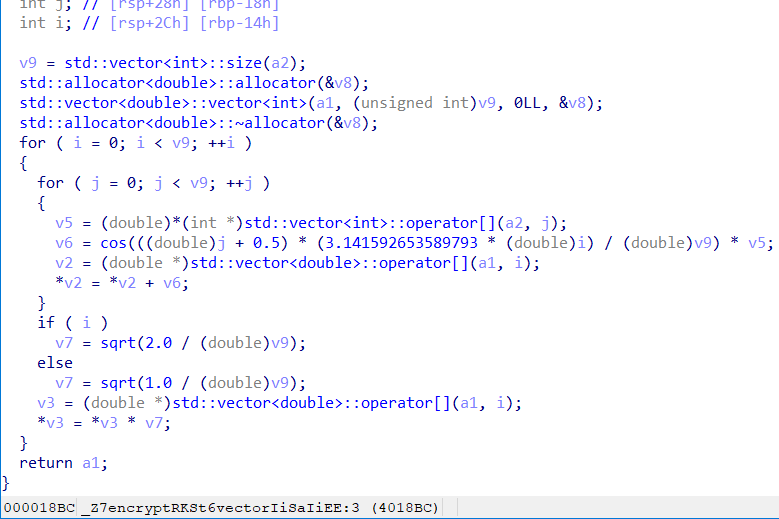

## 题目描述

位85岁老大爷于今年考入大学的计算机科学与技术专业，在第一 年的
学习中学到了高等数学、离散数学、C+ +等，下面是大爷编写的一道程
序，请破解大爷写的程序

## 解题

描述谜之操作

下载附件有两个文件一个是大爷程序的试卷答案，一个是程序，用`IDA`打开程序，



解读程序，大概流程就是打开名为`flag.txt`的文件，读取其中的内容并进行一系列处理（如填充字符串、转换为ASCII码、加密），然后将处理后的结果写入到名为`enc`的文件中。最后返回一个表示成功与否的标志值。

可以知道最后的`enc`文件（大爷答案），就是程序最终得到的结果，进入程序中唯一的加密函数`encrypt`：



可以看到还是看不懂全部复制过来经过百度和`GPT`可知该函数使用了一个叫做离散余弦变换（Discrete Cosine Transform，DCT）的数学变换。

知道了这个我们猜测`enc`中的数据就是该变换得到的最终结果，再次询问`gpt`如何求解该变换，通过`gpt`给出的代码和我们自己的修改，得到一个完整的解题代码：

```c
import cv2
import numpy as np

data = [370.75, 234.362, -58.0834, 59.8212, 88.8221, -30.2406, 21.8316, 49.9781, -33.5259, 2.69675, 43.5386, -30.2925,
        -28.0754, 27.593, -2.53962, -27.1883, -5.60777, -0.263937, 6.80326, 8.03022, -6.34681, -0.89506, -6.80685,
        -13.6088, 27.0958, 29.8439, -21.7688, -20.6925, -13.2155, -37.0994, 2.23679, 37.6699, -3.5, 9.85188, 57.2806,
        13.5715, -20.7184, 8.6816, 3.59369, -4.5302, 4.22203, -28.8166, -23.695, 31.2268, 6.58823, -39.9966, -20.7877,
        -19.7624, -22.031, 16.3285, 2.07557, -26.2521, 16.1914, 18.3976, -26.9295, 3.03769, 41.0412, 20.2598, 14.991,
        6.99392, -22.3752, -7.24466, 8.96299, -10.4874]

x = np.array(data, dtype=np.float64)
x = cv2.idct(x)
x = x.ravel()  # # 扁平化数组,将idct函数返回的二维数组转换为一维
flag = ''
for i in range(len(x)):
    flag += chr(round(x[i]))  # 通过`cv2.idct()`计算得到的逆离散余弦变换结果`x`是浮点数数组。
    # 为了将其转换为字符表示的flag，需要将浮点数舍入为最接近的整数，并将其转换为对应的Unicode字符。
print(flag)
# flag{9ab488a7-5b11-1b15-04f2-c230704ecf72}
```

