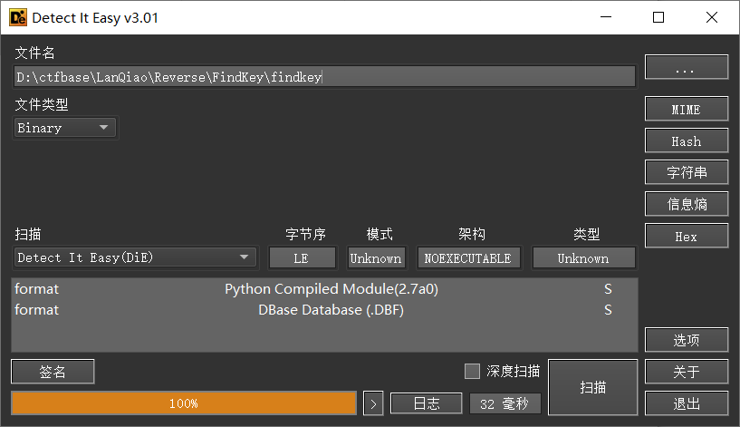
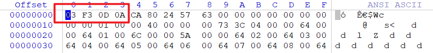

## 题目描述
FLAG就是你输入的key

## 解题
下载附件，用DIE打开查看文件信息，


可以看到是Python2.7下的文件，用winhex打开查看文件头：


与2.7版本的pyc文件头相同，是一个pyc文件，修改后缀，放入pyc在线编译网站[在线pyc,pyo,python,py文件反编译，目前支持python1.5到3.6版本的反编译-在线工具 (bugscaner.com)](http://tools.bugscaner.com/decompyle/)
得到源代码：
```python
# -*- coding: utf8 -*-
#! /usr/bin/env  2.7 (62211)
#coding=utf-8
#source path: findkey
#Compiled at: 2016-04-30 09:54:18
#Powered by BugScaner
#http://tools.bugscaner.com/
#如果觉得不错,请分享给你朋友使用吧!
import sys
lookup = [
 196, 153, 149, 206, 17, 221, 10, 217, 167, 18, 36, 135, 103, 61, 
 111, 31, 92, 152, 21, 228, 105, 191, 173, 41, 2, 245, 23, 144, 1, 
 246, 89, 178, 182, 119, 38, 85, 48, 226, 165, 241, 166, 214, 71, 
 90, 151, 3, 109, 169, 150, 224, 69, 156, 158, 57, 181, 29, 200, 
 37, 51, 252, 227, 93, 65, 82, 66, 80, 170, 77, 49, 177, 81, 94, 
 202, 107, 25, 73, 148, 98, 129, 231, 212, 14, 84, 121, 174, 171, 
 64, 180, 233, 74, 140, 242, 75, 104, 253, 44, 39, 87, 86, 27, 68, 
 22, 55, 76, 35, 248, 96, 5, 56, 20, 161, 213, 238, 220, 72, 100, 
 247, 8, 63, 249, 145, 243, 155, 222, 122, 32, 43, 186, 0, 102, 216, 
 126, 15, 42, 115, 138, 240, 147, 229, 204, 117, 223, 141, 159, 131, 
 232, 124, 254, 60, 116, 46, 113, 79, 16, 128, 6, 251, 40, 205, 137, 
 199, 83, 54, 188, 19, 184, 201, 110, 255, 26, 91, 211, 132, 160, 
 168, 154, 185, 183, 244, 78, 33, 123, 28, 59, 12, 210, 218, 47, 
 163, 215, 209, 108, 235, 237, 118, 101, 24, 234, 106, 143, 88, 9, 
 136, 95, 30, 193, 176, 225, 198, 197, 194, 239, 134, 162, 192, 11, 
 70, 58, 187, 50, 67, 236, 230, 13, 99, 190, 208, 207, 7, 53, 219, 
 203, 62, 114, 127, 125, 164, 179, 175, 112, 172, 250, 133, 130, 52, 
 189, 97, 146, 34, 157, 120, 195, 45, 4, 142, 139]
pwda = [
 188, 155, 11, 58, 251, 208, 204, 202, 150, 120, 206, 237, 114, 92, 
 126, 6, 42]
pwdb = [53, 222, 230, 35, 67, 248, 226, 216, 17, 209, 32, 2, 181, 200, 171, 
 60, 108]
flag = raw_input('Input your Key:').strip()
if len(flag) != 17:
    print 'Wrong Key!!'
    sys.exit(1)
flag = flag[::-1]
for i in range(0, len(flag)):
    if ord(flag[i]) + pwda[i] & 255 != lookup[i + pwdb[i]]:
        print 'Wrong Key!!'
        sys.exit(1)
 
print 'Congratulations!!'
```

代码逻辑很清晰，直接编写解题脚本：
```python
lookup = [  
    196, 153, 149, 206, 17, 221, 10, 217, 167, 18, 36, 135, 103, 61,  
    111, 31, 92, 152, 21, 228, 105, 191, 173, 41, 2, 245, 23, 144, 1,  
    246, 89, 178, 182, 119, 38, 85, 48, 226, 165, 241, 166, 214, 71,  
    90, 151, 3, 109, 169, 150, 224, 69, 156, 158, 57, 181, 29, 200,  
    37, 51, 252, 227, 93, 65, 82, 66, 80, 170, 77, 49, 177, 81, 94,  
    202, 107, 25, 73, 148, 98, 129, 231, 212, 14, 84, 121, 174, 171,  
    64, 180, 233, 74, 140, 242, 75, 104, 253, 44, 39, 87, 86, 27, 68,  
    22, 55, 76, 35, 248, 96, 5, 56, 20, 161, 213, 238, 220, 72, 100,  
    247, 8, 63, 249, 145, 243, 155, 222, 122, 32, 43, 186, 0, 102, 216,  
    126, 15, 42, 115, 138, 240, 147, 229, 204, 117, 223, 141, 159, 131,  
    232, 124, 254, 60, 116, 46, 113, 79, 16, 128, 6, 251, 40, 205, 137,  
    199, 83, 54, 188, 19, 184, 201, 110, 255, 26, 91, 211, 132, 160,  
    168, 154, 185, 183, 244, 78, 33, 123, 28, 59, 12, 210, 218, 47,  
    163, 215, 209, 108, 235, 237, 118, 101, 24, 234, 106, 143, 88, 9,  
    136, 95, 30, 193, 176, 225, 198, 197, 194, 239, 134, 162, 192, 11,  
    70, 58, 187, 50, 67, 236, 230, 13, 99, 190, 208, 207, 7, 53, 219,  
    203, 62, 114, 127, 125, 164, 179, 175, 112, 172, 250, 133, 130, 52,  
    189, 97, 146, 34, 157, 120, 195, 45, 4, 142, 139]  
pwda = [  
    188, 155, 11, 58, 251, 208, 204, 202, 150, 120, 206, 237, 114, 92,  
    126, 6, 42]  
pwdb = [53, 222, 230, 35, 67, 248, 226, 216, 17, 209, 32, 2, 181, 200, 171,  
        60, 108]  
flag = ""  
  
for i in range(0, 17):  
    flag += chr(lookup[i + pwdb[i]] - pwda[i] & 255)  
print(flag[::-1])
# PCTF{PyC_Cr4ck3r}
```

得到`PCTF{PyC_Cr4ck3r}`