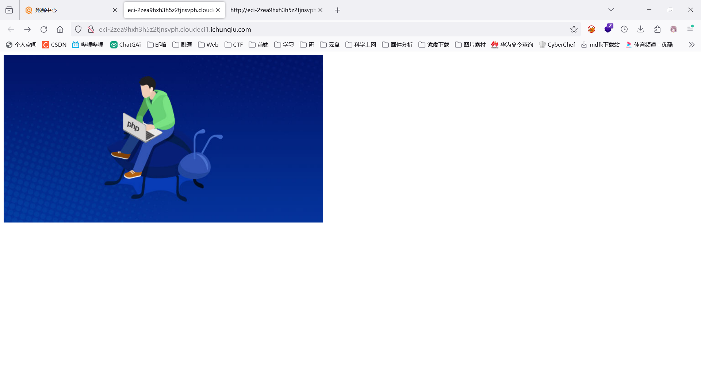
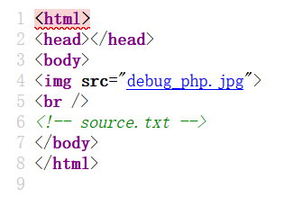
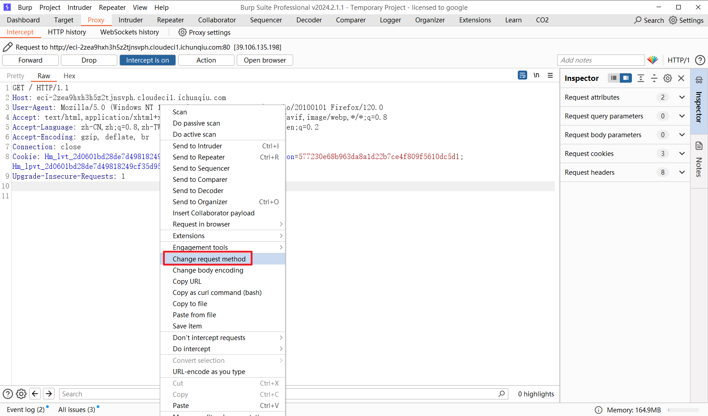
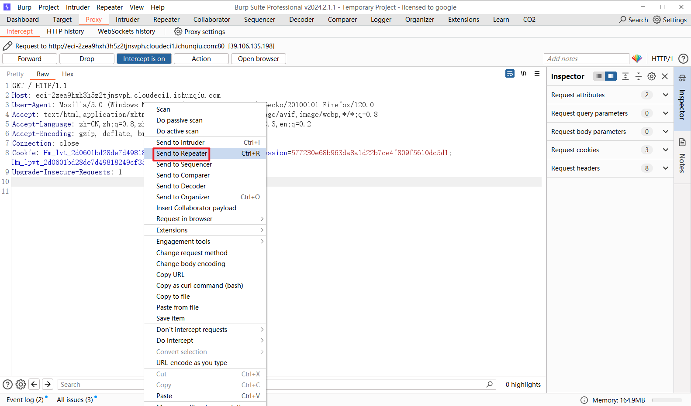
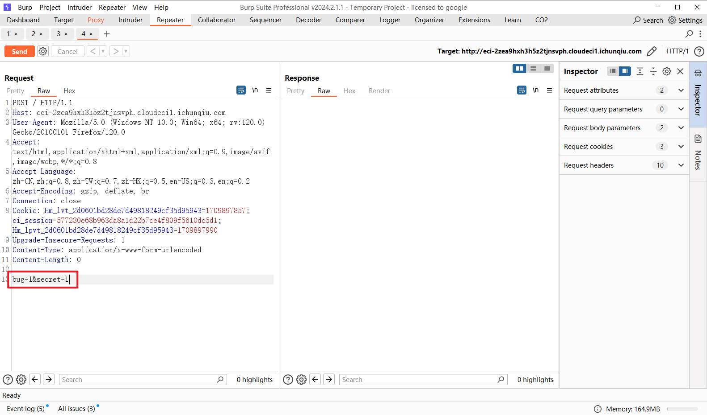
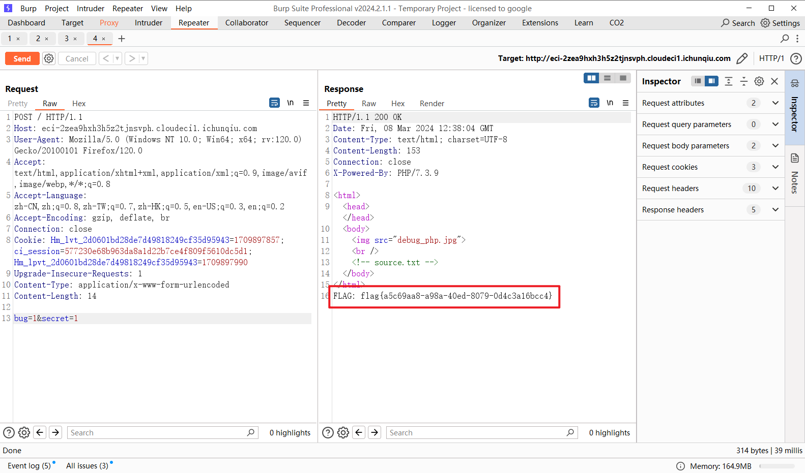

## 题目描述
try your best to find the flag.

## 解题
创建题目：


查看源代码，得到信息：source.txt


访问得到代码：
```php
<?php
include("secret.php");
if($_SERVER["REQUEST_METHOD"] == "POST"){
    extract($_POST);
    if($bug == $secret){
        die("FLAG: flag{xxxxxx}");
    }else{
        die("");
    }
}
?>
```
得知大概运行流程：**通过post数据传入一个数组，然后经过extract函数将数组的**
**内容变成变量。如果传入的数据正好覆盖了 \$bug 和 \$secret 原有的值，并使他们相等就**
**可以获取flag.**

使用BP构造流量包，使`bug==sercert`

右键改变http包类型为post


发送到重发器


添加字段：


点击Send：


得到`flag{a5c69aa8-a98a-40ed-8079-0d4c3a16bcc4}`