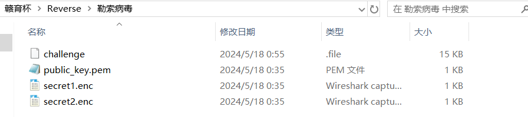
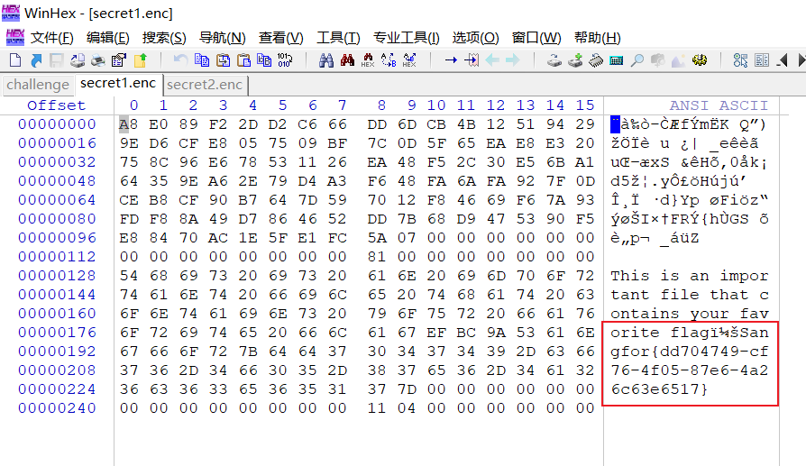
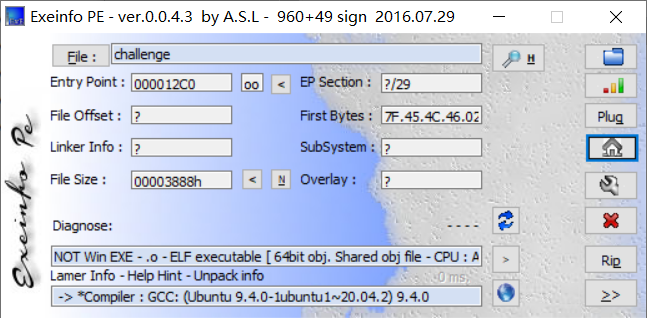
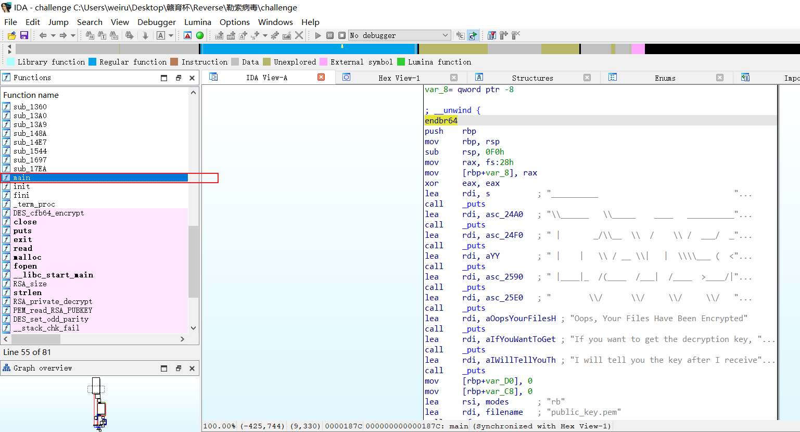
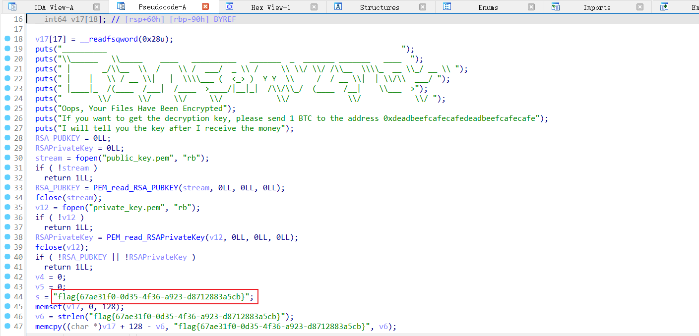

# 解题思路

下载附件，得到四个文件

使用winhex分别打开每个文件，得到flag：`Sangfor{dd704749-cf76-4f05-87e6-4a26c63e6517}`

# 混淆思路

使用`exeinfo`查看文件信息：

得知程序为64位且未加壳，使用64位IDA打开

找到main函数

按f5进行反汇编

查看得到**错误**flag：`flag{67ae31f0-0d35-4f36-a923-d8712883a5cb}`