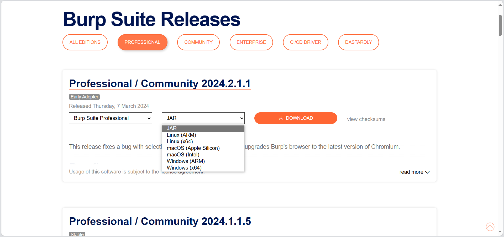
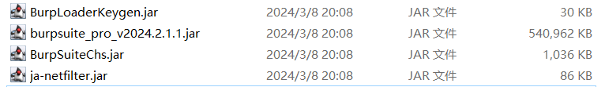
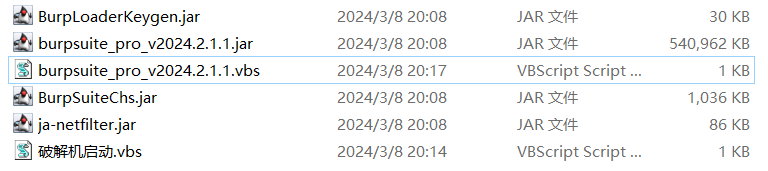
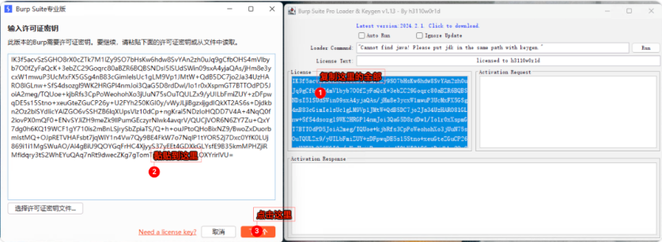
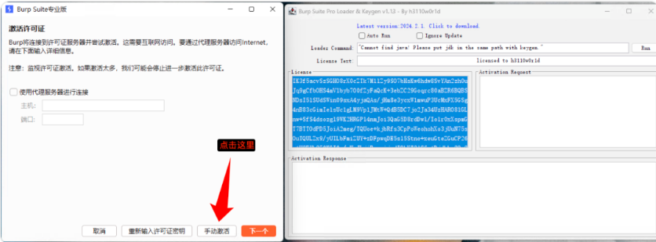
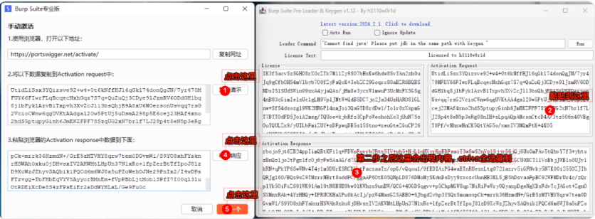
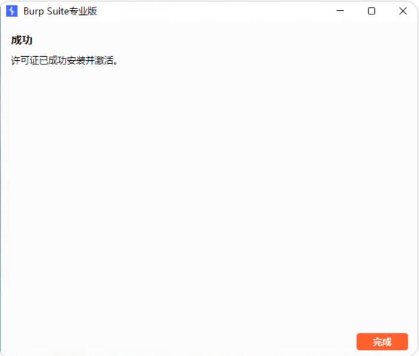

我们首先需要三个东西  

1、你破解的burp所需要的对应java版本，例如最新的2024.2.1版本的burp需要至少java18（我没记错的话），如何下载java并安装，我这里就不多说了，需要注意的是，这里并不需要强制你把java添加到环境变量，因为本文用的是绝对路径的方法写快捷启动。

2、你需要破解的burp版本的jar包，说到这个，有些师傅居然在群里找人发burp原版，靠。。。burp官方专业版下载地址：

https://portswigger.net/burp/releases#professional



3、pwn3的注册机包以及某大佬的汉化包(我忘了id，有点长)，不知道啥是pwn3的，请看这篇文章：

[你还在去公众号获取各种破解工具？看完这篇不需要了！](http://mp.weixin.qq.com/s?__biz=Mzg5NTYwMDIyOA==&mid=2247497632&idx=1&sn=7901dfb93d59df6a8a39c6d3e4df36de&chksm=c00f64abf778edbd87ebb2aed479669b48442df06f6847aa5ec88369ef961e89305b1d463220&scene=21#wechat_redirect)  

这里我直接把注册机和汉化包下载链接放在后台，回复：**240308**


ok，准备好以上三个东西，我们开始操作

**首先讲windows**

我们把burp的jar包，以及注册机，放进同一个文件夹，注意路径不要有空格！



然后我们右键新建txt文本，命名为你喜欢的名称，把txt后缀更改为vbs，然后使用文本编辑器打开它，填入下列命令：
```shell
Dim ws, javaPath
Set ws = CreateObject("WScript.Shell")

' 这里替换成你的java路径
javaPath = "C:\Program Files\Java21\bin\java.exe"

ws.Run """" & javaPath & """ --add-opens=java.desktop/javax.swing=ALL-UNNAMED --add-opens=java.base/java.lang=ALL-UNNAMED --add-opens=java.base/jdk.internal.org.objectweb.asm=ALL-UNNAMED --add-opens=java.base/jdk.internal.org.objectweb.asm.tree=ALL-UNNAMED --add-opens=java.base/jdk.internal.org.objectweb.asm.Opcodes=ALL-UNNAMED -javaagent:BurpLoaderKeygen.jar -javaagent:BurpSuiteChs.jar -javaagent:ja-netfilter.jar -noverify -Dsun.java2d.uiScale=1 -jar burpsuite_pro_v2024.2.1.jar", 0

```
你不用管这些命令具体是干啥玩意儿的你只管用，把你的java对应的路径修改了就好，如果你不喜欢汉化，删掉-javaagent:BurpSuiteChs.jar即可。ps：此脚本没有cmd的启动黑框。

然后我们新建另一个vbs用于启动注册机，和上面同样的操作，命令修改为：  

```
Dim ws, javaPath
Set ws = CreateObject("WScript.Shell")

' 这里替换成你的java路径
javaPath = "C:\Program Files\Java21\bin\java.exe"

ws.Run """" & javaPath & """ -jar BurpLoaderKeygen.jar", 0
```

当然了你直接命令行打开也是一样的，我这里只是为了更新版本时重新打开注册机方便一些。
ok我们的准备工作完成，你现在文件夹里应该是这样的：


直接双击打开这俩vbs，你会得到如下两个东西：


接下来请按照图片的步骤，一步一步操作：






**成功破解**


现在你就可以正常使用burp了，之后的启动直接双击你命名的vbs即可，如果后续burp版本更新了，重复一遍此操作即可（注意你的jar包文件名）。