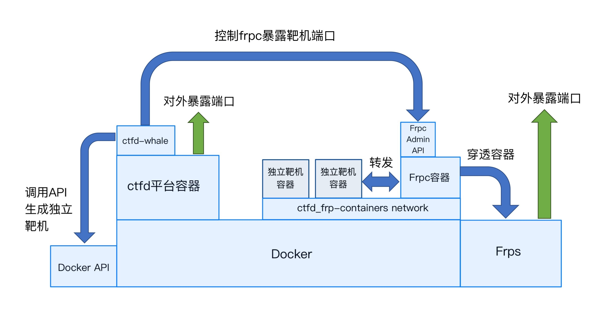

# 一、技术原理



# 二、前置需求下载安装

#### 1、CTFd

```bash
git clone https://github.com/CTFd/CTFd.git
```

#### 2、ctfd-whale

```bash
git clone https://github.com/glzjin/CTFd-Whale.git
```

#### 3、frp

1）下载frp

```shell
wget https://github.com/fatedier/frp/releases/download/v0.51.3/frp_0.51.3_linux_amd64.tar.gz
tar -zxvf frp_0.51.3_linux_amd64.tar.gz
cd ./frp_0.51.3_linux_amd64
mkdir /etc/frp
cp frpc.ini frps.ini /etc/frp/
cp frpc frps /usr/bin/
chmod a+x /usr/bin/frpc /usr/bin/frps
```

2)添加指令单元快捷启动frps

```shell
vim /usr/lib/systemd/system/frps.service
```

填入以下内容

```shell
[Unit]
Description=frps
After=network.target

[Service]
Type=simple
WorkingDirectory=/usr/bin
ExecStart=/usr/bin/frps -c /etc/frp/frps.ini
Restart=on-failure

[Install]
WantedBy=multi-user.target
```

启动frps

```bash
systemctl daemo-reload
systemctl start frps
systemctl enable frps
```

3)编辑配置文件

1. frps.ini

```shell
[common]
bind_port = 7897
bind_addr = 0.0.0.0
token = randomme
# vhost_http_port = 80 # 如果要配置http动态域名则需要这个。80端口开启需要systemd使用root权限启用frp，在这里不需要
```

2. frpc.ini

```shell
[common]
token = thisistoken
server_addr = 172.17.0.1    # 这里填写服务器ip addr之后docker0的ip地址
server_port = 7897          # 这里需与前面frps.ini的bind_port匹配
admin_addr = 172.1.0.4      # 这里填写frpc服务在frp网络中的ip
admin_port = 7400
# 这里需要留至少一行空行，因为新的 Whale 会把容器的转发代理写到这个文件里，没留空行的话会影响 admin_port。
```

# 三、安装docker和docker-compose

1、安装docker

```shell
yum-config-manager --add-repo https://download.docker.com/linux/centos/docker-ce.repo
yum install -y docker-ce
systemctl start docker
systemctl enable docker
```

2、安装docker-compose

```shell
yum install -y python3-pip
pip3 install --upgrade pip
pip3 install docker-compose
chmod +x /usr/local/bin/docker-compose
docker-compose --version
```

3、配置docker镜像加速

[容器镜像服务 (aliyun.com)](https://cr.console.aliyun.com/cn-hangzhou/instances/mirrors?accounttraceid=6b9f1ae9b14d403abfd97de2740117f3fiof)

```shell
mkdir -p /etc/docker
tee /etc/docker/daemon.json <<-'EOF'
{
  "registry-mirrors": ["https://npf794h9.mirror.aliyuncs.com"]
}
EOF
systemctl daemon-reload
systemctl restart docker
```

4、配置docker集群

```shell
docker swarm init
docker node update --label-add name=linux-1 $(docker node ls -q)
```

# 四、配置过程
