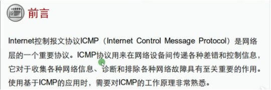
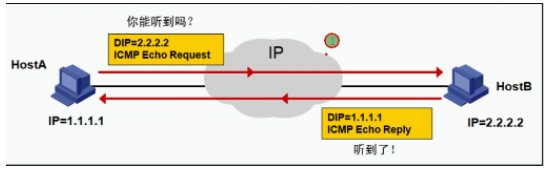
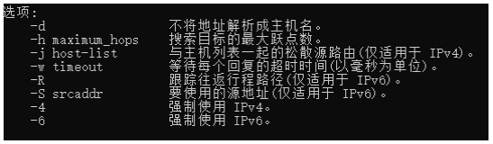

**ICMP：Internet control massage protocol 因特网控制协议**：用于测试网络可达性、使用ping、tracert等命令调用

ICMP的格式：

 

ICMP的类型：
* echo request 回响请求
* echo reply 回响应答

Type 类型和 Code 代码的组合：

| 命令    | 备注           |
| ------- | -------------- |
| Ping    | 测试网络连通性 |
| tracert | 显示经过的路径 |

Ping 参数：

tracert参数：

Ping 常见问题：

| 成功     | 对方成功回响                                                 |
| -------- | ------------------------------------------------------------ |
| 超时     | 对方主机不在线、屏蔽 （不在线-有对方MAC地址缓存，对方可能关机，平并-对方开启了策略“如防火墙”） |
| 传输失败 | 物理链路/网卡问题，网关未指定                                |
| 无法访问 | 未获取到MAC地址，导致无法进行ICMP封装                        |

