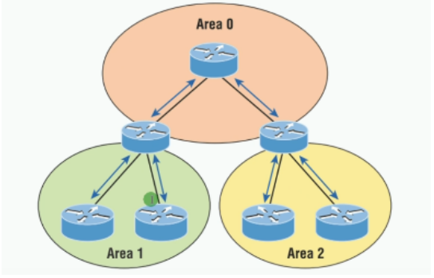
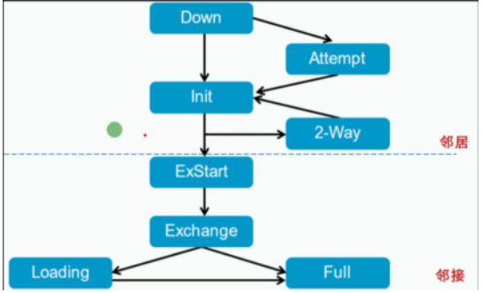
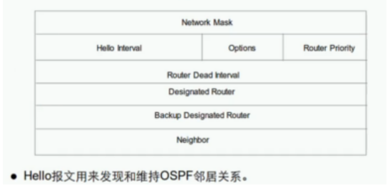
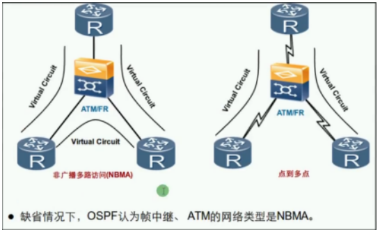
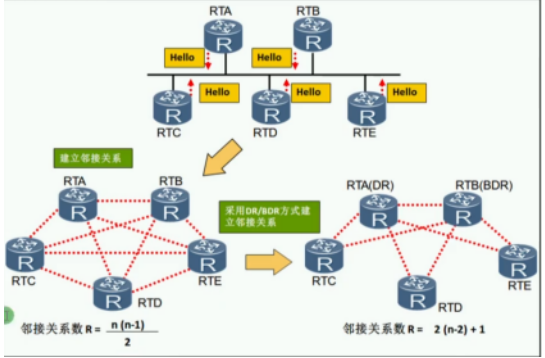

OSPF概述：Open shortest path first 开放式最短路径优先
- 大中型网络使用最广泛的IGP协议
- 链路状态路由协议
- 无类别路由
- 使用组播（224.0.0.5和224.0.0.6）
- 收敛较快
- 以开销（Cost以接口带宽作为计算）作为度量值
- 采用SPF算法可以有效的避免环路
- 触发式更新（以较低频率 （每30分钟）定期发送更新，被称为链路状态泛洪）
- 设置区域概率使得OSPF能够支持更大规模的网络（划分骨干区域和非骨干区域和特殊区域）
- 通过LSA（链路状态信息）的形式发布路由
- 不支持自动汇总，支持手动汇总 （在ABR/ASBR上配置）

OSPF区域概述：

| 术语              | 备注                                                         |
| ----------------- | ------------------------------------------------------------ |
| 区域（Area）      | 为了适应大型网络，OSPF在AS内划分多个区域区域是以接口为单位来划分每个OSPF路由器只维护所在区域的完整链路状态信息 |
| 区域ID（Area ID） | 可以表示成一个十进制的数字，如：1也可以表示成一个IP，如：0.0.0.1 |
| 区域优点          | 尽量减少LSDB大小拓扑变化仅影响本区域内部                     |

OSPF区域类型：

| 类型       | 备注                                                         |
| ---------- | ------------------------------------------------------------ |
| 骨干区域   | area 0骨干区域，也称为传输区域（负责在不同非骨干区域之间分发路由信息） |
| 非骨干区域 | area 0除外非骨干区域，称为末端区域                           |

划分多区域的作用：
- 为了减轻运行OSPF路由器的压力
- 防环机制：划分了骨干区域和非骨干区域，所有非骨干区域通讯必须经过骨干区域中转
- 骨干区域传来的LSA不会再传回骨干区域
- 非骨干区域之间通信需要骨干区域转发（为了防止环路）

OSPF路由器角色：

| 角色 | 备注                                                         |
| ---- | ------------------------------------------------------------ |
| IR   | Internal Router 内部路由器所有接口都属于同一个区域           |
| BR   | Backbone Router 骨干路由器至少有一个接口属于骨干区域         |
| ABR  | Area Border Router 区域边界路由连接多个不同的区域，至少有一个接口属于骨干区域 |
| ASBR | Autonomous System Border Router自治系统边界路由器 将其他路由协议学习到的路由以引入的方式到OSPF进程中 |
| PS   | 一台路由器可以同时属于多种类型                               |

 

OSPF核心工作流程：
1. 发现并建立邻居
2. 传播LSA（区别基于距离矢量算法的路由表更新） LSA的内容 ：
	   1. Link State Advertisement 链路状态宣告（路况信息）
	2. 链路：路由器接口
	3. 状态：描述接口信息（地址、掩码、开销、网络类型、邻居关系等）

3. 将LSA泛洪到区域中的所有OSPF路由器，而不仅是直连的路由
4. 收集LSA创建LSDB（链路状态数据库、地图） 
5. 使用SPF算法计算到达每个目标网络的最短路径，存放于路由表

OSPF三张表：

| 类型                             | 含义                 |
| -------------------------------- | -------------------- |
| 邻居表 dis ospf peer         | 记录所有邻居关系     |
| 链路状态数据库 dis ospf lsdb | 记录所有链路状态信息 |
| 路由表 dis ip routing-table  | 记录最佳路由         |

Router ID：
- 运行OSPF协议前，必须选取的一个RID
- 用来唯一标识一台OSPF路由器（不能重复）
- RID可以手动配置，也可以自动生成

| 规则            | 备注                                                         |
| --------------- | ------------------------------------------------------------ |
| RID选取规则顺序 | 1.推荐手动配置（例：ospf 1 router-id 1.1.1.1这个RID可以和你的接口地址完全没有关系也可以配置成一样的地址) 2.活动回环接口中选取IP地址最大的 3.活动物理接口中选取IP地址最大的 |

注：
- 选取Router-ID时，先看回环口再看物理口
- 任何选举值都未配置是运行不了OSPF的（router id为0.0.0.0）
- 比较到物理接口中活动物理接口选取不出来，会选择非活动接口
- RID选举具有非抢占性，除非重启OSPF进程 

OSPF数据包的结构和类型：封装基于IP协议，协议号为89 

OSPF数据包分为OSPF报头和OSPF数据部分：

OSPF报头字段是固定的，OSPF数据包的内容由报头的类型决定

 

OSPF数据包的类型（5种类型）：

| OSPF数据包                                                | 作用                            |
| --------------------------------------------------------- | ------------------------------- |
| Hello                                                     | 建立并维护邻居关系              |
| Database Description （DD）比较数据库，只在邻居建立时发送 | LSDB的摘要信息（仅包含LSA头部） |
| Link State Request（LSR）                                 | 请求LSA                         |
| Link State Update （LSU）                                 | 发送LSA （完整的LSA信息）       |
| Link State Acknowledge （LSAck）                          | 对LSU的确认 （OSPF的确认机制）  |

OSPF状态机制（7种状态）：下图有8种状态，Attempt状态只在帧中继中有用，暂不考虑

| 阶段                    | 状态                                    | 备注                            |
| ----------------------- | --------------------------------------- | ------------------------------- |
| 第一阶段                | 失效状态（Down）                        | 没有收到Hello包                 |
|第一阶段| 初始状态（Init）        | 收到了Hello包，但是邻居列表里没我       |
|第一阶段| 双向通信状态（Two-Way） | 收到了Hello包，且看到自己，形成邻居关系 |
|                         | 交换初始状态（Exstart）                 | 决定信息交换时的路由器主从关系  |
|                         | 交互状态（Exchange）                    | 向邻居发送DD数据包              |
|                         | 加载状态（Loading）                     | LSR和LSU交互阶段（互发LSA信息） |
|                         | 完全邻接状态（Full）                    | LSDB同步完成，形成邻接关系      |

注：只有Two-Way和Full是稳定状态

**OSPF工作流程（数据包和状态切换过程）：**
- OSPF第一阶段：使用Hello包建立双向通信的过程，成为邻居关系。

- OSPF第二阶段：通过交换LSA达到LSDB同步，建立邻接关系

Exstart：Seq序列号x，I=1表示是第一个发送的DD包，M=1表示后面还有DD包，MS=1表示我是主（初始都是主）
通过比较Router ID值大的一方为主，向主发送的DD报文中序列号会变成主的序列号，同时这才是真正的DD报文

Seq序列号y+n表示经过比较RID后较大的序列号建立了邻居，MS=1表示我是主，此处由R2先向你发送LSDB链路状态数据库摘要，R1收到后向R2反馈R1自己的LSDB摘要，使R2先达到Full状态；R2至此建立了完整的LSA，向R1发送LSU链路状态更新，R1收到后发送LSAck确认信息，R1至此也达到Full状态。

注：
1. 确认主从的作用是为了LSDB同步可靠
2. 同一区域内的路由器中LSDB链路状态数据库必须是一致的，但是每个路由器的路由表和邻居表是不一样的

OSPF邻居建立条件：必须三层直连

建立邻居需要检验的字段：  
- RID唯一（不能重复）
- 发送Hello包和邻居失效时间一致
- 区域ID一致
- 认证一致
- 链路MTU大小一致（华为默认不开启，思科默认开启）
- 子网掩码一致、网络地址一致 （以太网组网环境）
- 末梢区域设置一致 （Option字段）

OSPF网络类型：推出时间较早，为了支持不同的链路，而设计了网络类型

OSPF网络类型：基于接口

1. 广播网络类型（BMA）
2. 点到点网络类型(P2P)
3. 非广播多路访问类型(NBMA)
4. 点到多点网络类型(P2MP)

- 判断网络类型基于接口 （在BMA网络中，每一个网段选取一个DR,BDR） 

| 类型               | 备注                                                         |
| ------------------ | ------------------------------------------------------------ |
| 广播类型 BMA       | 通过以太网接口连接设备，支持广播和组播                       |
| 点到点P2P          | 通过串行接口连接设备，支持广播和组播                         |
| 非广播多路访问NBMA | 早期使用帧中继，ATM组网的设备，不支持广播和组播              |
| 点到多点 P2MP      | 多个点到点的集合，没有一种链路层协议会被缺省的认为是P2MP类型。点到多点必须是由其他的网络类型强制更改的。 |

DR和BDR：
- 只要是多路访问BMA和NBMA网络中，为了减少邻接关系的数量，从而减少数据包的交换次数，最终节省带宽，降低路由器的处理压力，选举DR和BDR

| 术语     | 备注                                                         |
| -------- | ------------------------------------------------------------ |
| DR       | Designed Router 指定路由器 ，类似于班长、总经理              |
| BDR      | Backup Designed Router 指定备份路由器，DR的备份，类似于副班长、副总经理 |
| DRothers | 路由器，类似于普通学生                                       |
| 关系     | DR、BDR、DRothers之间都保持邻接关系 （Full）DRthers之间都保持邻居关系（Two-Way） |
| 地址     | 224.0.0.6向DR和BDR发送 （LSA包）224.0.0.5向所有OSPF路由器发送 （Hello包） |
| 选举规则 | 首先比较Hello报文中携带的优先级优先级范围0~255，默认为1优先级最高的被选举为DR，优先级次高的被选举为BDR优先级为0不参与选举优先级一致，比较RID，越大越优先选举具有非抢占性（选举完成后出现更好的OSPF路由器不会强占角色） |

 实验演示：当前AR1是DR，AR2是BDR

R1（DR）和R3、R4,R2（BDR）和R3、R4是Full的关系，R3（DRothers）和R4（DRothers）是Two-way的关系

重新选举DR和BDR使用的命令

LSDB同步过程：DR和BDR会接收224.0.0.6的LSU监听信号和LSack确认信号，（DRthers的路由器链路状态一但发生改变会直接通过224.0.0.6发送组播LSU给DR和BDR）

DR收到LSU更新，会使用224.0.0.5组播泛洪到所有路由器

OSPF度量值：Cost 开销
- 在每一个运行OSPF的接口上，都维护着一个接口Cost
- 公式：Cost=10^8次方/带宽（bps）=100Mbps/BW=接口参考值/接口带宽（cost最小为1，没有小数）
- 到一个目标网络的度量值
- 从源到目标的所有出站接口的 Cost值累加（数据方向）
- 从目标到源沿途所有的入站接口的Cost值累加（路由方向）

注：华为的回环口的开销默认是0，思科的回环口开销默认是1

OSPF配置：

| 命令                                                       | 备注                                                         |
| ---------------------------------------------------------- | ------------------------------------------------------------ |
| ospf 1 router-id 1.1.1.1                                   | 开启OSPF，进程号默认为1，手动配置RID                         |
| area 0/0.0.0.0                                             | 配置区域                                                     |
| network 192.168.0.0 0.0.0.255                              | 宣告网络，即指定运行OSPF的接口；使用反掩码来匹配（255.255.255.255减去掩码得到的值） |
| authentication-mode md5/simple                             | 设置认证，明文或密文                                         |
| default -route-advertise                                   | 发布默认路由                                                 |
| display ospf peer （brief）                                | 显示OSPF邻居信息                                             |
| ospf timer Hello 10                                        | 修改Hello包的发送时间                                        |
| ospf timer dead 40                                         | 修改Hello包的超时时间                                        |
| display ospf interface g0/0/0                              | 显示OSPF接口信息                                             |
| ospf dr-priority 10                                        | 修改OSPF接口优先级，范围0~2550为不参与选举，255为必参与选举  |
| ospf cost 10                                               | 修改开销，范围1~65535，缺省值为1                             |
| bandwidth-reference 100                                    | 修改开销计算的参考值，默认为100Mbps（修改公式中的分子）最好在整个OSPF网络中统一修改 |
| reset ospf process *number*                                | 重启OSPF进程，默认为1                                        |
| ospf 1 enable area 0                                       | 在接口开启OSPF功能                                           |
| default-route-advertise                                    | OSPF缺省路由发布命令                                         |
| int g0/0/0  ospf authentication-mode md5 1 cipher password | 配置接口认证如果同时配置，接口认证优先生效                   |
| ospf 1  area 0  authentication-mode md5 1 cipher password  | 配置区域认证                                                 |

OSPF缺省路由发布：default-route-advertise 

在出口的路由器上发布一条缺省路由，让内部的其他路由器动态学习

OSPF认证：基于接口区域

 OSPF认证命令：

| 命令                                                       | 备注         |
| ---------------------------------------------------------- | ------------ |
| int g0/0/0  ospf authentication-mode md5 1 cipher password | 配置接口认证 |
| ospf 1  area 0  authentication-mode md5 1 cipher password  | 配置区域认证 |

 PS：如果同时配置，接口认证优先生效
