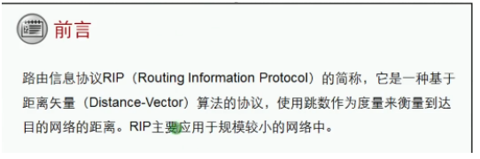
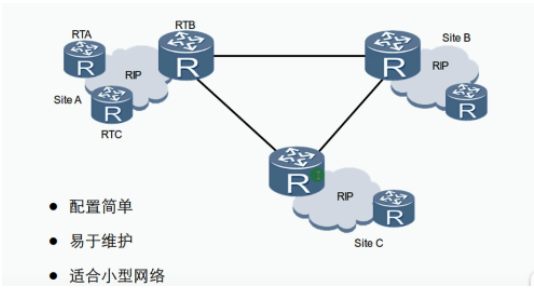

RIP：routing information protocol 路由信息协议
- 距离矢量路由协议，属于IGP协议
- 适合中小企业网络，有RIPv1和RIPv2、RIPv3版本
- 基于UDP，端口号520
- 周期性（25.5~30.0/次）更新
- 支持水平分割、毒性反转和触发更新等防环机制

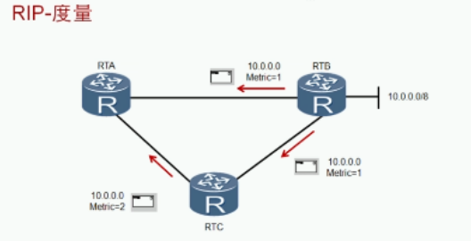

- RIP把跳数作为度量值来衡量到达目的网络的距离
- 缺省情况下，直连网络的路由跳数为0，当路由器发送路由更新时，会将度量值加1
- RIP规定超过15跳为网络不可达

RIP报文类型：请求request 和 回应response
- 请求报文：建立邻居后请求对方的路由信息
- 回应报文：回应对方的请求 每周期30/s次

RIPv1和RIPv2的区别：

| 版本  | 区别                                                         |
| ----- | ------------------------------------------------------------ |
| RIPv1 | 有类别路由协议不支持VLSM,CIDR以广播的形式发送报文不支持认证  |
| RIPv2 | 无类别路由协议支持VLSM，CIDR支持以广播或者组播（224.0.0.9）方式发送报文支持明文认证和MD5认证 |

RIPv1与RIPv2报文格式：
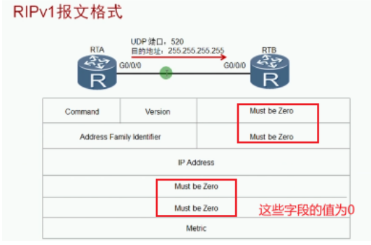

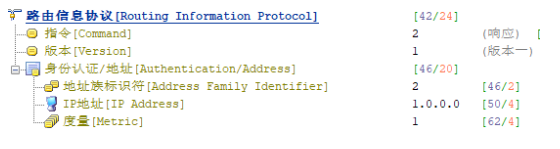

命令：值为1表示请求，值为2表示回应
版本：表明使用的版本
协议簇：TCP/IP协议该字段为2

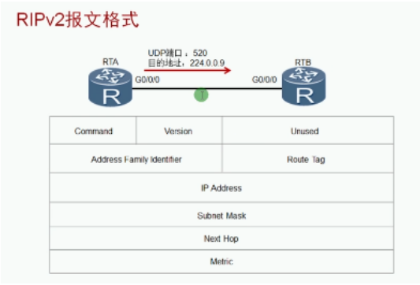

 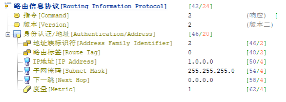

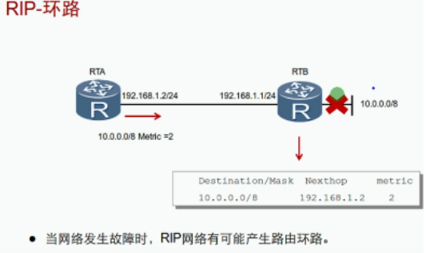

RIP解决环路的方式：触发更新和水平分割、毒性反转

| 类型       | 含义                                         |
| ---------- | -------------------------------------------- |
| 触发更新： | 网络存在变化立即通知邻居                     |
| 水平分割： | 从邻居收到的路由信息不会在转发回去           |
| 毒性反转： | 从邻居收到的路由信息会转发回去，但跳数置为16 |

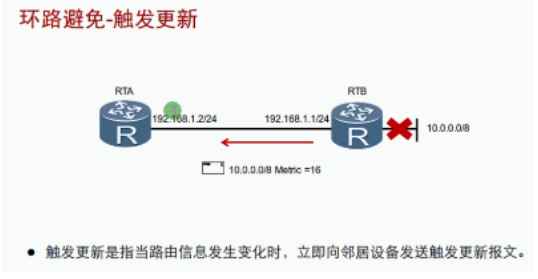
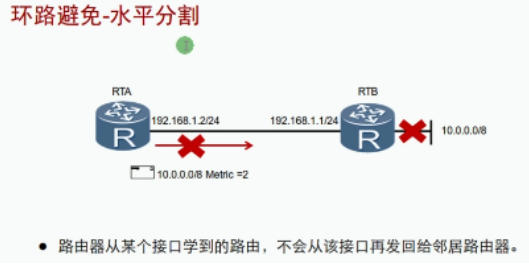

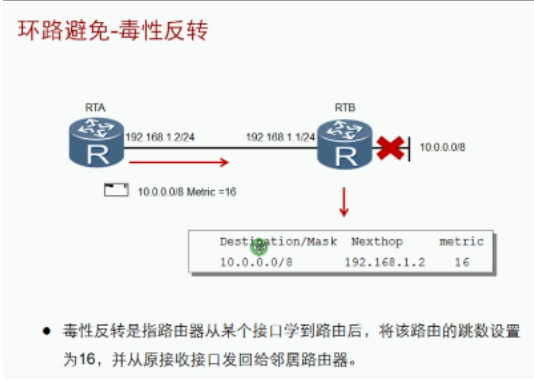

水平分割和毒性反转时不能同时使用
默认使用水平分割，如果水平分割和毒性反转都存在则毒性反转生效
同时存在多个网段，但只想一个接口生效：

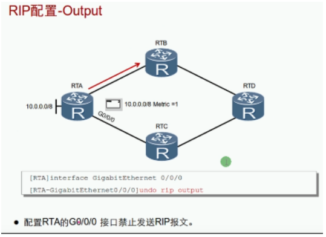
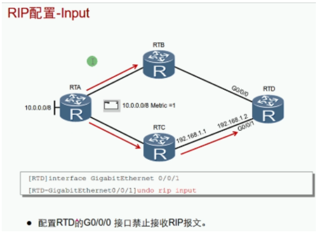
 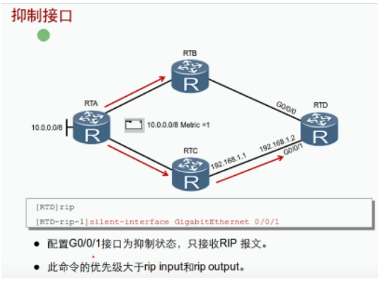

如果接口配置了input或output，静默生效

| 命令                      | 备注                    |
| ----------------------- | --------------------- |
| Rip 1                   | 开启RIP进程，默认进程为1        |
| Version 2               | 开启RIPv2版本             |
| Network 10.0.0.0        | 宣告网络，将该IP地址的接口开启RIP功能 |
| Rip metricin 5          | 设置接口接收路由增加度量值         |
| Rip metricout 5         | 设置接口发送路由修改度量值         |
| Rip split-horizon       | 开启水平分割，默认开启           |
| Rip poison-reverse      | 开启毒性反转，默认关闭           |
| Undo rip input          | 禁止接口接收RIP数据包          |
| Undo rip output         | 禁止接口发送RIP数据包          |
| slient-interface g0/0/0 | 配置被动接口，只收不发           |
