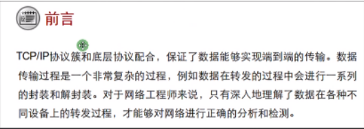

网关：Gateway
- 位于不同网络之间的主机需要通信，必须将数据包交给网关 （默认路由）
- 网关是一台具备路由功能的设备（路由器、三层交换机、防火墙、服务器）
- 网关地址与设备的接口地址是处于同个网络
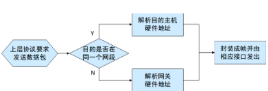

主机经过与计算得出目的地址是否在同个网段同一个网段直接封装目的的MAC转发不同网段封装网关的MAC，网关帮忙转发

数据包转发的过程中IP地址和MAC地址：在同一个网段内的源MAC地址是不会变化，非同一个网段的源MAC地址会变化、IP地址一般不会变化，除使用NAT技术
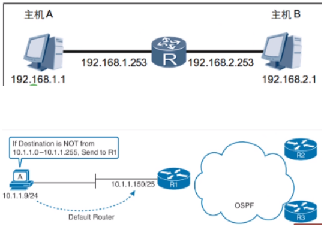

 

**数据转发过程**：
主机A访问HTTP服务器
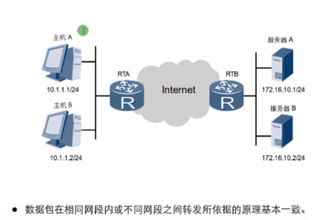

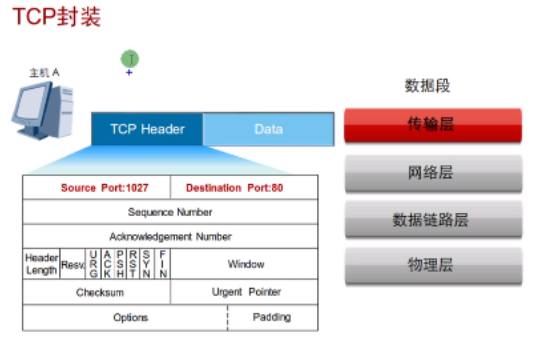

目的端口号：80

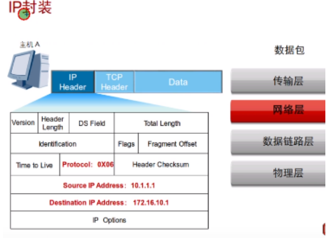

封装源IP目的IP地址，并进行与计算
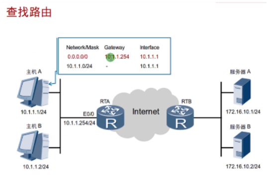

不在同一网段，交给网关
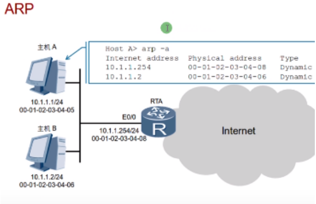

检查缓存表是否有网关的MAC，没有进行ARP请求
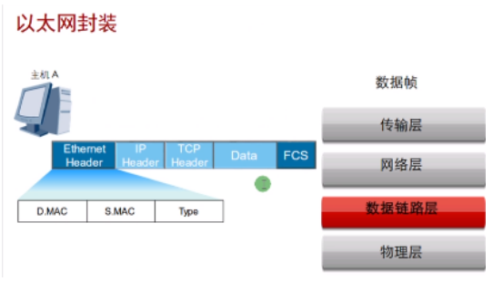

最终以光信号、电信号发送出去
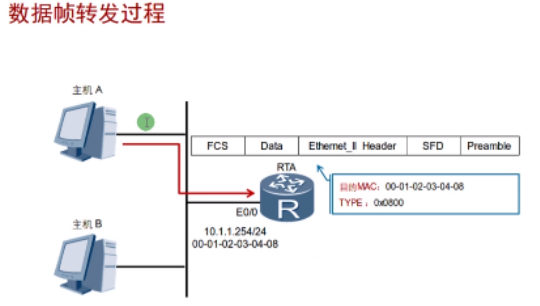

网关收到，进行FCS帧校验检测，通过检测目的MAC地址是否是我，通过交给网络层
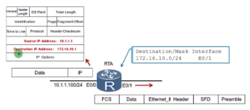

发现目的IP地址不是我，查找路由表、封装新的二层帧头和帧尾，并进行转发
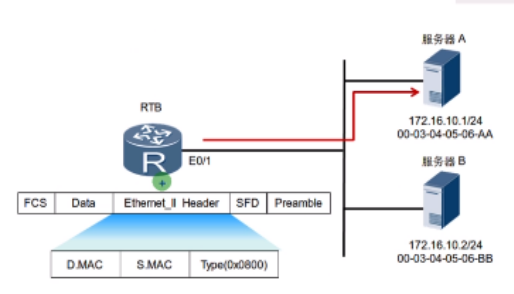

路由器以服务器A的MAC地址作为目的MAC地址继续转发
服务器A收到，进行FCS检测，通过检测目的MAC是我的MAC，继续交给上层处理
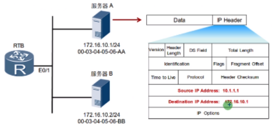

检测目的IP地址是我，检测协议号为TCP，交给TCP
TCP检测目的端口交给HTTP
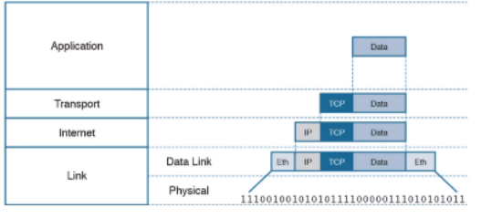