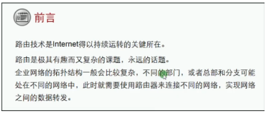
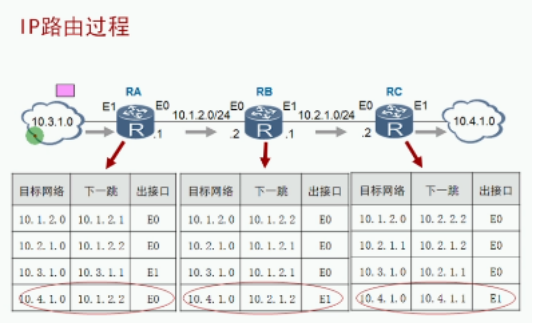
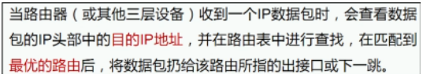
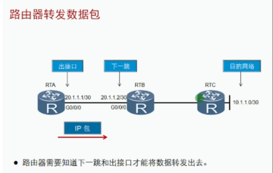
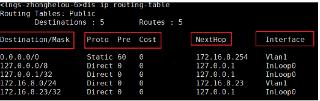
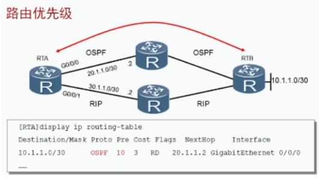
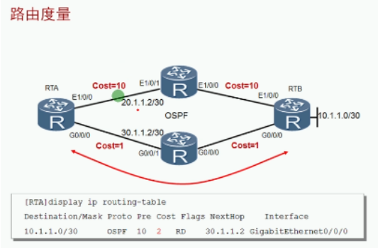
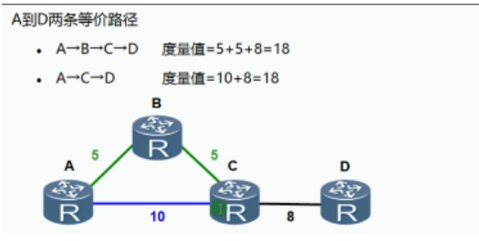
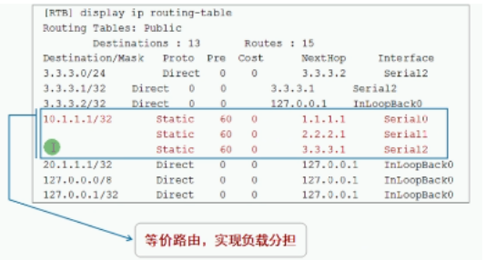
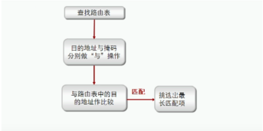

常用名词：

| 术语                    | 备注                                   |
| ----------------------- | -------------------------------------- |
| 路由routing             | 从源地址到目的地址不同网络间的转发过程 |
| 路由表routing table     | 路由信息的集合  路由的依据             |
| 路由器 router           | 具有路由功能的设备                     |
| 默认网关default gateway | 通过是路由设备的接口IP地址             |

路由过程图解：

路由器收到数据包检测路由表中是否存在能够去往目的IP地址、转发过程中是逐跳转发“并不会引导其他路由器转发”、数据通信是”双向性“

路由表只是转发的依据，真正转发的是根据接口 “知道从哪里发送”
下一跳是路由器需要将该数据包交给谁来转发

路由协议分为动态协议和静态协议
静态的配置简单，不占用资源
动态协议配置相对复杂，可以及时同步网络变化

IP路由表：存放最优的路由信息/条目

路由表包含了可以去往的目的网络 ，路由器收到目的网络不存在的会直接丢弃

| 路由表字段          | 备注                                                         |
| ------------------- | ------------------------------------------------------------ |
| Destination目标地址 | **用来标识存在的能够去往的目的地址或目的网络**               |
| Mask掩码            | **用来选择最佳路由的重要依据（最长匹配原则）**               |
| NextHop下一跳       | **指明该数据包所经过的下一个路由器的接口地址**               |
| Interface出接口     | **指明该数据包将从哪个接口转发**                             |
| Protocol 协议       | **路由的来源（学习方式）**                                   |
| Preference优先级    | **用来比较不同协议学习去往相同地址不同路径的优先程度（越小越优先）** |
| cost开销            | **用来比较相同协议学习去往相同地址不同路径的的代价（越小越优先）** |

 

不同协议比较

| 路由协议/类型   | Direct | OSPF | ISIS | Static | RIP  | OSPF ASE | BGP  |
| --------------- | ------ | ---- | ---- | ------ | ---- | -------- | ---- |
| 管理距离/优先级 | 0      | 10   | 15   | 60     | 100  | 150      | 255  |

 

# 相同协议比较

等价路由（ECMP，Equal cost multi-Path）：

对于一个路由来源，当到同一个目标网络存在多条相同度量值的路由时，路由器会将这些路由条目都加入路由表，数据包会在这几个链路（路径）进行负载分担。

（负载均衡的选择：逐包，逐流 可以根据目标IP或源IP，目标MAC或源MAC选择。最终会经过“哈希”计算实现）

最长掩码匹配原则：最终数据包实现最佳路由的算法

